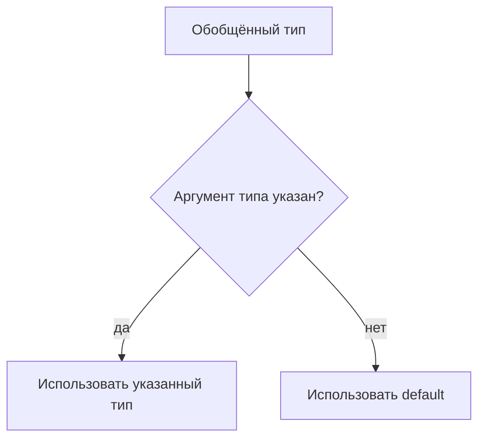

# Default Generic Parameters

## Связь с предыдущей главой

Обобщённые классы и типы могут принимать аргументы типа.

Иногда у generic API есть разумный тип по умолчанию, который можно использовать, если пользователь не передал аргумент типа явно.

## Главный вопрос

Как задать generic-тип по умолчанию?

## Мотивация

Обобщённый тип может быть удобнее, если самый частый вариант не нужно указывать каждый раз:

```ts
type ApiResponse<Data = unknown> = {
  status: number;
  body: Data;
};
```

Если `Data` не указан, TypeScript использует `unknown`.

## Теория

Параметр типа по умолчанию записывается через `=`:

```ts
type Result<Value = string> = {
  value: Value;
};
```

Значение по умолчанию используется только тогда, когда аргумент типа не указан и TypeScript не вывел другой тип из контекста.

Если есть constraint, default должен ему соответствовать:

```ts
type EntityBox<Entity extends { id: string } = { id: string }> = {
  entity: Entity;
};
```

## Внутренний механизм



Параметр типа по умолчанию существует только на этапе проверки TypeScript.

## Главная ментальная модель

Параметр типа по умолчанию — это запасной аргумент типа для удобства API.

## Практические примеры

```ts
type ApiResponse<Data = unknown> = {
  status: number;
  body: Data;
};

type UnknownResponse = ApiResponse;
type UserResponse = ApiResponse<{ id: string }>;
```

```ts
interface Builder<Data = unknown> {
  build(): Data;
}
```

## Automation QA

Для ответов вспомогательных функций удобно иметь безопасный default:

```ts
type HelperResult<Data = unknown> = {
  ok: boolean;
  data: Data;
};

const rawResult: HelperResult = {
  ok: true,
  data: { received: true },
};
```

`unknown` заставляет проверить данные перед использованием.

## Распространённые ошибки

Ошибка — выбирать слишком широкий default, который скрывает проблему:

```ts
type ApiResponse<Data = any> = {
  body: Data;
};
```

`any` отключает проверку. Для неизвестных данных безопаснее `unknown`.

## Практика

Практические задания находятся в конце страницы.

## Краткие итоги

- Параметр типа по умолчанию используется, когда аргумент типа не указан.
- Default не меняет поведение во время выполнения.
- Default должен соответствовать constraint.
- `unknown` часто безопаснее, чем `any`.
- Defaults делают public API удобнее, но слишком широкие defaults вредят проверке.

## Переход

Модуль Generics завершен. Следующий раздел переходит к операциям над типами и начинает с `keyof` как отдельной темы.
