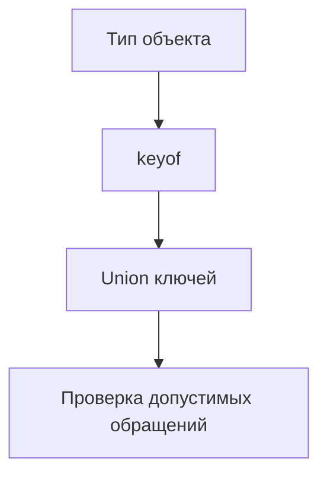

# keyof

## Связь с предыдущей главой

В главе про default generic parameters мы завершили модуль Generics.

Теперь начинается раздел операций над типами. Первая операция — `keyof`, потому что многие следующие механизмы строятся на идее: взять форму объекта и получить набор его ключей.

## Главный вопрос

Как получить union всех ключей типа?

## Мотивация

В JavaScript можно обратиться к свойству объекта по строке:

```ts
const user = {
  id: "u-1",
  role: "admin",
};

console.log(user["id"]);
```

Проблема в том, что строка может быть ошибочной:

```ts
console.log(user["rol"]);
```

TypeScript помогает описать не любую строку, а только ключи конкретного типа.

## Теория

`keyof Type` создает union известных ключей типа:

```ts
type User = {
  id: string;
  role: string;
};

type UserKey = keyof User;
```

`UserKey` становится типом `"id" | "role"`.

Это не операция во время выполнения. TypeScript не обходит объект во время выполнения. Он смотрит на описание типа во время проверки.

## Внутренний механизм



Если у типа есть index signature, результат может быть шире:

```ts
type Headers = {
  [name: string]: string;
};

type HeaderKey = keyof Headers;
```

Для такого словаря TypeScript не знает конечный список ключей, поэтому ключ описывается шире, чем набор литералов. У string index signature результатом будет не только `string`, а `string | number`, потому что числовые ключи объектов в JavaScript приводятся к строкам.

У массивов и tuples поведение отличается от обычных объектных контрактов: в ключи попадают не только индексы, но и свойства массивов. Поэтому в этой главе мы используем `keyof` прежде всего для объектных контрактов, где набор ключей читается явно.

## Главная ментальная модель

`keyof` — это список допустимых имен свойств, полученный из типа.

## Практические примеры

```ts
type TestUser = {
  id: string;
  email: string;
  active: boolean;
};

function readField(user: TestUser, key: keyof TestUser) {
  return user[key];
}

const user: TestUser = {
  id: "u-1",
  email: "qa@example.com",
  active: true,
};

readField(user, "email");
```

`keyof` отличается от `Object.keys`.

```ts
const keys = Object.keys(user);
```

`Object.keys(user)` выполняется во время выполнения и возвращает строки. `keyof TestUser` существует только в системе типов.

## Automation QA

В QA-проекте часто нужны безопасные имена полей:

```ts
type LocatorMap = {
  submitButton: string;
  emailInput: string;
  passwordInput: string;
};

function getLocator(name: keyof LocatorMap, locators: LocatorMap) {
  return locators[name];
}
```

Теперь helper не примет случайное имя локатора.

## Распространённые ошибки

Ошибка — считать, что `keyof` смотрит на объект во время выполнения:

```ts
type User = {
  id: string;
};

type UserKey = keyof User;
```

Если во время выполнения в объект добавят новое свойство, `UserKey` от этого не изменится.

## Практика

Практические задания находятся в конце страницы.

## Краткие итоги

- `keyof Type` создает union ключей типа.
- `keyof` работает на этапе проверки TypeScript.
- `keyof` не заменяет `Object.keys`.
- Index signatures могут расширять тип ключа.
- `keyof` полезен для безопасного выбора полей, карт локаторов и объектных контрактов.

## Переход

Мы научились получать ключи из типа. Следующий шаг — получить тип из существующего значения через `typeof Type Query`.
