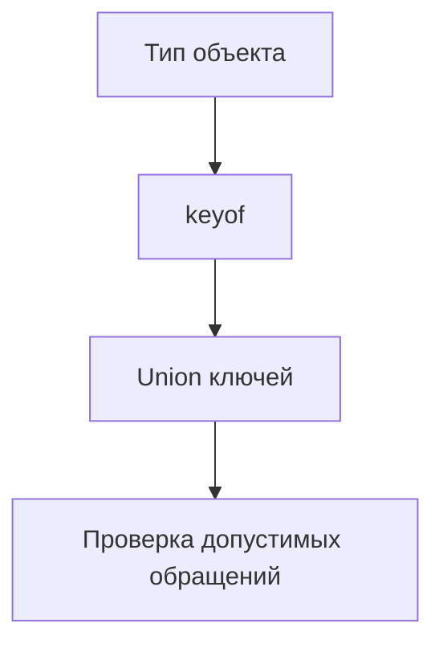

# keyof

## Связь с предыдущей главой

В главе про default generic parameters мы завершили модуль Generics.

Теперь начинается раздел операций над типами. Первая операция — `keyof`, потому что многие следующие механизмы строятся на идее: взять форму объекта и получить набор его ключей.

## Главный вопрос

Как получить union всех ключей типа?

## Мотивация

В JavaScript можно обратиться к свойству объекта по строке:

```ts
const user = {
  id: "u-1",
  role: "admin",
};

console.log(user["id"]);
```

Проблема в том, что строка может быть ошибочной:

```ts
console.log(user["rol"]);
```

TypeScript помогает описать не любую строку, а только ключи конкретного типа.

## Теория

### Оператор над типом, а не над значением

`keyof` берёт тип и возвращает объединение его ключей:

```ts
type User = { id: string; role: string };
type UserKey = keyof User;   // 'id' | 'role'
```

Всё происходит на этапе проверки. Компилятор читает **описание типа**, а не обходит объект: если во время выполнения в объект добавят свойство, `UserKey` не изменится.

### Отличие от `Object.keys`

Конструкции решают разные задачи и не заменяют друг друга:

| | `keyof T` | `Object.keys(obj)` |
| --- | --- | --- |
| Когда работает | При проверке типов | Во время выполнения |
| Что даёт | Объединение литералов | Массив строк |
| Видит лишние свойства | Нет | Да |

Важное следствие: `Object.keys` возвращает `string[]`, а не `(keyof T)[]`. Это не упущение — объект может содержать свойства сверх описанных в типе, и обещать обратное было бы неверно.

### `keyof` объединения даёт общие ключи

Самое неочевидное поведение:

```ts
type A = { id: string; a: number };
type B = { id: string; b: boolean };

type K = keyof (A | B);   // 'id' — только общий ключ
```

Логика строгая: значение типа `A | B` может оказаться любым из вариантов, поэтому безопасно обратиться можно лишь к тому, что есть у обоих.

Для пересечения — наоборот:

```ts
type K2 = keyof (A & B);   // 'id' | 'a' | 'b'
```

Значение типа `A & B` обладает всеми свойствами сразу.

Это зеркально правилу доступа к членам объединения из главы 118 — и по той же причине.

### Индексная сигнатура расширяет результат

```ts
type Headers = { [name: string]: string };
type HeaderKey = keyof Headers;   // string | number
```

Откуда `number`? В JavaScript числовой ключ приводится к строке, значит обратиться числом тоже можно. Результат оказывается шире, чем ожидается.

### Массивы и кортежи

У массива в ключи попадают не только индексы, но и все методы:

```ts
type ArrayKeys = keyof string[];   // number | 'length' | 'push' | 'map' | …
```

Поэтому `keyof` применяют прежде всего к объектным типам, где набор ключей читается явно. Для типа элемента используют индексированный доступ — тема главы 141.

### Практическая польза

`keyof` превращает имена полей в проверяемые значения:

```ts
type LocatorMap = { submitButton: string; emailInput: string };

function getLocator(name: keyof LocatorMap, locators: LocatorMap) {
  return locators[name];
}
```

Опечатка в имени становится ошибкой компиляции, а переименование поля подсвечивает все места использования. Без `keyof` параметр пришлось бы объявить как `string` — и потерять обе гарантии.

## Внутренний механизм



Если у типа есть index signature, результат может быть шире:

```ts
type Headers = {
  [name: string]: string;
};

type HeaderKey = keyof Headers;
```

Для такого словаря TypeScript не знает конечный список ключей, поэтому ключ описывается шире, чем набор литералов. У string index signature результатом будет не только `string`, а `string | number`, потому что числовые ключи объектов в JavaScript приводятся к строкам.

У массивов и tuples поведение отличается от обычных объектных контрактов: в ключи попадают не только индексы, но и свойства массивов. Поэтому в этой главе мы используем `keyof` прежде всего для объектных контрактов, где набор ключей читается явно.

## Главная ментальная модель

`keyof` — это список допустимых имен свойств, полученный из типа.

## Практические примеры

```ts
type TestUser = {
  id: string;
  email: string;
  active: boolean;
};

function readField(user: TestUser, key: keyof TestUser) {
  return user[key];
}

const user: TestUser = {
  id: "u-1",
  email: "qa@example.com",
  active: true,
};

readField(user, "email");
```

`keyof` отличается от `Object.keys`.

```ts
const keys = Object.keys(user);
```

`Object.keys(user)` выполняется во время выполнения и возвращает строки. `keyof TestUser` существует только в системе типов.

## Automation QA

В QA-проекте часто нужны безопасные имена полей:

```ts
type LocatorMap = {
  submitButton: string;
  emailInput: string;
  passwordInput: string;
};

function getLocator(name: keyof LocatorMap, locators: LocatorMap) {
  return locators[name];
}
```

Теперь helper не примет случайное имя локатора.

## Распространённые ошибки

Ошибка — считать, что `keyof` смотрит на объект во время выполнения:

```ts
type User = {
  id: string;
};

type UserKey = keyof User;
```

Если во время выполнения в объект добавят новое свойство, `UserKey` от этого не изменится.

## Распространённые мифы

**Миф: `keyof` смотрит на объект во время выполнения.**
Он работает с описанием типа. Добавленные позже свойства на результат не влияют.

**Миф: `Object.keys` возвращает `(keyof T)[]`.**
Возвращает `string[]`: объект может содержать свойства сверх описанных.

**Миф: `keyof (A | B)` даёт все ключи обоих типов.**
Даёт только общие. Все ключи даёт `keyof (A & B)`.

**Миф: `keyof` словаря — это `string`.**
Это `string | number`, потому что числовой ключ приводится к строке.

## Частые вопросы

**Почему `Object.keys` не типизирован точнее?**
Потому что это было бы неправдой: во время выполнения объект может иметь лишние свойства.

**Почему у объединения остаются только общие ключи?**
Значение может оказаться любым из вариантов, поэтому безопасны лишь общие свойства.

**Как получить тип элемента массива?**
Через индексированный доступ `Items[number]`, а не через `keyof`.

**Зачем использовать `keyof` вместо `string` для имени поля?**
Чтобы опечатка стала ошибкой компиляции, а переименование поля подсветило места использования.

## Проверьте себя

1. Что возвращает `keyof` и на каком этапе работает?
2. Почему `Object.keys` возвращает `string[]`?
3. Чем `keyof (A | B)` отличается от `keyof (A & B)` и почему?
4. Откуда в `keyof` словаря берётся `number`?
5. Почему `keyof` редко применяют к массивам?

## Практика

Практические задания находятся в конце страницы.

## Краткие итоги

- `keyof Type` создает union ключей типа.
- `keyof` работает на этапе проверки TypeScript.
- `keyof` не заменяет `Object.keys`.
- Index signatures могут расширять тип ключа.
- `keyof` полезен для безопасного выбора полей, карт локаторов и объектных контрактов.

## Переход

Мы научились получать ключи из типа. Следующий шаг — получить тип из существующего значения через `typeof Type Query`.
