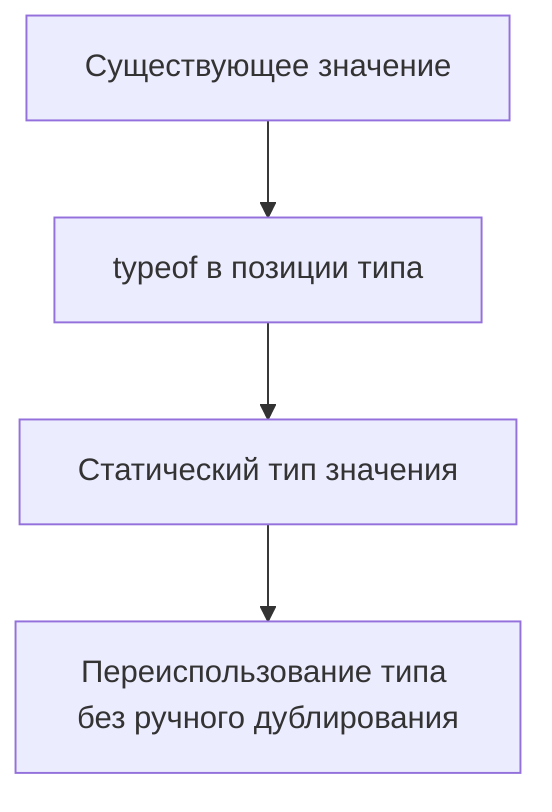

# typeof Type Query

## Связь с предыдущей главой

`keyof` берет тип объекта и получает union его ключей.

Иногда тип уже не нужно писать вручную: в проекте есть константа, и хочется получить тип прямо из нее.

## Главный вопрос

Как получить тип существующего значения?

## Мотивация

В QA-проекте часто есть константы конфигурации:

```ts
const environments = {
  dev: "https://dev.example.com",
  stage: "https://stage.example.com",
} as const;
```

Если отдельно написать тип для этой структуры, появится дублирование. При изменении значения легко забыть обновить тип.

## Теория

В JavaScript `typeof value` возвращает строку во время выполнения:

```ts
console.log(typeof "test");
```

В TypeScript `typeof` может использоваться в позиции типа:

```ts
const config = {
  retries: 2,
  baseUrl: "https://example.com",
};

type Config = typeof config;
```

`Config` получает статический тип значения `config`.

Это не проверка во время выполнения. После компиляции запрос типа исчезает.

## Внутренний механизм



Запрос типа работает с именами значений, которые TypeScript может увидеть во время проверки. Нельзя написать запрос типа от произвольного выражения времени выполнения, например от вызова функции или нового object literal.

## Главная ментальная модель

`typeof` в позиции типа — это способ сказать: "возьми тип вот этой уже существующей константы".

## Практические примеры

```ts
const defaultUser = {
  id: "u-1",
  role: "admin",
  active: true,
};

type DefaultUser = typeof defaultUser;

const copiedUser: DefaultUser = {
  id: "u-2",
  role: "editor",
  active: false,
};
```

Обычный object literal в `const`-переменной не делает свойства readonly и не всегда сохраняет literal types. В примере выше `role` остается `string`, поэтому `"editor"` допустим.

`typeof` хорошо сочетается с `as const`:

```ts
const statuses = {
  passed: "passed",
  failed: "failed",
} as const;

type StatusMap = typeof statuses;
```

`as const` сохраняет точные literal types и readonly-структуру. `satisfies` из предыдущего раздела решает другую задачу: проверяет соответствие контракту, но не превращает значение во время выполнения в объект с типами.

## Automation QA

Можно описать тип конфигурации от реального объекта:

```ts
const testConfig = {
  baseUrl: "https://stage.example.com",
  retries: 2,
  report: "html",
} as const;

type TestConfig = typeof testConfig;
```

Если конфигурация изменится, тип обновится вместе с ней.

## Распространённые ошибки

Ошибка — смешивать оператор `typeof` во время выполнения и `typeof` в позиции типа.

```ts
const runtimeResult = typeof "abc";
type StaticType = typeof runtimeResult;
```

Первое выражение возвращает строку во время выполнения. Второе извлекает тип переменной `runtimeResult`.

## Практика

Практические задания находятся в конце страницы.

## Краткие итоги

- Runtime `typeof` возвращает строку.
- Type-position `typeof` извлекает статический тип значения.
- Type query исчезает после компиляции.
- `typeof` не валидирует внешние данные.
- Этот механизм уменьшает ручное дублирование типов.

## Переход

Мы умеем брать тип целого значения. Следующая глава показывает, как получить тип отдельного свойства через indexed access types.
