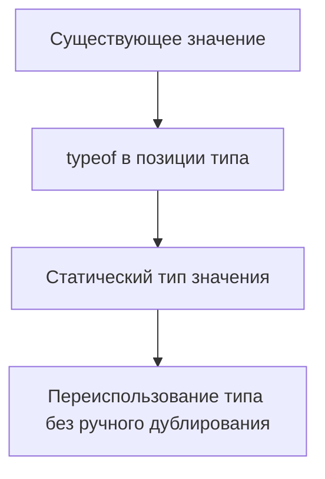

# typeof Type Query

## Связь с предыдущей главой

`keyof` берет тип объекта и получает union его ключей.

Иногда тип уже не нужно писать вручную: в проекте есть константа, и хочется получить тип прямо из нее.

## Главный вопрос

Как получить тип существующего значения?

## Мотивация

В QA-проекте часто есть константы конфигурации:

```ts
const environments = {
  dev: "https://dev.example.com",
  stage: "https://stage.example.com",
} as const;
```

Если отдельно написать тип для этой структуры, появится дублирование. При изменении значения легко забыть обновить тип.

## Теория

### Тип из уже существующего значения

В позиции типа `typeof` означает совсем не то, что в выражении:

```ts
const config = { retries: 2, baseUrl: "https://example.com" };

type Config = typeof config;   // { retries: number; baseUrl: string }
```

Это **запрос типа**: «возьми тип вот этой константы». Никакого кода не появляется, после компиляции конструкция исчезает.

### Два разных `typeof`

Одно слово, два механизма:

```ts
const runtime = typeof "abc";        // выражение: строка "string"
type Static = typeof runtime;        // запрос типа: тип переменной runtime
```

Различает их позиция: в выражении — оператор JavaScript, в позиции типа — запрос типа TypeScript.

### Работает только с идентификаторами

Запрос типа применяется к имени значения, а не к произвольному выражению:

```ts
type A = typeof config;        // допустимо
type B = typeof config.retries; // допустимо: квалифицированное имя
type C = typeof getConfig();    // синтаксическая ошибка
```

Для результата вызова существует отдельный инструмент — `ReturnType`, о котором в главе про utility types.

### Направление зависимости

Обычно тип пишется первым, а значение подгоняется под него. Запрос типа переворачивает связь: **источником истины становится значение**.

Это полезно там, где значение и так должно существовать — конфигурации, таблицы констант, наборы тестовых данных. Тип перестаёт дублировать данные и не может с ними разойтись.

### Сочетание с `as const`

Без `as const` литеральные типы теряются:

```ts
const statuses = { passed: "passed", failed: "failed" };
type S = typeof statuses;   // { passed: string; failed: string }
```

С ним сохраняются:

```ts
const statuses = { passed: "passed", failed: "failed" } as const;
type S = typeof statuses;              // readonly, литеральные типы
type StatusValue = S[keyof S];         // 'passed' | 'failed'
```

Эта связка — основной способ получить объединение из реальных данных. Подробно приём разбирался в главе 116.

### Запрос типа функции

```ts
function formatStatus(status: string): number { }

type Formatter = typeof formatStatus;   // (status: string) => number
```

Удобно, когда нужно объявить переменную или параметр с той же сигнатурой, не переписывая её вручную. При изменении функции тип обновится сам.

### Ограничение

Запрос типа видит только то, что известно при проверке. Он не может «посмотреть» на данные, которые появятся во время выполнения: тип, полученный из константы, описывает именно эту константу, а не ответ сервера, который на неё похож.

## Внутренний механизм



Запрос типа работает с именами значений, которые TypeScript может увидеть во время проверки. Нельзя написать запрос типа от произвольного выражения времени выполнения, например от вызова функции или нового object literal.

## Главная ментальная модель

`typeof` в позиции типа — это способ сказать: "возьми тип вот этой уже существующей константы".

## Практические примеры

```ts
const defaultUser = {
  id: "u-1",
  role: "admin",
  active: true,
};

type DefaultUser = typeof defaultUser;

const copiedUser: DefaultUser = {
  id: "u-2",
  role: "editor",
  active: false,
};
```

Обычный object literal в `const`-переменной не делает свойства readonly и не всегда сохраняет literal types. В примере выше `role` остается `string`, поэтому `"editor"` допустим.

`typeof` хорошо сочетается с `as const`:

```ts
const statuses = {
  passed: "passed",
  failed: "failed",
} as const;

type StatusMap = typeof statuses;
```

`as const` сохраняет точные literal types и readonly-структуру. `satisfies` из предыдущего раздела решает другую задачу: проверяет соответствие контракту, но не превращает значение во время выполнения в объект с типами.

Запускаемые версии этих примеров находятся в:

```text
examples/02-typescript/chapter-140/
```

`01-typeof-config.ts` — тип, выведенный из объекта конфигурации.

`02-typeof-statuses.ts` — `typeof` вместе с `as const`.

`03-typeof-diagnostic.ts` — литеральный тип переменной (намеренная ошибка).

## Automation QA

Можно описать тип конфигурации от реального объекта:

```ts
const testConfig = {
  baseUrl: "https://stage.example.com",
  retries: 2,
  report: "html",
} as const;

type TestConfig = typeof testConfig;
```

Если конфигурация изменится, тип обновится вместе с ней.

## Распространённые ошибки

Ошибка — смешивать оператор `typeof` во время выполнения и `typeof` в позиции типа.

```ts
const runtimeResult = typeof "abc";
type StaticType = typeof runtimeResult;
```

Первое выражение возвращает строку во время выполнения. Второе извлекает тип переменной `runtimeResult`.

## Распространённые мифы

**Миф: `typeof` в типе и в выражении — одно и то же.**
Первое возвращает тип значения при проверке, второе — строку во время выполнения.

**Миф: можно написать `typeof` от вызова функции.**
Нет, требуется идентификатор. Для результата вызова есть `ReturnType`.

**Миф: `typeof` от объекта сохраняет точные значения.**
Без `as const` литералы расширяются до `string` и `number`.

**Миф: тип, полученный запросом, описывает похожие данные из сети.**
Он описывает конкретную константу и ничего не гарантирует о внешних данных.

## Частые вопросы

**Когда источником истины делать значение, а не тип?**
Когда значение и так необходимо: конфигурации, справочники, наборы тестовых данных.

**Как получить объединение значений объекта?**
`typeof obj[keyof typeof obj]` при условии `as const`.

**Зачем запрашивать тип функции?**
Чтобы объявить переменную или параметр с той же сигнатурой и не поддерживать её копию вручную.

**Можно ли взять `typeof` от свойства?**
Да, квалифицированное имя допустимо: `typeof config.retries`.

## Проверьте себя

1. Чем `typeof` в позиции типа отличается от оператора в выражении?
2. Почему `typeof getConfig()` не работает и что использовать вместо?
3. Как `as const` меняет результат запроса типа?
4. Как из объекта-справочника получить объединение его значений?
5. Что запрос типа не может узнать?

## Практика

Практические задания находятся в конце страницы.

## Краткие итоги

- Runtime `typeof` возвращает строку.
- Type-position `typeof` извлекает статический тип значения.
- Type query исчезает после компиляции.
- `typeof` не валидирует внешние данные.
- Этот механизм уменьшает ручное дублирование типов.

## Переход

Мы умеем брать тип целого значения. Следующая глава показывает, как получить тип отдельного свойства через indexed access types.
