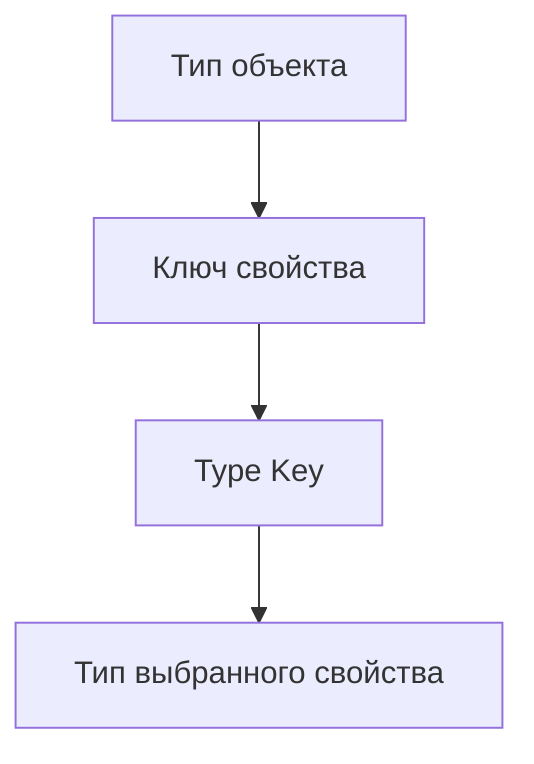

# Indexed Access Types

## Связь с предыдущей главой

`typeof Type Query` позволяет получить тип существующего значения целиком.

Теперь нужно научиться извлекать не весь тип, а отдельную его часть.

## Главный вопрос

Как получить тип отдельного свойства?

## Мотивация

В больших проектах часто есть общий тип ответа:

```ts
type ApiResponse = {
  status: number;
  body: {
    id: string;
    role: string;
  };
};
```

Если нужно переиспользовать тип `body`, не хочется копировать его вручную.

## Теория

Indexed access type записывается как `Type[Key]`:

```ts
type ResponseBody = ApiResponse["body"];
```

Это операция над типами. Она не читает свойство во время выполнения.

Ключ должен существовать в целевом типе:

```ts
type Status = ApiResponse["status"];
```

Для нескольких ключей результат становится union:

```ts
type ResponsePart = ApiResponse["status" | "body"];
```

Если свойство optional, обращение к типу свойства возвращает тип с учетом возможности отсутствия:

```ts
type User = {
  name?: string;
};

type UserName = User["name"];
```

`UserName` будет `string | undefined`. Это отличается от `noUncheckedIndexedAccess`: такая compiler option влияет на чтение по произвольному индексу в выражениях, а не на сам факт существования optional property.

## Внутренний механизм



Для массивов можно получить тип элемента:

```ts
type Users = Array<{ id: string; email: string }>;
type User = Users[number];
```

`number` означает: возьми тип элемента массива.

## Главная ментальная модель

Indexed access type — это чтение свойства у типа, а не у объекта.

## Практические примеры

```ts
type TestResult = {
  title: string;
  durationMs: number;
  status: "passed" | "failed";
};

type TestStatus = TestResult["status"];

const status: TestStatus = "passed";
```

```ts
type Suite = {
  tests: TestResult[];
};

type SuiteTest = Suite["tests"][number];
```

## Automation QA

Если API helper возвращает общий response type, можно переиспользовать части:

```ts
type CreateUserResponse = {
  status: 201;
  body: {
    id: string;
    email: string;
  };
};

type CreatedUser = CreateUserResponse["body"];
```

Так модель пользователя остается связанной с response contract.

## Распространённые ошибки

Ошибка — думать, что `Type[Key]` обращается к значению во время выполнения:

```ts
type User = {
  id: string;
};

type UserId = User["id"];
```

В JavaScript после компиляции этого обращения не будет.

## Практика

Практические задания находятся в конце страницы.

## Краткие итоги

- `Type[Key]` извлекает тип свойства.
- Ключ должен быть допустимым для целевого типа.
- Union ключей дает union типов свойств.
- `ArrayType[number]` получает тип элемента массива.
- Indexed access types помогают не дублировать вложенные типы.

## Переход

Мы научились выбирать часть типа. Следующий шаг — автоматически преобразовать все свойства типа через mapped types.
