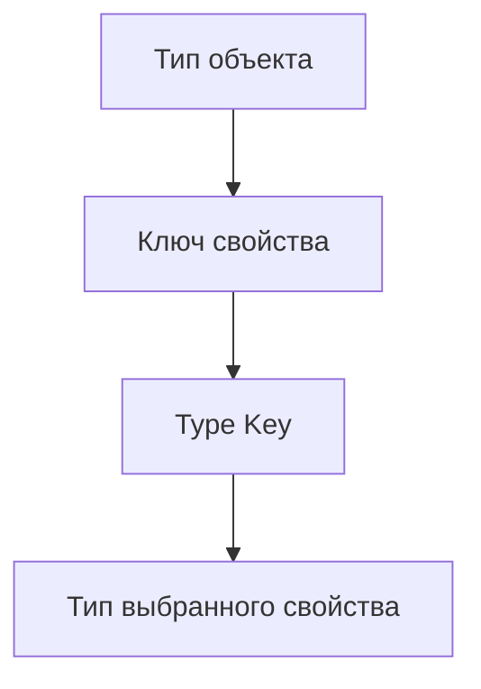

# Indexed Access Types

## Связь с предыдущей главой

`typeof Type Query` позволяет получить тип существующего значения целиком.

Теперь нужно научиться извлекать не весь тип, а отдельную его часть.

## Главный вопрос

Как получить тип отдельного свойства?

## Мотивация

В больших проектах часто есть общий тип ответа:

```ts
type ApiResponse = {
  status: number;
  body: {
    id: string;
    role: string;
  };
};
```

Если нужно переиспользовать тип `body`, не хочется копировать его вручную.

## Теория

### Чтение свойства у типа

Индексированный доступ записывается как `Type[Key]` и возвращает тип значения по этому ключу:

```ts
type ApiResponse = { status: number; body: { id: string } };

type Body = ApiResponse["body"];   // { id: string }
```

Синтаксис совпадает с обращением к свойству объекта, но работает на другом уровне: это операция над типом, после компиляции её не остаётся.

Ключ обязан существовать — несуществующее имя даёт ошибку, а не `undefined`.

### Несколько ключей дают объединение

```ts
type Part = ApiResponse["status" | "body"];   // number | { id: string }
```

Частный случай — все ключи сразу:

```ts
type AnyValue = ApiResponse[keyof ApiResponse];
```

Это стандартный способ получить «тип любого значения этого объекта».

### Массивы и кортежи

Для массива тип элемента берут по числовому индексу:

```ts
type Users = { id: string }[];
type User = Users[number];   // { id: string }
```

`number` здесь означает «по любому индексу». Именно этот приём используют вместо `keyof`, который для массива вернул бы ещё и все его методы.

У кортежа можно обратиться к конкретной позиции:

```ts
type Pair = [status: number, text: string];
type First = Pair[0];       // number
type Any = Pair[number];    // number | string
```

### Вложенный доступ

Операции соединяются в цепочку:

```ts
type Suite = { tests: { title: string; status: "passed" | "failed" }[] };

type TestStatus = Suite["tests"][number]["status"];   // 'passed' | 'failed'
```

Так из крупной модели извлекают ровно нужную часть, не объявляя её отдельно и не рискуя рассинхронизацией.

### Необязательное свойство включает `undefined`

```ts
type User = { name?: string };
type Name = User["name"];   // string | undefined
```

Это отражает реальность: свойства может не быть. Не путайте с `noUncheckedIndexedAccess` — та настройка влияет на чтение по произвольному индексу в выражениях, а здесь речь о самом объявлении свойства как необязательного.

### Зачем это нужно на практике

Главная ценность — **держать производные типы связанными с исходным**:

```ts
type CreateUserResponse = { status: 201; body: { id: string; email: string } };
type CreatedUser = CreateUserResponse["body"];
```

Модель пользователя не объявлена отдельно, а извлечена из контракта ответа. Изменится контракт — изменится и она, без ручной синхронизации.

Противоположный подход — объявить `CreatedUser` самостоятельно — работает ровно до первого изменения API, после чего два описания начинают расходиться молча.

## Внутренний механизм



Для массивов можно получить тип элемента:

```ts
type Users = Array<{ id: string; email: string }>;
type User = Users[number];
```

`number` означает: возьми тип элемента массива.

## Главная ментальная модель

Indexed access type — это чтение свойства у типа, а не у объекта.

## Практические примеры

```ts
type TestResult = {
  title: string;
  durationMs: number;
  status: "passed" | "failed";
};

type TestStatus = TestResult["status"];

const status: TestStatus = "passed";
```

```ts
type Suite = {
  tests: TestResult[];
};

type SuiteTest = Suite["tests"][number];
```

## Automation QA

Если API helper возвращает общий response type, можно переиспользовать части:

```ts
type CreateUserResponse = {
  status: 201;
  body: {
    id: string;
    email: string;
  };
};

type CreatedUser = CreateUserResponse["body"];
```

Так модель пользователя остается связанной с response contract.

## Распространённые ошибки

Ошибка — думать, что `Type[Key]` обращается к значению во время выполнения:

```ts
type User = {
  id: string;
};

type UserId = User["id"];
```

В JavaScript после компиляции этого обращения не будет.

## Распространённые мифы

**Миф: `Type[Key]` читает свойство объекта.**
Это операция над типом. Во время выполнения её не существует.

**Миф: несуществующий ключ даст `undefined`.**
Он даст ошибку компиляции.

**Миф: тип элемента массива получают через `keyof`.**
Через `Items[number]`. `keyof` вернул бы ещё и методы массива.

**Миф: `User["name"]` для необязательного свойства даёт `string`.**
Даёт `string | undefined`: свойства может не быть.

## Частые вопросы

**Как получить тип любого значения объекта?**
`Type[keyof Type]` — объединение типов всех свойств.

**Можно ли обращаться вглубь?**
Да, операции соединяются в цепочку: `Suite["tests"][number]["status"]`.

**Чем это лучше отдельного объявления типа?**
Производный тип не может разойтись с исходным при изменении контракта.

**Что даёт `Pair[number]` для кортежа?**
Объединение типов всех его позиций.

## Проверьте себя

1. Что возвращает `Type[Key]` и на каком этапе вычисляется?
2. Как получить объединение типов всех значений объекта?
3. Почему для элемента массива используют `[number]`, а не `keyof`?
4. Какой тип даёт индексированный доступ к необязательному свойству?
5. В чём преимущество извлечения типа из контракта перед отдельным объявлением?

## Практика

Практические задания находятся в конце страницы.

## Краткие итоги

- `Type[Key]` извлекает тип свойства.
- Ключ должен быть допустимым для целевого типа.
- Union ключей дает union типов свойств.
- `ArrayType[number]` получает тип элемента массива.
- Indexed access types помогают не дублировать вложенные типы.

## Переход

Мы научились выбирать часть типа. Следующий шаг — автоматически преобразовать все свойства типа через mapped types.
