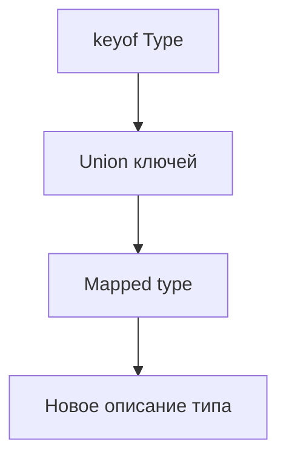

# Mapped Types

## Связь с предыдущей главой

Indexed access types позволяют взять тип одного свойства.

Mapped types идут дальше: они проходят по набору ключей и строят новый тип на основе каждого свойства.

## Главный вопрос

Как автоматически преобразовать каждое свойство типа?

## Мотивация

Допустим, есть модель формы:

```ts
type LoginForm = {
  email: string;
  password: string;
};
```

Для UI-состояния может понадобиться объект, где для каждого поля хранится флаг ошибки:

```ts
type LoginFormErrors = {
  email: boolean;
  password: boolean;
};
```

Ручное дублирование быстро становится хрупким.

## Теория

### Проход по ключам

Сопоставленный тип строит новый тип, перебирая ключи существующего:

```ts
type Flags<Type> = {
  [Key in keyof Type]: boolean;
};
```

Синтаксис `[Key in ...]` напоминает цикл, но никакого выполнения нет: компилятор раскрывает описание при проверке, а после компиляции от него ничего не остаётся.

Значение по ключу берут через индексированный доступ:

```ts
type Copy<Type> = {
  [Key in keyof Type]: Type[Key];
};
```

### Модификаторы сохраняются автоматически

Важная деталь: если проход идёт по `keyof Type`, исходные `readonly` и `?` **переносятся** в результат.

```ts
type Src = { readonly a: string; b?: number };
type C = Copy<Src>;   // a остался readonly, b остался необязательным
```

Такие типы называют гомоморфными. Именно поэтому `Copy<T>` действительно копирует форму, а не создаёт её огрублённую версию.

### Модификаторы можно менять

Префиксы `+` и `-` добавляют и убирают модификаторы:

```ts
type Mutable<Type> = {
  -readonly [Key in keyof Type]: Type[Key];
};

type RequiredFields<Type> = {
  [Key in keyof Type]-?: Type[Key];
};
```

Знак `+` подразумевается по умолчанию и пишется редко. Изменения действуют только на уровне типов: объект во время выполнения не замораживается и не меняется.

### Переименование ключей

Предложение `as` позволяет построить новые имена:

```ts
type Getters<Type> = {
  [Key in keyof Type as `get${Capitalize<string & Key>}`]: () => Type[Key];
};

type P = Getters<{ name: string }>;   // { getName: () => string }
```

Тот же механизм позволяет **отфильтровать** ключи: если `as` возвращает `never`, ключ выпадает из результата.

### Перебирать можно любое объединение

Источником ключей не обязан быть `keyof`:

```ts
type Status = "passed" | "failed";
type Counters = { [Key in Status]: number };   // { passed: number; failed: number }
```

Это частый способ гарантировать, что структура покрывает все варианты: добавится статус — тип потребует новое поле.

### Где это окупается

Основная ценность — производные структуры, которые **не расходятся с исходной**:

```ts
type FieldErrors<Form> = { [Field in keyof Form]: string[] };
```

Добавили поле в форму — тип ошибок обновился сам. Альтернатива с ручным перечислением полей разойдётся при первом же изменении.

## Внутренний механизм



Mapped type может сохранить исходные типы значений:

```ts
type Copy<Type> = {
  [Key in keyof Type]: Type[Key];
};
```

## Главная ментальная модель

Mapped type — это проход по ключам типа на этапе проверки.

## Практические примеры

```ts
type ValidationState<Type> = {
  [Key in keyof Type]: boolean;
};

type UserForm = {
  email: string;
  age: number;
};

type UserFormValidation = ValidationState<UserForm>;
```

Можно менять modifiers:

```ts
type Mutable<Type> = {
  -readonly [Key in keyof Type]: Type[Key];
};

type RequiredFields<Type> = {
  [Key in keyof Type]-?: Type[Key];
};
```

`readonly` и `?` меняются только на уровне типов. Объекты во время выполнения не замораживаются и не мутируют.

Запускаемые версии этих примеров находятся в:

```text
examples/02-typescript/chapter-142/
```

`01-field-flags.ts` — отображённый тип флагов по полям формы.

`02-field-errors.ts` — отображение полей в списки ошибок.

`03-mapped-type-diagnostic.ts` — отображение сохраняет типы полей (намеренная ошибка).

## Automation QA

Для формы Page Object можно описать состояние всех полей:

```ts
type CheckoutForm = {
  email: string;
  address: string;
  cardNumber: string;
};

type FieldErrors<Form> = {
  [Field in keyof Form]: string[];
};

type CheckoutErrors = FieldErrors<CheckoutForm>;
```

Если в форму добавится поле, тип ошибок обновится автоматически.

## Распространённые ошибки

Ошибка — воспринимать mapped type как преобразование объекта во время выполнения:

```ts
type Flags<Type> = {
  [Key in keyof Type]: boolean;
};
```

Этот тип ничего не делает с объектом во время выполнения.

## Распространённые мифы

**Миф: сопоставленный тип преобразует объект.**
Он создаёт описание типа. Во время выполнения ничего не происходит.

**Миф: при копировании ключей модификаторы теряются.**
При проходе по `keyof Type` они сохраняются автоматически.

**Миф: `[Key in ...]` — это цикл.**
Это конструкция уровня типов; компилятор раскрывает её при проверке.

**Миф: перебирать можно только ключи существующего типа.**
Источником может быть любое объединение, включая объединение литералов.

## Частые вопросы

**Как убрать `readonly` или `?` из всех свойств?**
Префиксом `-` перед модификатором: `-readonly` и `-?`.

**Как исключить часть ключей?**
Через `as`, возвращающий `never` для ненужных ключей.

**Зачем перебирать объединение статусов?**
Чтобы структура гарантированно покрывала все варианты: новый статус потребует нового поля.

**Почему такой тип лучше ручного перечисления?**
Он не может разойтись с исходным типом при его изменении.

## Проверьте себя

1. Что делает конструкция `[Key in keyof Type]` и когда она вычисляется?
2. Почему при копировании через `keyof` сохраняются `readonly` и `?`?
3. Как добавить и как убрать модификатор?
4. Для чего нужно предложение `as` и как им отфильтровать ключи?
5. Почему производный тип надёжнее ручного перечисления полей?

## Практика

Практические задания находятся в конце страницы.

## Краткие итоги

- Mapped type проходит по union ключей на этапе проверки.
- `[Key in keyof Type]` строит новый тип.
- `Type[Key]` позволяет сохранить или изменить тип значения свойства.
- Modifiers `readonly` и `?` меняют только описание типа.
- Mapped types уменьшают ручное дублирование моделей.

## Переход

Mapped types преобразуют свойства. Следующая глава добавит условный выбор типа через conditional types.
