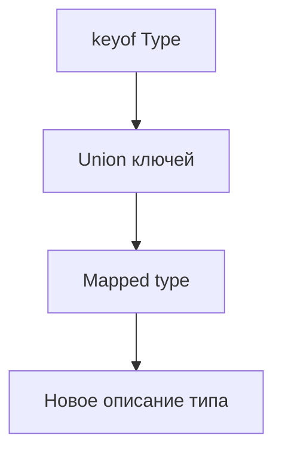

# Mapped Types

## Связь с предыдущей главой

Indexed access types позволяют взять тип одного свойства.

Mapped types идут дальше: они проходят по набору ключей и строят новый тип на основе каждого свойства.

## Главный вопрос

Как автоматически преобразовать каждое свойство типа?

## Мотивация

Допустим, есть модель формы:

```ts
type LoginForm = {
  email: string;
  password: string;
};
```

Для UI-состояния может понадобиться объект, где для каждого поля хранится флаг ошибки:

```ts
type LoginFormErrors = {
  email: boolean;
  password: boolean;
};
```

Ручное дублирование быстро становится хрупким.

## Теория

Mapped type использует синтаксис `[Key in Union]`:

```ts
type Flags<Type> = {
  [Key in keyof Type]: boolean;
};
```

Для `LoginForm` получится:

```ts
type LoginFormFlags = Flags<LoginForm>;
```

Это новый тип. Объект во время выполнения не создается автоматически.

## Внутренний механизм



Mapped type может сохранить исходные типы значений:

```ts
type Copy<Type> = {
  [Key in keyof Type]: Type[Key];
};
```

## Главная ментальная модель

Mapped type — это проход по ключам типа на этапе проверки.

## Практические примеры

```ts
type ValidationState<Type> = {
  [Key in keyof Type]: boolean;
};

type UserForm = {
  email: string;
  age: number;
};

type UserFormValidation = ValidationState<UserForm>;
```

Можно менять modifiers:

```ts
type Mutable<Type> = {
  -readonly [Key in keyof Type]: Type[Key];
};

type RequiredFields<Type> = {
  [Key in keyof Type]-?: Type[Key];
};
```

`readonly` и `?` меняются только на уровне типов. Объекты во время выполнения не замораживаются и не мутируют.

## Automation QA

Для формы Page Object можно описать состояние всех полей:

```ts
type CheckoutForm = {
  email: string;
  address: string;
  cardNumber: string;
};

type FieldErrors<Form> = {
  [Field in keyof Form]: string[];
};

type CheckoutErrors = FieldErrors<CheckoutForm>;
```

Если в форму добавится поле, тип ошибок обновится автоматически.

## Распространённые ошибки

Ошибка — воспринимать mapped type как преобразование объекта во время выполнения:

```ts
type Flags<Type> = {
  [Key in keyof Type]: boolean;
};
```

Этот тип ничего не делает с объектом во время выполнения.

## Практика

Практические задания находятся в конце страницы.

## Краткие итоги

- Mapped type проходит по union ключей на этапе проверки.
- `[Key in keyof Type]` строит новый тип.
- `Type[Key]` позволяет сохранить или изменить тип значения свойства.
- Modifiers `readonly` и `?` меняют только описание типа.
- Mapped types уменьшают ручное дублирование моделей.

## Переход

Mapped types преобразуют свойства. Следующая глава добавит условный выбор типа через conditional types.
