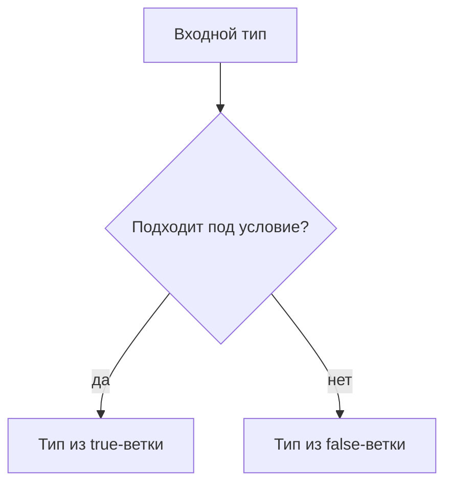

# Conditional Types

## Связь с предыдущей главой

Mapped types строят новый тип по ключам существующего типа.

Иногда преобразование зависит не от ключа, а от того, подходит ли один тип под другой.

## Главный вопрос

Как создавать типы с условной логикой?

## Мотивация

В проекте могут быть разные варианты результата:

```ts
type ApiSuccess = {
  ok: true;
  body: unknown;
};

type ApiFailure = {
  ok: false;
  error: string;
};
```

Иногда нужен вспомогательный тип, который выбирает одну форму типа в зависимости от входного типа.

## Теория

### Развилка на уровне типов

Условный тип выбирает один из двух типов:

```ts
type IsString<Value> = Value extends string ? true : false;
```

`extends` здесь означает не наследование, а **проверку совместимости**: «можно ли значение типа `Value` использовать там, где ожидается `string`».

Вычисление происходит при проверке типов и полностью исчезает после компиляции.

### Дистрибутивность

Главная особенность, о которую спотыкаются чаще всего. Если проверяется **голый параметр типа**, условие применяется к каждому члену объединения отдельно:

```ts
type ToArray<Value> = Value extends unknown ? Value[] : never;

type D = ToArray<string | number>;   // string[] | number[]
```

Результат — объединение массивов, а не массив объединения. Компилятор раздал условие по вариантам и собрал результаты обратно.

### Как отключить дистрибутивность

Приём — обернуть обе стороны в кортеж:

```ts
type NoDist<Value> = [Value] extends [unknown] ? Value[] : never;

type ND = NoDist<string | number>;   // (string | number)[]
```

Параметр перестаёт быть голым, объединение не разбирается по частям, и условие применяется к типу целиком.

Знать оба поведения важно: разница между `string[] | number[]` и `(string | number)[]` существенна, а выбирается она одной парой скобок.

### Фильтрация объединений

Дистрибутивность даёт стандартный приём — отсеивание вариантов через `never`:

```ts
type OnlyString<Value> = Value extends string ? Value : never;

type S = OnlyString<string | number | boolean>;   // string
```

`never` исчезает в объединении, поэтому неподходящие варианты просто пропадают. На этом устроены встроенные `Exclude` и `Extract`.

### Вложенные условия

Условия можно соединять в цепочку:

```ts
type Describe<Value> =
  Value extends string ? "строка" :
  Value extends number ? "число" :
  "другое";
```

Читается как последовательность проверок сверху вниз — так же, как цепочка `if`.

### Где остановиться

Условные типы позволяют построить внутри системы типов почти произвольные вычисления. Это редко окупается.

Практический ориентир: если тип требует комментария, чтобы его прочитать, скорее всего задачу лучше решить иначе — перегрузкой, дженериком или просто двумя отдельными типами. Сложность в типах платится временем каждого, кто потом читает код и разбирает сообщения об ошибках.

## Внутренний механизм



С generic-параметрами conditional types могут распределяться по union:

```ts
type ToArray<Value> = Value extends unknown ? Value[] : never;

type Result = ToArray<string | number>;
```

`Result` становится `string[] | number[]`.

Распределение происходит потому, что в условии используется naked type parameter `Value`. Это поведение на этапе проверки типов, а не цикл по значениям во время выполнения.

## Главная ментальная модель

Conditional type — это развилка на этапе проверки типов, которая выбирает тип, а не выполняет код.

## Практические примеры

```ts
type MessageFor<Result> = Result extends { ok: true }
  ? "success"
  : "failure";

type SuccessMessage = MessageFor<{ ok: true; body: string }>;
type FailureMessage = MessageFor<{ ok: false; error: string }>;
```

```ts
type OnlyString<Value> = Value extends string ? Value : never;

type StringPart = OnlyString<string | number | boolean>;
```

Запускаемые версии этих примеров находятся в:

```text
examples/02-typescript/chapter-143/
```

`01-is-string.ts` — условный тип с ветками `true` и `false`.

`02-filter-union.ts` — фильтрация объединения через `never`.

`03-conditional-diagnostic.ts` — выбрана не та ветка условного типа (намеренная ошибка).

## Automation QA

Conditional types полезны для вспомогательных типов:

```ts
type AssertionMessage<Result> = Result extends { passed: true }
  ? "Проверка прошла"
  : "Проверка упала";

type PassedMessage = AssertionMessage<{ passed: true }>;
```

Главное — не превращать типы в сложную программу.

## Распространённые ошибки

Ошибка — думать, что conditional type проверит данные во время выполнения:

```ts
type IsOk<Result> = Result extends { ok: true } ? true : false;
```

Если с сервера придет неправильный JSON, conditional type сам его не проверит.

## Распространённые мифы

**Миф: `extends` в условном типе — это наследование.**
Это проверка совместимости типов.

**Миф: условие применяется к объединению целиком.**
Если параметр голый, оно распределяется по каждому варианту.

**Миф: `ToArray<string | number>` даёт `(string | number)[]`.**
Даёт `string[] | number[]`. Второй результат получается только при отключённой дистрибутивности.

**Миф: условный тип может проверить данные.**
Он вычисляется при проверке типов и исчезает после компиляции.

## Частые вопросы

**Как отключить дистрибутивность?**
Обернуть обе стороны условия в кортеж: `[V] extends [U]`.

**Почему неподходящие варианты исчезают из результата?**
Они превращаются в `never`, а `never` растворяется в объединении.

**Когда условный тип оправдан?**
Когда связь между входом и выходом регулярна и выражается одной-двумя строками.

**Что делать, если тип стал нечитаемым?**
Разбить на именованные части или отказаться от вычислений в пользу перегрузки либо отдельных типов.

## Проверьте себя

1. Что означает `extends` в условном типе?
2. Что такое дистрибутивность и при каком условии она включается?
3. Чем различаются `string[] | number[]` и `(string | number)[]` и как выбрать нужное?
4. Почему `never` позволяет фильтровать объединения?
5. По какому признаку понять, что условный тип стал слишком сложным?

## Практика

Практические задания находятся в конце страницы.

## Краткие итоги

- Conditional type выбирает тип по условию `T extends U ? X : Y`.
- Это механизм этапа проверки типов, а не `if` во время выполнения.
- `extends` здесь означает assignability.
- Generic conditional types могут распределяться по union.
- Conditional types полезны, но легко становятся слишком сложными.

## Переход

Conditional types выбирают ветку. Следующая глава покажет, как внутри такой ветки извлечь часть типа через `infer`.
