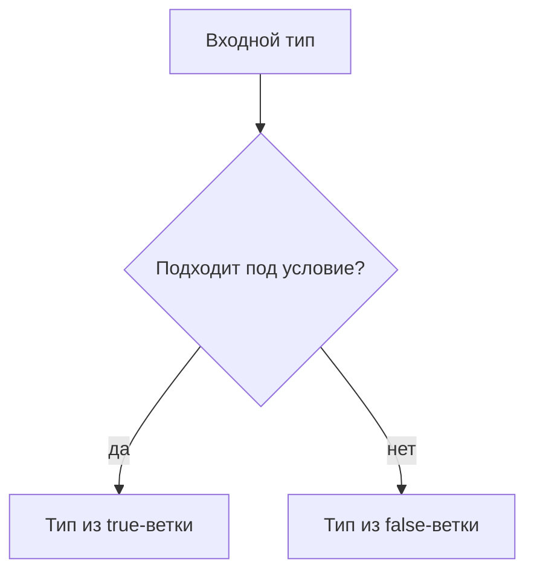

# Conditional Types

## Связь с предыдущей главой

Mapped types строят новый тип по ключам существующего типа.

Иногда преобразование зависит не от ключа, а от того, подходит ли один тип под другой.

## Главный вопрос

Как создавать типы с условной логикой?

## Мотивация

В проекте могут быть разные варианты результата:

```ts
type ApiSuccess = {
  ok: true;
  body: unknown;
};

type ApiFailure = {
  ok: false;
  error: string;
};
```

Иногда нужен вспомогательный тип, который выбирает одну форму типа в зависимости от входного типа.

## Теория

Conditional type записывается так:

```ts
type IsString<Value> = Value extends string ? true : false;
```

В этом контексте `extends` означает проверку assignability на уровне типов.

Это не `if` в JavaScript. Такой выбор выполняется во время проверки TypeScript и исчезает после компиляции.

## Внутренний механизм



С generic-параметрами conditional types могут распределяться по union:

```ts
type ToArray<Value> = Value extends unknown ? Value[] : never;

type Result = ToArray<string | number>;
```

`Result` становится `string[] | number[]`.

Распределение происходит потому, что в условии используется naked type parameter `Value`. Это поведение на этапе проверки типов, а не цикл по значениям во время выполнения.

## Главная ментальная модель

Conditional type — это развилка на этапе проверки типов, которая выбирает тип, а не выполняет код.

## Практические примеры

```ts
type MessageFor<Result> = Result extends { ok: true }
  ? "success"
  : "failure";

type SuccessMessage = MessageFor<{ ok: true; body: string }>;
type FailureMessage = MessageFor<{ ok: false; error: string }>;
```

```ts
type OnlyString<Value> = Value extends string ? Value : never;

type StringPart = OnlyString<string | number | boolean>;
```

## Automation QA

Conditional types полезны для вспомогательных типов:

```ts
type AssertionMessage<Result> = Result extends { passed: true }
  ? "Проверка прошла"
  : "Проверка упала";

type PassedMessage = AssertionMessage<{ passed: true }>;
```

Главное — не превращать типы в сложную программу.

## Распространённые ошибки

Ошибка — думать, что conditional type проверит данные во время выполнения:

```ts
type IsOk<Result> = Result extends { ok: true } ? true : false;
```

Если с сервера придет неправильный JSON, conditional type сам его не проверит.

## Практика

Практические задания находятся в конце страницы.

## Краткие итоги

- Conditional type выбирает тип по условию `T extends U ? X : Y`.
- Это механизм этапа проверки типов, а не `if` во время выполнения.
- `extends` здесь означает assignability.
- Generic conditional types могут распределяться по union.
- Conditional types полезны, но легко становятся слишком сложными.

## Переход

Conditional types выбирают ветку. Следующая глава покажет, как внутри такой ветки извлечь часть типа через `infer`.
