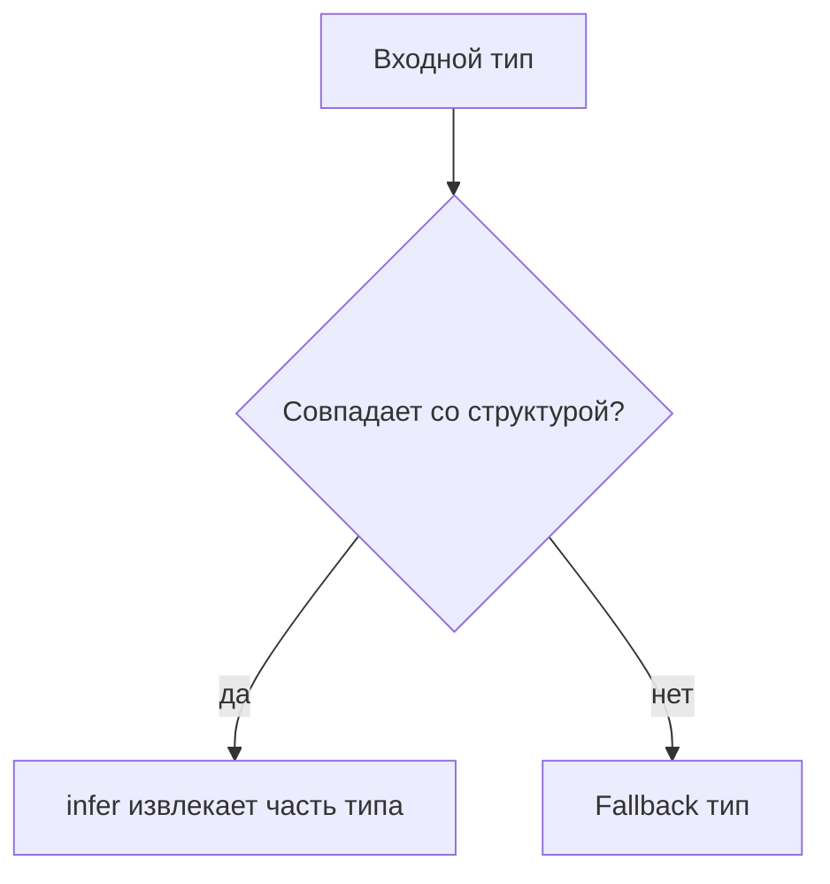

# infer

## Связь с предыдущей главой

Conditional types позволяют выбрать тип по условию.

`infer` добавляет возможность извлечь часть типа, если входной тип подходит под ожидаемую структуру.

## Главный вопрос

Как извлечь часть типа автоматически?

## Мотивация

Функция может возвращать сложный тип:

```ts
function createUser() {
  return {
    id: "u-1",
    role: "admin",
  };
}
```

Иногда нужно получить тип результата без ручного описания такой же структуры.

## Теория

`infer` используется внутри conditional type:

```ts
type FunctionResult<Fn> = Fn extends (...args: never[]) => infer Result
  ? Result
  : never;
```

`infer Result` говорит TypeScript: если `Fn` похож на функцию, извлеки тип ее результата и назови его `Result`.

Это не переменная JavaScript. Это временное имя типа внутри успешной ветки conditional type.

## Внутренний механизм



`infer` также может извлекать тип элемента массива:

```ts
type ArrayItem<Value> = Value extends Array<infer Item> ? Item : never;
```

## Главная ментальная модель

`infer` — это карман внутри conditional type, куда TypeScript кладет извлеченную часть типа.

## Практические примеры

```ts
type PromiseValue<Value> = Value extends Promise<infer Result>
  ? Result
  : Value;

type User = PromiseValue<Promise<{ id: string }>>;
```

```ts
type ItemOf<List> = List extends Array<infer Item> ? Item : never;

type TestName = ItemOf<string[]>;
```

## Automation QA

Async helpers часто возвращают `Promise`:

```ts
async function loadReport() {
  return {
    title: "Smoke",
    passed: true,
  };
}

type AsyncResult<Fn> = Fn extends (...args: never[]) => Promise<infer Result>
  ? Result
  : never;

type Report = AsyncResult<typeof loadReport>;
```

Так можно связать тип результата с реальной helper-функцией.

## Распространённые ошибки

Ошибка — использовать `infer` как обычный вывод generic-типа:

```ts
type Bad<Value> = infer Value;
```

`infer` работает только внутри шаблона conditional type.

## Практика

Практические задания находятся в конце страницы.

## Краткие итоги

- `infer` используется внутри conditional types.
- Он извлекает часть типа из подходящей структуры.
- `infer` не создает переменные во время выполнения.
- С его помощью можно извлекать return type, Promise value и array item.
- Сложные цепочки `infer` быстро ухудшают читаемость.

## Переход

Мы научились строить собственные преобразования. Следующая глава показывает готовые utility types, которые TypeScript уже предоставляет.
