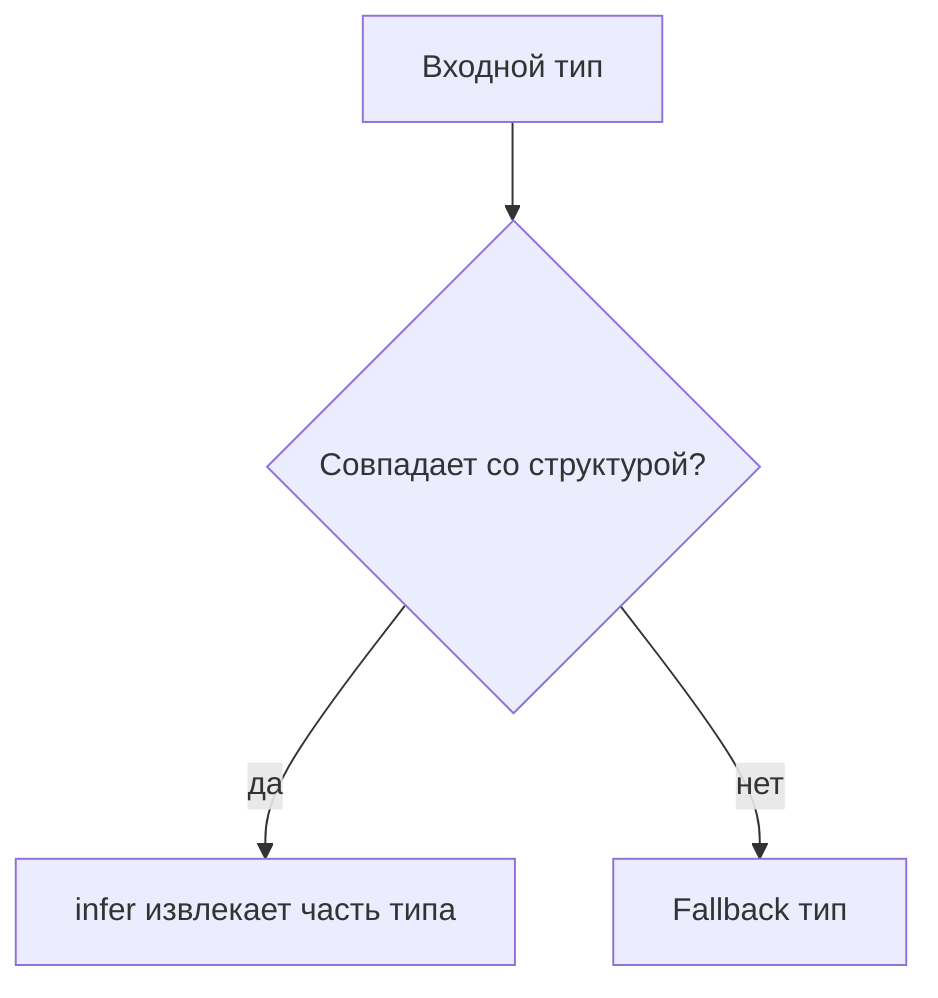

# infer

## Связь с предыдущей главой

Conditional types позволяют выбрать тип по условию.

`infer` добавляет возможность извлечь часть типа, если входной тип подходит под ожидаемую структуру.

## Главный вопрос

Как извлечь часть типа автоматически?

## Мотивация

Функция может возвращать сложный тип:

```ts
function createUser() {
  return {
    id: "u-1",
    role: "admin",
  };
}
```

Иногда нужно получить тип результата без ручного описания такой же структуры.

## Теория

### Карман для извлечённой части

`infer` объявляет временное имя для куска типа, который компилятор должен вытащить из структуры:

```ts
type FunctionResult<Fn> = Fn extends (...args: never[]) => infer Result
  ? Result
  : never;
```

Читается так: «если `Fn` похож на функцию — запомни тип её результата под именем `Result` и верни его».

Имя существует **только в истинной ветке** условного типа. В ложной ветке его нет, и использовать там его нельзя.

### Работает только внутри условного типа

```ts
type Bad<Value> = infer Value;   // ошибка
```

`infer` не самостоятельная конструкция: он имеет смысл только как часть шаблона, с которым что-то сопоставляется.

### Извлечение из разных структур

Приём один и тот же, меняется только шаблон:

```ts
type ItemOf<List> = List extends Array<infer Item> ? Item : never;
type Unwrap<Value> = Value extends Promise<infer Result> ? Result : Value;
type FirstArg<Fn> = Fn extends (first: infer Arg, ...rest: never[]) => unknown ? Arg : never;
```

Обратите внимание на `Unwrap`: в ложной ветке возвращается сам `Value`, а не `never`. Так тип становится «разверни, если это промис, иначе оставь как есть» — типичный полезный вариант.

### Ограничение у `infer`

Извлекаемый тип можно сузить прямо в шаблоне:

```ts
type FirstChar<S> = S extends `${infer C extends string}${string}` ? C : never;
```

Ограничение полезно, когда без него компилятор выведет слишком широкий тип.

### Несколько `infer` в одном шаблоне

```ts
type Split<Fn> = Fn extends (arg: infer Arg) => infer Result
  ? { arg: Arg; result: Result }
  : never;
```

Каждое имя заполняется независимо. Если одно и то же имя встречается дважды, компилятор объединит найденные варианты.

### Зачем это в тестовом коде

Главное применение — **связать тип с реальной функцией**, вместо того чтобы описывать её результат отдельно:

```ts
async function loadReport() {
  return { title: "Smoke", passed: true };
}

type Report = Awaited<ReturnType<typeof loadReport>>;
```

Здесь `infer` работает внутри встроенных `ReturnType` и `Awaited`. Тип отчёта извлечён из самой функции: изменится реализация — изменится и тип, без ручной правки.

Именно так `infer` чаще всего и встречается на практике: не напрямую, а внутри стандартных утилит.

## Внутренний механизм



`infer` также может извлекать тип элемента массива:

```ts
type ArrayItem<Value> = Value extends Array<infer Item> ? Item : never;
```

## Главная ментальная модель

`infer` — это карман внутри conditional type, куда TypeScript кладет извлеченную часть типа.

## Практические примеры

```ts
type PromiseValue<Value> = Value extends Promise<infer Result>
  ? Result
  : Value;

type User = PromiseValue<Promise<{ id: string }>>;
```

```ts
type ItemOf<List> = List extends Array<infer Item> ? Item : never;

type TestName = ItemOf<string[]>;
```

Запускаемые версии этих примеров находятся в:

```text
examples/02-typescript/chapter-144/
```

`01-array-item-infer.ts` — извлечение типа элемента через `infer`.

`02-promise-value.ts` — извлечение типа значения промиса.

`03-infer-diagnostic.ts` — `never`, когда шаблон не совпал (намеренная ошибка).

## Automation QA

Async helpers часто возвращают `Promise`:

```ts
async function loadReport() {
  return {
    title: "Smoke",
    passed: true,
  };
}

type AsyncResult<Fn> = Fn extends (...args: never[]) => Promise<infer Result>
  ? Result
  : never;

type Report = AsyncResult<typeof loadReport>;
```

Так можно связать тип результата с реальной helper-функцией.

## Распространённые ошибки

Ошибка — использовать `infer` как обычный вывод generic-типа:

```ts
type Bad<Value> = infer Value;
```

`infer` работает только внутри шаблона conditional type.

## Распространённые мифы

**Миф: `infer` — это объявление переменной типа.**
Это шаблон для сопоставления, работающий только внутри условного типа.

**Миф: имя из `infer` доступно в обеих ветках.**
Только в истинной. В ложной его не существует.

**Миф: `infer` нужен в повседневном коде.**
Чаще он встречается внутри готовых утилит вроде `ReturnType` и `Awaited`.

**Миф: ложная ветка обязана возвращать `never`.**
Часто полезнее вернуть исходный тип — получится «разверни, если подходит».

## Частые вопросы

**Почему `type Bad<V> = infer V` не работает?**
`infer` имеет смысл только как часть шаблона в условном типе.

**Как извлечь тип результата асинхронной функции?**
`Awaited<ReturnType<typeof fn>>` — обе утилиты построены на `infer`.

**Что делать, если извлечённый тип слишком широк?**
Добавить ограничение прямо в шаблоне: `infer C extends string`.

**Можно ли использовать несколько `infer` сразу?**
Да, каждое имя заполняется независимо.

## Проверьте себя

1. Что делает `infer` и где существует объявленное им имя?
2. Почему `infer` нельзя использовать вне условного типа?
3. Чем полезен возврат исходного типа в ложной ветке?
4. Зачем ограничивать извлекаемый тип?
5. Где `infer` встречается на практике чаще всего?

## Практика

Практические задания находятся в конце страницы.

## Краткие итоги

- `infer` используется внутри conditional types.
- Он извлекает часть типа из подходящей структуры.
- `infer` не создает переменные во время выполнения.
- С его помощью можно извлекать return type, Promise value и array item.
- Сложные цепочки `infer` быстро ухудшают читаемость.

## Переход

Мы научились строить собственные преобразования. Следующая глава показывает готовые utility types, которые TypeScript уже предоставляет.
