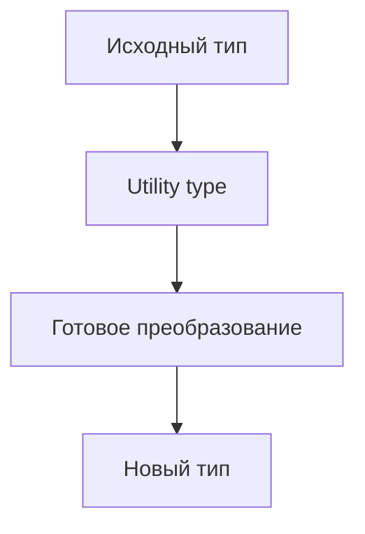

# Utility Types

## Связь с предыдущей главой

`infer`, conditional types и mapped types позволяют создавать собственные преобразования типов.

Но многие типовые преобразования уже есть в TypeScript.

## Главный вопрос

Какие типовые преобразования TypeScript уже предоставляет?

## Мотивация

В проекте часто нужно:

- сделать все поля необязательными;
- выбрать часть полей;
- исключить часть полей;
- описать словарь;
- получить параметры или результат функции.

Если каждый раз писать такие преобразования вручную, типы станут шумными.

## Теория

Utility types — это готовые generic-типы из стандартной библиотеки TypeScript.

Примеры:

```ts
type User = {
  id: string;
  email: string;
  role: "admin" | "viewer";
};

type UserPatch = Partial<User>;
type PublicUser = Pick<User, "id" | "email">;
type UserWithoutRole = Omit<User, "role">;
```

Они не создают код времени выполнения. Это только описание для проверки.

## Внутренний механизм



Многие utility types построены на уже изученных операциях: `keyof`, mapped types, conditional types и `infer`.

## Главная ментальная модель

Utility types — это стандартные инструменты для частых преобразований типов.

## Практические примеры

```ts
type Config = {
  baseUrl: string;
  retries: number;
  report: "html" | "json";
};

type ConfigDraft = Partial<Config>;
type RequiredConfig = Required<ConfigDraft>;
type ReadonlyConfig = Readonly<Config>;
```

```ts
type Status = "passed" | "failed" | "skipped";

type FinalStatus = Exclude<Status, "skipped">;
type FailedOrSkipped = Extract<Status, "failed" | "skipped">;
```

```ts
function buildTitle(suite: string, test: string) {
  return `${suite}: ${test}`;
}

type TitleArgs = Parameters<typeof buildTitle>;
type Title = ReturnType<typeof buildTitle>;
```

## Automation QA

Utility types хорошо подходят для test data и API-моделей:

```ts
type CreateUserPayload = {
  email: string;
  password: string;
  role: "admin" | "viewer";
};

type UpdateUserPayload = Partial<CreateUserPayload>;
type PublicUserPayload = Omit<CreateUserPayload, "password">;
type UserById = Record<string, PublicUserPayload>;
```

Так типы остаются связанными между собой.

## Распространённые ошибки

Ошибка — использовать utility types без понимания исходной формы:

```ts
type LooseUser = Partial<User>;
```

Если сделать все поля optional без причины, можно ослабить контракт сильнее, чем нужно.

## Практика

Практические задания находятся в конце страницы.

## Краткие итоги

- Utility types — готовые преобразования типов.
- `Partial`, `Required`, `Readonly`, `Pick`, `Omit`, `Record` работают с объектными формами.
- `Exclude` и `Extract` работают с union.
- `ReturnType` и `Parameters` извлекают части function type.
- Utility types не выполняют преобразования во время выполнения.

## Переход

Раздел операций над типами завершен. Следующий модуль переходит к классам и объектным контрактам TypeScript.
