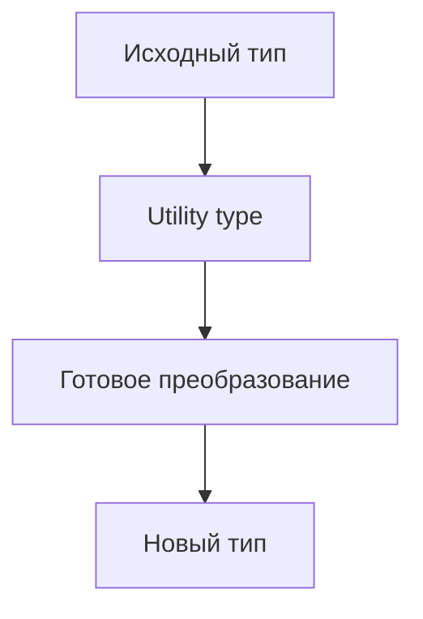

# Utility Types

## Связь с предыдущей главой

`infer`, conditional types и mapped types позволяют создавать собственные преобразования типов.

Но многие типовые преобразования уже есть в TypeScript.

## Главный вопрос

Какие типовые преобразования TypeScript уже предоставляет?

## Мотивация

В проекте часто нужно:

- сделать все поля необязательными;
- выбрать часть полей;
- исключить часть полей;
- описать словарь;
- получить параметры или результат функции.

Если каждый раз писать такие преобразования вручную, типы станут шумными.

## Теория

### Готовые преобразования типов

Utility types — стандартные обобщённые типы, доступные без импорта. Они не добавляют кода: это те же сопоставленные и условные типы, только уже написанные.

Полезно держать в голове их деление по назначению.

### Работа с ключами объекта

```ts
type User = { id: string; email: string; role: "admin" | "viewer" };

type Draft = Partial<User>;              // все поля необязательны
type Full = Required<Draft>;             // все обязательны
type Frozen = Readonly<User>;            // все readonly
type Public = Pick<User, "id" | "email">;// оставить перечисленные
type NoRole = Omit<User, "role">;        // убрать перечисленные
```

`Pick` и `Omit` решают одну задачу с разных сторон. Выбирают тот, который придётся реже менять: если полей много, а нужно два — `Pick`; если нужно убрать одно — `Omit`.

### Работа с объединениями

```ts
type Status = "passed" | "failed" | "skipped";

type Final = Exclude<Status, "skipped">;          // 'passed' | 'failed'
type Unfinished = Extract<Status, "skipped">;     // 'skipped'
type Defined = NonNullable<string | undefined>;   // string
```

Все три построены на дистрибутивном условном типе из главы 143.

### Работа с функциями

```ts
function buildTitle(suite: string, test: string) {
  return `${suite}: ${test}`;
}

type Args = Parameters<typeof buildTitle>;    // [suite: string, test: string]
type Title = ReturnType<typeof buildTitle>;   // string
type Value = Awaited<Promise<Promise<string>>>;  // string
```

`Awaited` разворачивает вложенные промисы до конца — именно так работает `await`.

### Словари

```ts
type ByEnvironment = Record<"local" | "staging", string>;
```

`Record` с объединением литералов требует все ключи и запрещает лишние. С `string` в качестве ключа он эквивалентен индексной сигнатуре.

### Опасность `Partial`

Самая частая ошибка — применять `Partial` там, где нужен другой смысл:

```ts
type UpdatePayload = Partial<User>;
```

Это уместно, если обновлять действительно можно любое подмножество полей. Но `Partial` разрешает и **пустой объект**, и любое сочетание — включая бессмысленные. Если допустимы только определённые комбинации, точнее описывать их размеченным объединением.

Правило: `Partial` выражает «любое подмножество», а не «некоторые поля необязательны».

### Собственные утилиты

Ничто не мешает написать свою:

```ts
type Nullable<Type> = { [Key in keyof Type]: Type[Key] | null };
```

Но прежде стоит проверить, нет ли готовой: встроенные знакомы всем, а собственные требуют объяснения.

## Внутренний механизм



Многие utility types построены на уже изученных операциях: `keyof`, mapped types, conditional types и `infer`.

## Главная ментальная модель

Utility types — это стандартные инструменты для частых преобразований типов.

## Практические примеры

```ts
type Config = {
  baseUrl: string;
  retries: number;
  report: "html" | "json";
};

type ConfigDraft = Partial<Config>;
type RequiredConfig = Required<ConfigDraft>;
type ReadonlyConfig = Readonly<Config>;
```

```ts
type Status = "passed" | "failed" | "skipped";

type FinalStatus = Exclude<Status, "skipped">;
type FailedOrSkipped = Extract<Status, "failed" | "skipped">;
```

```ts
function buildTitle(suite: string, test: string) {
  return `${suite}: ${test}`;
}

type TitleArgs = Parameters<typeof buildTitle>;
type Title = ReturnType<typeof buildTitle>;
```

## Automation QA

Utility types хорошо подходят для test data и API-моделей:

```ts
type CreateUserPayload = {
  email: string;
  password: string;
  role: "admin" | "viewer";
};

type UpdateUserPayload = Partial<CreateUserPayload>;
type PublicUserPayload = Omit<CreateUserPayload, "password">;
type UserById = Record<string, PublicUserPayload>;
```

Так типы остаются связанными между собой.

## Распространённые ошибки

Ошибка — использовать utility types без понимания исходной формы:

```ts
type LooseUser = Partial<User>;
```

Если сделать все поля optional без причины, можно ослабить контракт сильнее, чем нужно.

## Распространённые мифы

**Миф: utility types добавляют код.**
Это обычные типы; после компиляции от них ничего не остаётся.

**Миф: `Partial` — безопасный способ сделать поля необязательными.**
Он разрешает любое подмножество, включая пустое. Для ограниченных сочетаний нужны варианты.

**Миф: `Pick` и `Omit` взаимозаменяемы.**
Задача одна, но устойчивость к изменениям разная: выбирают ту запись, которую придётся реже править.

**Миф: `Awaited` снимает один уровень промиса.**
Он разворачивает вложенность до конца, как и `await`.

## Частые вопросы

**Когда `Pick`, а когда `Omit`?**
`Pick` — когда нужно оставить немногое. `Omit` — когда нужно убрать немногое.

**Чем `Record<string, T>` отличается от индексной сигнатуры?**
Ничем по смыслу. Разница появляется при ключах-литералах: тогда `Record` требует все ключи.

**Как получить тип результата асинхронной функции?**
`Awaited<ReturnType<typeof fn>>`.

**Стоит ли писать собственные утилиты?**
Только если готовой нет. Встроенные понятны без объяснений.

## Проверьте себя

1. На каких изученных конструкциях построены `Exclude` и `Extract`?
2. Чем `Pick` отличается от `Omit` с точки зрения поддержки кода?
3. Почему `Partial` может ослабить контракт сильнее, чем нужно?
4. Что делает `Awaited` с вложенными промисами?
5. Когда `Record` строже индексной сигнатуры?

## Практика

Практические задания находятся в конце страницы.

## Краткие итоги

- Utility types — готовые преобразования типов.
- `Partial`, `Required`, `Readonly`, `Pick`, `Omit`, `Record` работают с объектными формами.
- `Exclude` и `Extract` работают с union.
- `ReturnType` и `Parameters` извлекают части function type.
- Utility types не выполняют преобразования во время выполнения.

## Переход

Раздел операций над типами завершен. Следующий модуль переходит к классам и объектным контрактам TypeScript.
