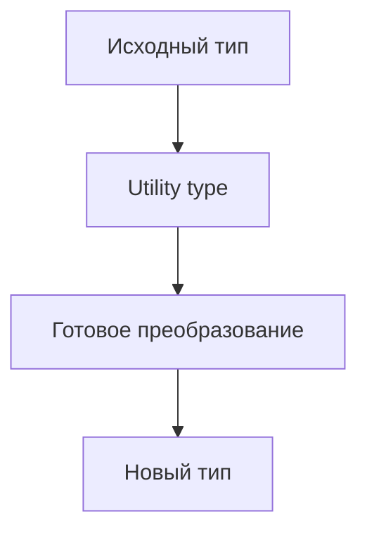

# Служебные типы

## Связь с предыдущей главой

`infer`, conditional types и mapped types позволяют создавать собственные преобразования типов.

Но многие типовые преобразования уже есть в TypeScript.

## Главный вопрос

Какие типовые преобразования TypeScript уже предоставляет?

## Мотивация

В проекте часто нужно:

- сделать все поля необязательными;
- выбрать часть полей;
- исключить часть полей;
- описать словарь;
- получить параметры или результат функции.

Если каждый раз писать такие преобразования вручную, типы станут шумными.

## Теория

### Готовые преобразования типов

Служебные типы — стандартные обобщённые типы, доступные без импорта. Они не добавляют кода: это те же отображённые и условные типы, только уже написанные.

Полезно держать в голове их деление по назначению.

### Работа с ключами объекта

```ts
type User = { id: string; email: string; role: "admin" | "viewer" };

type Draft = Partial<User>;              // все поля необязательны
type Full = Required<Draft>;             // все обязательны
type Frozen = Readonly<User>;            // все readonly
type Public = Pick<User, "id" | "email">;// оставить перечисленные
type NoRole = Omit<User, "role">;        // убрать перечисленные
```

`Pick` и `Omit` решают одну задачу с разных сторон. Выбирают тот, который придётся реже менять: если полей много, а нужно два — `Pick`; если нужно убрать одно — `Omit`.

### Работа с объединениями

```ts
type Status = "passed" | "failed" | "skipped";

type Final = Exclude<Status, "skipped">;          // 'passed' | 'failed'
type Unfinished = Extract<Status, "skipped">;     // 'skipped'
type Defined = NonNullable<string | undefined>;   // string
```

Все три построены на дистрибутивном условном типе из главы 143.

### Работа с функциями

```ts
function buildTitle(suite: string, test: string) {
  return `${suite}: ${test}`;
}

type Args = Parameters<typeof buildTitle>;    // [suite: string, test: string]
type Title = ReturnType<typeof buildTitle>;   // string
type Value = Awaited<Promise<Promise<string>>>;  // string
```

`Awaited` разворачивает вложенные промисы до конца — именно так работает `await`.

### Словари

```ts
type ByEnvironment = Record<"local" | "staging", string>;
```

`Record` с объединением литералов требует все ключи и запрещает лишние. С `string` в качестве ключа он эквивалентен индексной сигнатуре.

### Опасность `Partial`

Самая частая ошибка — применять `Partial` там, где нужен другой смысл:

```ts
type UpdatePayload = Partial<User>;
```

Это уместно, если обновлять действительно можно любое подмножество полей. Но `Partial` разрешает и **пустой объект**, и любое сочетание — включая бессмысленные. Если допустимы только определённые комбинации, точнее описывать их размеченным объединением.

Правило: `Partial` выражает «любое подмножество», а не «некоторые поля необязательны».

### Собственные утилиты

Ничто не мешает написать свою:

```ts
type Nullable<Type> = { [Key in keyof Type]: Type[Key] | null };
```

Но прежде стоит проверить, нет ли готовой: встроенные знакомы всем, а собственные требуют объяснения.

## Внутренний механизм


```mermaid
flowchart TD
    A[Исходный тип] --> B[Utility type]
    B --> C[Готовое преобразование]
    C --> D[Новый тип]
```

Многие служебные типы построены на уже изученных операциях: `keyof`, отображённых и условных типах и `infer`.

### Из чего они сделаны

| Утилита | Определение |
| --- | --- |
| `Partial<T>` | отображённый тип с `?` |
| `Required<T>` | отображённый тип с `-?` |
| `Readonly<T>` | отображённый тип с `readonly` |
| `Pick<T, K>` | отображение по подмножеству ключей |
| `Omit<T, K>` | `Pick<T, Exclude<keyof T, K>>` |
| `Exclude`, `Extract` | распределение условного типа |
| `ReturnType`, `Parameters` | условный тип с `infer` |
| `Awaited<T>` | рекурсивный `infer` по `Promise` |

Ничего особенного в них нет — это те же операции над типами, собранные в
стандартной библиотеке. Полезно уметь читать их определения: сообщение об ошибке
часто показывает раскрытую форму.

### Пара различий, которые путают

```ts
type A = Omit<WorkItem, "id">;        // ключи проверяются НЕ строго
type B = Pick<WorkItem, "id">;        // ключ обязан существовать

Omit<WorkItem, "опечатка">;           // ошибки нет, тип просто не изменится
Pick<WorkItem, "опечатка">;           // ошибка компиляции
```

`Omit` принимает любые ключи по историческим причинам, и опечатка в нём
проходит молча. Если это важно, ключи ограничивают явно:
`Omit<T, K extends keyof T>`.

Отдельно: `Record<K, V>` создаёт тип с ключами `K` — но `Record<string, V>` не
означает, что все строки есть в объекте. Обращение по отсутствующему ключу даст
`V`, а в прогоне `undefined`, пока не включён `noUncheckedIndexedAccess`.

## Главная ментальная модель

Служебные типы — это стандартные инструменты для частых преобразований.

## Практические примеры

```ts
type Config = {
  baseUrl: string;
  retries: number;
  report: "html" | "json";
};

type ConfigDraft = Partial<Config>;
type RequiredConfig = Required<ConfigDraft>;
type ReadonlyConfig = Readonly<Config>;
```

```ts
type Status = "passed" | "failed" | "skipped";

type FinalStatus = Exclude<Status, "skipped">;
type FailedOrSkipped = Extract<Status, "failed" | "skipped">;
```

```ts
function buildTitle(suite: string, test: string) {
  return `${suite}: ${test}`;
}

type TitleArgs = Parameters<typeof buildTitle>;
type Title = ReturnType<typeof buildTitle>;
```

Запускаемые версии этих примеров находятся в:

```text
examples/02-typescript/chapter-145/
```

`01-object-utilities.ts` — `Partial` и `Pick` для типа объекта.

`02-function-utilities.ts` — `Parameters` и `ReturnType`.

`03-utility-diagnostic.ts` — значение, исключённое через `Exclude` (намеренная ошибка).

## Automation QA

Служебные типы хорошо подходят для тестовых данных и моделей API:

```ts
type CreateUserPayload = {
  email: string;
  password: string;
  role: "admin" | "viewer";
};

type UpdateUserPayload = Partial<CreateUserPayload>;
type PublicUserPayload = Omit<CreateUserPayload, "password">;
type UserById = Record<string, PublicUserPayload>;
```

Так типы остаются связанными между собой.

### Какие служебные типы нужны в автоматизации

| Тип | Где применяется |
| --- | --- |
| `Partial<T>` | переопределения построителя данных |
| `Omit<T, K>` | модель ответа без секретов: пароль, токен |
| `Pick<T, K>` | проекция для проверки: сравниваем два-три поля |
| `Required<T>` | форма после проверки, где все поля заполнены |
| `Readonly<T>` | справочные данные, общие для нескольких тестов |
| `Record<K, V>` | карта окружений, карта локаторов |

Первые две строки закрывают большую часть работы: `Partial` — на входе
построителя, `Omit` — на выходе в отчёт.

### `Required` описывает, но не заполняет

Важная граница: служебный тип меняет **тип**, а не значение. `Required<Draft>`
не добавит недостающих полей во время выполнения — он лишь запретит
компилятору считать их необязательными.

```ts
const draft: Partial<CreateUserPayload> = { email: 'qa@example.test' };

// Обещание, а не проверка: password по-прежнему отсутствует.
const full = draft as Required<CreateUserPayload>;
```

Превращение черновика в полную форму делает функция, которая проверяет поля и
возвращает либо значение, либо ошибку.

## Распространённые ошибки

Ошибка — использовать служебные типы без понимания исходной формы:

```ts
type LooseUser = Partial<User>;
```

Если сделать все поля необязательными без причины, можно ослабить договор сильнее, чем нужно.

## Распространённые мифы

**Миф: служебные типы добавляют код.**
Это обычные типы; после компиляции от них ничего не остаётся.

**Миф: `Partial` — безопасный способ сделать поля необязательными.**
Он разрешает любое подмножество, включая пустое. Для ограниченных сочетаний нужны варианты.

**Миф: `Pick` и `Omit` взаимозаменяемы.**
Задача одна, но устойчивость к изменениям разная: выбирают ту запись, которую придётся реже править.

**Миф: `Awaited` снимает один уровень промиса.**
Он разворачивает вложенность до конца, как и `await`.

## Частые вопросы

**Когда `Pick`, а когда `Omit`?**
`Pick` — когда нужно оставить немногое. `Omit` — когда нужно убрать немногое.

**Чем `Record<string, T>` отличается от индексной сигнатуры?**
Ничем по смыслу. Разница появляется при ключах-литералах: тогда `Record` требует все ключи.

**Как получить тип результата асинхронной функции?**
`Awaited<ReturnType<typeof fn>>`.

**Стоит ли писать собственные утилиты?**
Только если готовой нет. Встроенные понятны без объяснений.

## Проверьте себя

1. На каких изученных конструкциях построены `Exclude` и `Extract`?
2. Чем `Pick` отличается от `Omit` с точки зрения поддержки кода?
3. Почему `Partial` может ослабить контракт сильнее, чем нужно?
4. Что делает `Awaited` с вложенными промисами?
5. Когда `Record` строже индексной сигнатуры?

### Ответы

1. На условных типах и дистрибутивности: каждый член объединения проверяется отдельно и отображается либо в себя, либо в `never`.
2. `Pick` перечисляет нужное: при добавлении поля в источник производный тип не меняется. `Omit` перечисляет лишнее: новое поле автоматически попадает в результат. Выбор зависит от того, какое поведение при изменении контракта правильнее.
3. Он делает необязательными все свойства сразу, включая те, что обязаны быть. Обычно нужнее точечный вариант через `Partial` от `Pick`.
4. Разворачивает их до конечного типа значения: `Awaited<Promise<Promise<T>>>` даёт `T`.
5. Когда ключи заданы объединением литералов: тогда перечень допустимых ключей точен, а обращение гарантированно даёт значение. Индексная сигнатура разрешает любой ключ.

## Практика

Практические задания находятся в конце страницы.

## Краткие итоги

- Служебные типы — готовые преобразования типов.
- `Partial`, `Required`, `Readonly`, `Pick`, `Omit`, `Record` работают с объектными формами.
- `Exclude` и `Extract` работают с объединением.
- `ReturnType` и `Parameters` извлекают части типа функции.
- Служебные типы не выполняют преобразований во время выполнения.

## Переход

Раздел операций над типами завершен. Следующий модуль переходит к классам и объектным контрактам TypeScript.
