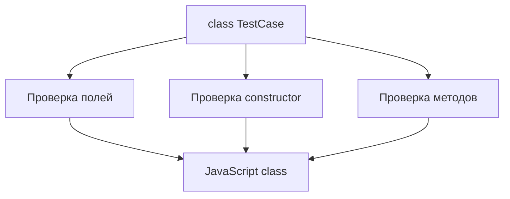

# Typed Classes

## Связь с предыдущей главой

В главе про utility types мы использовали готовые преобразования типов для объектов и функций.

Теперь мы переходим к классам. JavaScript-классы уже знакомы, но TypeScript добавляет к ним проверку полей, конструктора и методов.

## Главный вопрос

Как TypeScript проверяет поля, конструктор и методы класса?

## Мотивация

В большом проекте классы часто становятся публичными точками входа:

- Page Object;
- helper;
- API client;
- config reader;
- reporter.

Если поле класса не инициализировано или метод возвращает не тот результат, ошибка может проявиться далеко от места создания объекта.

TypeScript помогает обнаружить такие ошибки до запуска.

## Теория

### Класс существует во время выполнения

В отличие от `interface` и `type`, класс после компиляции остаётся:

```ts
class TestCase {
  title: string;

  constructor(title: string) {
    this.title = title;
  }
}
```

Отсюда его двойственность: имя `TestCase` означает **и значение, и тип**.

```ts
const instance = new TestCase("x");   // значение: конструктор
function run(test: TestCase) { }       // тип: форма экземпляра
```

Важно: в позиции типа имя класса означает тип **экземпляра**, а не самого конструктора. Тип конструктора записывается как `typeof TestCase`.

### Что проверяет компилятор

- какие поля есть у экземпляра и каких они типов;
- что передаётся в конструктор;
- что принимают и возвращают методы;
- что поля инициализированы к концу конструктора.

Последний пункт обеспечивает `strictPropertyInitialization` в составе `strict`: поле, объявленное без значения и не заполненное в конструкторе, вызовет ошибку. Это ловит целый класс ошибок с `undefined` в полях.

### Проверка остаётся структурной

Класс не становится номинальным типом:

```ts
class ReportEntry { title = ""; }

const looksLike = { title: "x" };
const entry: ReportEntry = looksLike;   // допустимо
```

Объект подходящей формы годится там, где ожидается экземпляр. При этом `looksLike instanceof ReportEntry` вернёт `false` — совместимость типов и принадлежность классу это разные вещи.

### Приватное поле делает класс номинальным

Если нужно, чтобы посторонний объект не подошёл, достаточно добавить приватное поле:

```ts
class WithPrivate { #secret = 1; public v = 2; }
class Lookalike { public v = 2; }

const w: WithPrivate = new Lookalike();   // ошибка
```

Приватное поле нельзя воспроизвести снаружи, поэтому структурное совпадение становится невозможным. Это тот же приём с меткой из главы 114, только встроенный в язык.

### Сокращённая запись полей

Параметры конструктора с модификатором доступа объявляют и инициализируют поле одновременно:

```ts
class ReportEntry {
  constructor(
    public readonly title: string,
    public readonly status: "passed" | "failed",
  ) {}
}
```

Это не просто сахар: такая запись порождает реальные присваивания в скомпилированном коде — один из немногих случаев, когда конструкция TypeScript оставляет след во время выполнения.

### Класс не проверяет внешние данные

Тип поля описывает ожидание, а не гарантию:

```ts
const entry = new ReportEntry(rawTitle, rawStatus);
```

Если значения пришли из JSON, конструктор их не проверит. Класс с валидацией внутри конструктора — рабочий приём, но проверку нужно написать самому.

## Внутренний механизм



После компиляции типы исчезают. Остается обычный JavaScript-класс.

## Главная ментальная модель

Typed class — это JavaScript-класс с проверяемым контрактом экземпляра.

## Практические примеры

```ts
class TestCase {
  title: string;
  retries: number;

  constructor(title: string, retries: number) {
    this.title = title;
    this.retries = retries;
  }

  buildLabel(): string {
    return `${this.title} (${this.retries})`;
  }
}

const test = new TestCase("opens login page", 2);
console.log(test.buildLabel());
```

`TestCase` в позиции типа означает тип экземпляра:

```ts
function printTest(test: TestCase): void {
  console.log(test.buildLabel());
}
```

Такой тип проверяется структурно по публичной форме. Объект с теми же публичными полями и методами может подойти как тип `TestCase`, но от этого он не становится настоящим экземпляром `TestCase` во время выполнения. Проверка `instanceof TestCase` по-прежнему зависит от prototype chain.

Запускаемые версии этих примеров находятся в:

```text
examples/02-typescript/chapter-146/
```

`01-typed-class.ts` — поля и методы класса с типами.

`02-instance-type.ts` — класс в позиции типа экземпляра.

`03-class-diagnostics.ts` — аргумент конструктора неверного типа (намеренная ошибка).

## Automation QA

В QA-проекте класс может описывать helper для отчета:

```ts
class ReportEntry {
  title: string;
  status: "passed" | "failed";

  constructor(title: string, status: "passed" | "failed") {
    this.title = title;
    this.status = status;
  }

  toLine(): string {
    return `${this.status}: ${this.title}`;
  }
}
```

Так TypeScript проверяет, что status не станет случайной строкой.

## Распространённые ошибки

Ошибка — думать, что тип поля проверяет внешние данные во время выполнения.

```ts
class User {
  email: string;

  constructor(email: string) {
    this.email = email;
  }
}
```

Если данные пришли из внешнего источника, TypeScript не проверит их автоматически во время выполнения.

## Распространённые мифы

**Миф: имя класса в позиции типа означает конструктор.**
Оно означает тип экземпляра. Конструктор — это `typeof Class`.

**Миф: только настоящий экземпляр подойдёт под тип класса.**
Проверка структурная: подойдёт любой объект нужной формы.

**Миф: класс валидирует данные в конструкторе.**
Только если валидация написана явно. Типы стираются.

**Миф: параметры конструктора с модификатором — просто синтаксический сахар без следа.**
Они порождают реальные присваивания в скомпилированном коде.

## Частые вопросы

**Как сделать класс несовместимым с похожими объектами?**
Добавить приватное поле — структурное совпадение станет невозможным.

**Почему компилятор требует инициализировать поле?**
Это `strictPropertyInitialization`: иначе поле могло бы оказаться `undefined` вопреки объявленному типу.

**Чем отличается `Class` от `typeof Class` в позиции типа?**
Первое — тип экземпляра, второе — тип конструктора.

**Стоит ли проверять данные в конструкторе?**
Да, если объект создаётся из внешних данных: иначе неверное значение разойдётся по коду.

## Проверьте себя

1. Почему имя класса одновременно значение и тип?
2. Что означает имя класса в позиции типа?
3. Почему объект подходящей формы подходит под тип класса, но не проходит `instanceof`?
4. Как приватное поле влияет на совместимость типов?
5. Какую ошибку предотвращает `strictPropertyInitialization`?

## Практика

Практические задания находятся в конце страницы.

## Краткие итоги

- Классы существуют во время выполнения как JavaScript-классы.
- TypeScript проверяет поля, конструктор и методы до запуска.
- Имя класса в позиции типа описывает экземпляр класса.
- Типы полей не являются проверкой внешних данных во время выполнения.

## Переход

Теперь мы умеем описывать форму экземпляра класса. Следующий шаг — ограничить доступ к деталям реализации класса.
