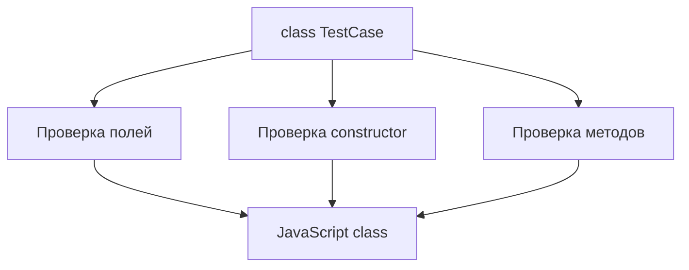

# Typed Classes

## Связь с предыдущей главой

В главе про utility types мы использовали готовые преобразования типов для объектов и функций.

Теперь мы переходим к классам. JavaScript-классы уже знакомы, но TypeScript добавляет к ним проверку полей, конструктора и методов.

## Главный вопрос

Как TypeScript проверяет поля, конструктор и методы класса?

## Мотивация

В большом проекте классы часто становятся публичными точками входа:

- Page Object;
- helper;
- API client;
- config reader;
- reporter.

Если поле класса не инициализировано или метод возвращает не тот результат, ошибка может проявиться далеко от места создания объекта.

TypeScript помогает обнаружить такие ошибки до запуска.

## Теория

Класс в TypeScript остается JavaScript-классом.

Он существует во время выполнения:

```ts
class TestCase {
  title: string;

  constructor(title: string) {
    this.title = title;
  }
}

const test = new TestCase("opens login page");
```

TypeScript добавляет проверку:

- какие поля есть у экземпляра;
- какие значения можно передать в конструктор;
- какие параметры принимает метод;
- какой результат метод возвращает.

## Внутренний механизм



После компиляции типы исчезают. Остается обычный JavaScript-класс.

## Главная ментальная модель

Typed class — это JavaScript-класс с проверяемым контрактом экземпляра.

## Практические примеры

```ts
class TestCase {
  title: string;
  retries: number;

  constructor(title: string, retries: number) {
    this.title = title;
    this.retries = retries;
  }

  buildLabel(): string {
    return `${this.title} (${this.retries})`;
  }
}

const test = new TestCase("opens login page", 2);
console.log(test.buildLabel());
```

`TestCase` в позиции типа означает тип экземпляра:

```ts
function printTest(test: TestCase): void {
  console.log(test.buildLabel());
}
```

Такой тип проверяется структурно по публичной форме. Объект с теми же публичными полями и методами может подойти как тип `TestCase`, но от этого он не становится настоящим экземпляром `TestCase` во время выполнения. Проверка `instanceof TestCase` по-прежнему зависит от prototype chain.

## Automation QA

В QA-проекте класс может описывать helper для отчета:

```ts
class ReportEntry {
  title: string;
  status: "passed" | "failed";

  constructor(title: string, status: "passed" | "failed") {
    this.title = title;
    this.status = status;
  }

  toLine(): string {
    return `${this.status}: ${this.title}`;
  }
}
```

Так TypeScript проверяет, что status не станет случайной строкой.

## Распространённые ошибки

Ошибка — думать, что тип поля проверяет внешние данные во время выполнения.

```ts
class User {
  email: string;

  constructor(email: string) {
    this.email = email;
  }
}
```

Если данные пришли из внешнего источника, TypeScript не проверит их автоматически во время выполнения.

## Практика

Практические задания находятся в конце страницы.

## Краткие итоги

- Классы существуют во время выполнения как JavaScript-классы.
- TypeScript проверяет поля, конструктор и методы до запуска.
- Имя класса в позиции типа описывает экземпляр класса.
- Типы полей не являются проверкой внешних данных во время выполнения.

## Переход

Теперь мы умеем описывать форму экземпляра класса. Следующий шаг — ограничить доступ к деталям реализации класса.
