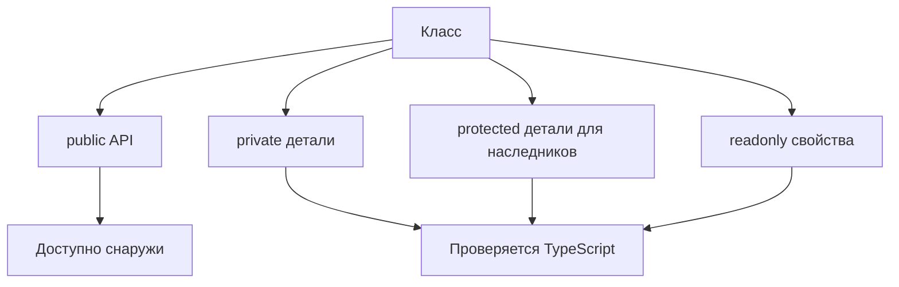

# Access Modifiers and readonly Members

## Связь с предыдущей главой

В предыдущей главе класс рассматривался как JavaScript-класс с проверяемыми полями, конструктором и методами.

Теперь нужно понять, какие части класса должны быть доступны снаружи, а какие остаются деталями реализации.

## Главный вопрос

Как ограничить доступ к деталям реализации класса?

## Мотивация

Класс часто имеет публичный API и внутренние детали.

Например, helper может позволять вызвать `logStep()`, но не должен разрешать менять внутренний список записей напрямую.

Модификаторы доступа TypeScript помогают сделать границы класса явными.

## Теория

### Четыре модификатора

- `public` — доступен отовсюду, подразумевается по умолчанию;
- `private` — только внутри самого класса;
- `protected` — внутри класса и его наследников;
- `readonly` — запрещает переприсваивание после инициализации.

### `private` — это проверка, а не секретность

Модификатор существует только при проверке типов. Значение остаётся обычным свойством объекта:

```ts
class A { private secret = 1; }

const a = new A();
a.secret;                  // ошибка компиляции
(a as any)["secret"];      // но значение доступно
```

Отсюда правило: `private` защищает от **случайного** обращения в своём коде, но не является механизмом безопасности. Данные, которые нельзя раскрывать, не должны попадать в объект.

### `#private` — настоящая приватность

Приватное поле JavaScript работает во время выполнения:

```ts
class B { #real = 1; }
```

Доступ снаружи невозможен никаким способом. Побочный и очень полезный эффект: поле делает класс **номинальным** — похожий по форме объект перестаёт подходить под его тип.

Практический выбор: `#private` — когда важна настоящая изоляция или номинальность; `private` — когда достаточно договорённости и нужна совместимость со старым кодом.

### `protected` тоже влияет на совместимость

Неочевидное следствие: классы с `protected`-членами совместимы только в пределах одной иерархии.

```ts
class P { protected x = 1; }
class PLike { protected x = 1; }

const p: P = new PLike();        // ошибка, хотя форма совпадает
const p2: P = new PChild();      // наследник подходит
```

Структурная проверка здесь отступает: защищённый член имеет смысл только внутри своей иерархии.

### `readonly` не замораживает содержимое

```ts
class Report {
  readonly entries: string[] = [];
}

report.entries.push("passed");   // допустимо
report.entries = [];             // ошибка
```

Запрет касается **ссылки**, а не объекта за ней. Для неизменяемого содержимого нужен `readonly string[]` или `Object.freeze`.

### Параметры-свойства

Модификатор в параметре конструктора объявляет и заполняет поле одновременно:

```ts
class TestRun {
  constructor(
    public readonly id: string,
    private status: "created" | "finished",
  ) {}
}
```

Запись экономит шесть строк на каждый класс. В отличие от большинства конструкций TypeScript, она порождает реальный код: присваивания в теле конструктора.

### Что показывать наружу

Практический ориентир для тестового кода: наружу выносят **действия**, а не данные.

```ts
class LoginActions {
  constructor(private readonly baseUrl: string) {}
  getLoginUrl(): string { return `${this.baseUrl}/login`; }
}
```

Тогда тест не сможет случайно изменить состояние объекта, а изменение внутреннего устройства не затронет вызывающий код.

## Внутренний механизм



Эти проверки относятся к TypeScript. Они не превращают класс в схему проверки во время выполнения.

## Главная ментальная модель

Модификаторы доступа — это забор вокруг публичного API класса.

## Практические примеры

```ts
class StepLogger {
  private steps: string[] = [];

  addStep(title: string): void {
    this.steps.push(title);
  }

  getCount(): number {
    return this.steps.length;
  }
}

const logger = new StepLogger();
logger.addStep("open page");
console.log(logger.getCount());
```

Параметры-свойства позволяют создать и инициализировать свойства прямо в конструкторе:

```ts
class TestRun {
  constructor(
    public readonly id: string,
    private status: "created" | "finished",
  ) {}

  finish(): void {
    this.status = "finished";
  }
}
```

`id` становится публичным readonly-свойством экземпляра. `status` становится private-свойством.

## Automation QA

Для Page Object-подобного класса можно оставить наружу только действия:

```ts
class LoginActions {
  constructor(private readonly baseUrl: string) {}

  getLoginUrl(): string {
    return `${this.baseUrl}/login`;
  }
}
```

Так тестовый код не меняет `baseUrl` случайно.

## Распространённые ошибки

Ошибка — считать `readonly` полной неизменяемостью объекта.

```ts
class Report {
  readonly entries: string[] = [];
}

const report = new Report();
report.entries.push("passed");
```

`readonly` запрещает переназначить `entries`, но не замораживает сам массив.

## Распространённые мифы

**Миф: `private` скрывает данные во время выполнения.**
Это проверка компилятора. Значение доступно через обходные пути.

**Миф: `private` и `#private` — одно и то же.**
Второе работает во время выполнения и делает класс номинальным.

**Миф: `readonly` делает объект неизменяемым.**
Он запрещает переприсваивание ссылки, но не меняет содержимое.

**Миф: `protected` не влияет на совместимость типов.**
Влияет: классы с защищёнными членами совместимы только внутри одной иерархии.

## Частые вопросы

**Когда выбрать `#private`?**
Когда нужна настоящая изоляция или номинальность типа.

**Как сделать содержимое массива неизменяемым?**
Объявить поле как `readonly string[]` либо заморозить значение во время выполнения.

**Зачем параметры-свойства?**
Они убирают дублирование объявления и присваивания в конструкторе.

**Что выносить в публичный API класса?**
Действия. Данные лучше держать внутри, чтобы их нельзя было изменить мимо методов.

## Проверьте себя

1. Чем `private` отличается от `#private` по поведению во время выполнения?
2. Как приватное поле влияет на совместимость типов?
3. Почему два класса с одинаковым `protected`-членом несовместимы?
4. Что именно запрещает `readonly` у поля-массива?
5. Чем параметры-свойства отличаются от остальных конструкций TypeScript?

## Практика

Практические задания находятся в конце страницы.

## Краткие итоги

- `public` — доступно снаружи и используется по умолчанию.
- `private` — доступно только внутри класса на этапе проверки типов.
- `protected` — доступно внутри класса и его наследников.
- `readonly` запрещает переназначение свойства, но не делает вложенные значения неизменяемыми.
- Параметры-свойства создают и инициализируют свойства через конструктор.

## Переход

Теперь класс может скрывать детали реализации. Дальше мы посмотрим, как описать базовый класс, который задает общий контракт для наследников.
