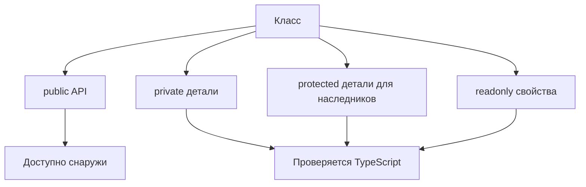

# Access Modifiers and readonly Members

## Связь с предыдущей главой

В предыдущей главе класс рассматривался как JavaScript-класс с проверяемыми полями, конструктором и методами.

Теперь нужно понять, какие части класса должны быть доступны снаружи, а какие остаются деталями реализации.

## Главный вопрос

Как ограничить доступ к деталям реализации класса?

## Мотивация

Класс часто имеет публичный API и внутренние детали.

Например, helper может позволять вызвать `logStep()`, но не должен разрешать менять внутренний список записей напрямую.

Модификаторы доступа TypeScript помогают сделать границы класса явными.

## Теория

TypeScript поддерживает:

- `public`;
- `private`;
- `protected`;
- `readonly`;
- параметры-свойства.

`public` используется по умолчанию.

```ts
class Logger {
  public name: string;

  constructor(name: string) {
    this.name = name;
  }
}
```

`private` запрещает обращаться к члену класса снаружи на этапе проверки типов.

`protected` разрешает доступ внутри самого класса и его наследников.

`readonly` запрещает переназначение свойства после инициализации.

TypeScript `private` — это не JavaScript `#private`. Он ограничивает доступ для компилятора, но не должен описываться как секретность во время выполнения.

## Внутренний механизм



Эти проверки относятся к TypeScript. Они не превращают класс в схему проверки во время выполнения.

## Главная ментальная модель

Модификаторы доступа — это забор вокруг публичного API класса.

## Практические примеры

```ts
class StepLogger {
  private steps: string[] = [];

  addStep(title: string): void {
    this.steps.push(title);
  }

  getCount(): number {
    return this.steps.length;
  }
}

const logger = new StepLogger();
logger.addStep("open page");
console.log(logger.getCount());
```

Параметры-свойства позволяют создать и инициализировать свойства прямо в конструкторе:

```ts
class TestRun {
  constructor(
    public readonly id: string,
    private status: "created" | "finished",
  ) {}

  finish(): void {
    this.status = "finished";
  }
}
```

`id` становится публичным readonly-свойством экземпляра. `status` становится private-свойством.

## Automation QA

Для Page Object-подобного класса можно оставить наружу только действия:

```ts
class LoginActions {
  constructor(private readonly baseUrl: string) {}

  getLoginUrl(): string {
    return `${this.baseUrl}/login`;
  }
}
```

Так тестовый код не меняет `baseUrl` случайно.

## Распространённые ошибки

Ошибка — считать `readonly` полной неизменяемостью объекта.

```ts
class Report {
  readonly entries: string[] = [];
}

const report = new Report();
report.entries.push("passed");
```

`readonly` запрещает переназначить `entries`, но не замораживает сам массив.

## Практика

Практические задания находятся в конце страницы.

## Краткие итоги

- `public` — доступно снаружи и используется по умолчанию.
- `private` — доступно только внутри класса на этапе проверки типов.
- `protected` — доступно внутри класса и его наследников.
- `readonly` запрещает переназначение свойства, но не делает вложенные значения неизменяемыми.
- Параметры-свойства создают и инициализируют свойства через конструктор.

## Переход

Теперь класс может скрывать детали реализации. Дальше мы посмотрим, как описать базовый класс, который задает общий контракт для наследников.
