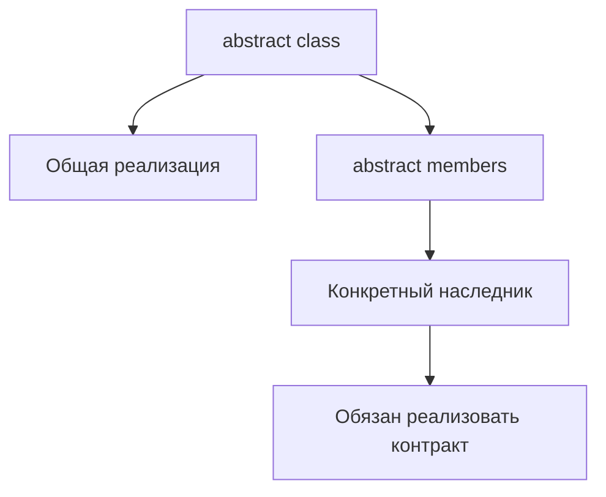

# Abstract Classes

## Связь с предыдущей главой

Мы уже описали публичные и внутренние части класса через модификаторы доступа.

Теперь нужно описать общий базовый класс, который содержит часть реализации, но не должен создаваться напрямую.

## Главный вопрос

Как описать общий базовый класс, который нельзя использовать напрямую?

## Мотивация

В QA-проекте разные страницы или helpers могут иметь общие действия.

Например:

- у всех страниц есть `url`;
- у всех страниц есть метод построения полного адреса;
- каждая конкретная страница сама определяет свой путь.

Абстрактный класс позволяет зафиксировать общий контракт и общую реализацию.

## Теория

`abstract class` нельзя создать напрямую.

```ts
abstract class BasePage {
  constructor(protected readonly baseUrl: string) {}

  abstract path: string;

  getUrl(): string {
    return `${this.baseUrl}${this.path}`;
  }
}
```

Абстрактный член класса объявляется без реализации. Конкретный наследник обязан его реализовать.

```ts
class LoginPage extends BasePage {
  path = "/login";
}
```

## Внутренний механизм



`abstract` проверяется TypeScript. После компиляции остается JavaScript-класс.

## Главная ментальная модель

Абстрактный класс — это чертеж с готовыми деталями и обязательными пустыми местами.

## Практические примеры

```ts
abstract class ReportWriter {
  abstract format: "text" | "json";

  writeHeader(title: string): string {
    return `Report: ${title}`;
  }

  abstract writeBody(items: string[]): string;
}

class TextReportWriter extends ReportWriter {
  format = "text" as const;

  writeBody(items: string[]): string {
    return items.join("\n");
  }
}
```

Конкретный класс получает готовый `writeHeader()` и обязан реализовать `writeBody()`.

## Automation QA

Базовую модель страницы можно описать через `abstract class`:

```ts
abstract class BaseScreen {
  constructor(protected readonly baseUrl: string) {}

  abstract route: string;

  openUrl(): string {
    return `${this.baseUrl}${this.route}`;
  }
}

class UsersScreen extends BaseScreen {
  route = "/users";
}
```

Это не подключает фреймворк. Это только типизированная модель общего поведения.

## Распространённые ошибки

Ошибка — думать, что abstract class проверяет внешние объекты во время выполнения.

```ts
abstract class PayloadReader {
  abstract read(): string;
}
```

`abstract` помогает компилятору проверить наследников, но не валидирует произвольные данные во время выполнения.

## Практика

Практические задания находятся в конце страницы.

## Краткие итоги

- `abstract class` нельзя создавать напрямую в TypeScript.
- Абстрактные члены класса задают обязательства для конкретных наследников.
- Абстрактный класс может содержать готовую реализацию.
- `abstract` не является валидацией во время выполнения.

## Переход

Абстрактный класс задает контракт через наследование. Следующая глава покажет, как проверить соответствие класса контракту через `implements` и безопасно переопределять поведение.
