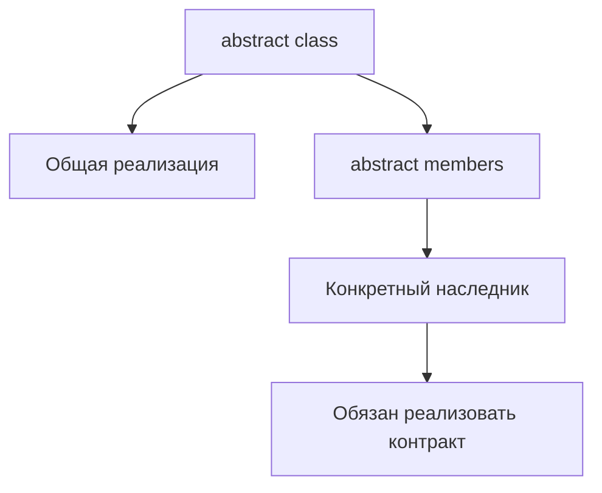

# Abstract Classes

## Связь с предыдущей главой

Мы уже описали публичные и внутренние части класса через модификаторы доступа.

Теперь нужно описать общий базовый класс, который содержит часть реализации, но не должен создаваться напрямую.

## Главный вопрос

Как описать общий базовый класс, который нельзя использовать напрямую?

## Мотивация

В QA-проекте разные страницы или helpers могут иметь общие действия.

Например:

- у всех страниц есть `url`;
- у всех страниц есть метод построения полного адреса;
- каждая конкретная страница сама определяет свой путь.

Абстрактный класс позволяет зафиксировать общий контракт и общую реализацию.

## Теория

### Класс, который нельзя создать

```ts
abstract class BasePage {
  constructor(protected readonly baseUrl: string) {}

  abstract path: string;

  getUrl(): string {
    return `${this.baseUrl}${this.path}`;
  }
}

const page = new BasePage("...");   // ошибка
```

Абстрактный класс существует, чтобы от него наследовались. Попытка создать экземпляр — ошибка компиляции.

### Готовая часть плюс обязательства

Ценность конструкции в сочетании двух вещей:

- **реализованные** члены — общее поведение, написанное один раз;
- **абстрактные** члены — обязательства, которые наследник обязан выполнить.

```ts
class LoginPage extends BasePage {
  path = "/login";   // обязательство выполнено
}
```

`getUrl()` достался бесплатно, `path` пришлось объявить. Если наследник забудет абстрактный член, компилятор об этом скажет.

### Абстрактный класс против интерфейса

Оба описывают договор, но решают разные задачи:

| | `interface` | `abstract class` |
| --- | --- | --- |
| Содержит реализацию | Нет | Да |
| Существует после компиляции | Нет | Да |
| Сколько можно применить | Несколько | Один (одиночное наследование) |
| Хранит состояние | Нет | Да |

Правило выбора: если нужен **только договор** — интерфейс. Если есть общий код или состояние, которые не хочется дублировать, — абстрактный класс.

Интерфейс дешевле: он ничего не добавляет во время выполнения и не занимает единственное место для наследования.

### Абстрактный класс в позиции типа

Имя абстрактного класса можно использовать как тип:

```ts
function open(page: BasePage): string {
  return page.getUrl();
}
```

Тип означает «любой конкретный наследник». Создать значение этого типа напрямую нельзя, но принимать его — можно.

### Осторожно с глубокими иерархиями

Соблазн вынести в базовый класс всё общее приводит к иерархии, где поведение размазано по нескольким уровням, а изменение базового класса затрагивает всех потомков.

Для тестового кода это особенно заметно: базовый класс страниц, куда постепенно переехали все вспомогательные методы, становится тем самым «объектом, отвечающим за всё приложение», о котором предупреждала глава про Page Object.

Практический ориентир: один уровень наследования — норма, два — повод подумать, три — почти наверняка композиция подошла бы лучше.

### После компиляции остаётся обычный класс

`abstract` — проверка времени компиляции. В скомпилированном коде это обычный класс, который технически можно создать. Защита существует только при проверке типов.

## Внутренний механизм



`abstract` проверяется TypeScript. После компиляции остается JavaScript-класс.

## Главная ментальная модель

Абстрактный класс — это чертеж с готовыми деталями и обязательными пустыми местами.

## Практические примеры

```ts
abstract class ReportWriter {
  abstract format: "text" | "json";

  writeHeader(title: string): string {
    return `Report: ${title}`;
  }

  abstract writeBody(items: string[]): string;
}

class TextReportWriter extends ReportWriter {
  format = "text" as const;

  writeBody(items: string[]): string {
    return items.join("\n");
  }
}
```

Конкретный класс получает готовый `writeHeader()` и обязан реализовать `writeBody()`.

Запускаемые версии этих примеров находятся в:

```text
examples/02-typescript/chapter-148/
```

`01-abstract-page.ts` — абстрактный базовый экран и его наследник.

`02-abstract-report.ts` — готовый метод базы и обязательная реализация.

`03-abstract-diagnostics.ts` — попытка создать абстрактный класс (намеренная ошибка).

## Automation QA

Базовую модель страницы можно описать через `abstract class`:

```ts
abstract class BaseScreen {
  constructor(protected readonly baseUrl: string) {}

  abstract route: string;

  openUrl(): string {
    return `${this.baseUrl}${this.route}`;
  }
}

class UsersScreen extends BaseScreen {
  route = "/users";
}
```

Это не подключает фреймворк. Это только типизированная модель общего поведения.

## Распространённые ошибки

Ошибка — думать, что abstract class проверяет внешние объекты во время выполнения.

```ts
abstract class PayloadReader {
  abstract read(): string;
}
```

`abstract` помогает компилятору проверить наследников, но не валидирует произвольные данные во время выполнения.

## Распространённые мифы

**Миф: абстрактный класс нельзя создать и во время выполнения.**
`abstract` стирается; защита действует только при проверке типов.

**Миф: абстрактный класс всегда лучше интерфейса.**
Он занимает единственное место для наследования и остаётся в скомпилированном коде.

**Миф: абстрактный класс нельзя использовать как тип.**
Можно: он означает «любой конкретный наследник».

**Миф: чем больше общего в базовом классе, тем меньше дублирования.**
Глубокая иерархия превращает базовый класс в объект, отвечающий за всё.

## Частые вопросы

**Когда выбрать интерфейс, а когда абстрактный класс?**
Только договор — интерфейс. Есть общий код или состояние — абстрактный класс.

**Что будет, если наследник не реализует абстрактный член?**
Ошибка компиляции при объявлении наследника.

**Можно ли наследовать несколько абстрактных классов?**
Нет, наследование одиночное. Несколько договоров выражают интерфейсами.

**Сколько уровней наследования допустимо?**
Один — норма. На третьем стоит рассмотреть композицию.

## Проверьте себя

1. Что даёт абстрактный класс помимо договора?
2. Почему интерфейс «дешевле» абстрактного класса?
3. Что означает имя абстрактного класса в позиции типа?
4. Чем опасна глубокая иерархия в тестовом коде?
5. Сохраняется ли запрет на создание экземпляра после компиляции?

## Практика

Практические задания находятся в конце страницы.

## Краткие итоги

- `abstract class` нельзя создавать напрямую в TypeScript.
- Абстрактные члены класса задают обязательства для конкретных наследников.
- Абстрактный класс может содержать готовую реализацию.
- `abstract` не является валидацией во время выполнения.

## Переход

Абстрактный класс задает контракт через наследование. Следующая глава покажет, как проверить соответствие класса контракту через `implements` и безопасно переопределять поведение.
