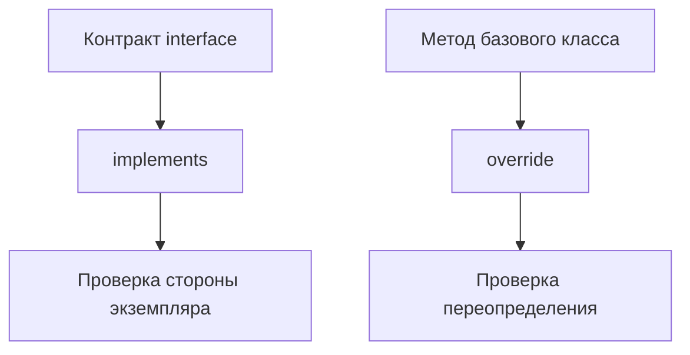

# implements and override

## Связь с предыдущей главой

В абстрактных классах контракт задавался через базовый класс и наследование.

Теперь мы разделим две задачи: проверить, что класс соответствует interface, и проверить, что метод действительно переопределяет базовое поведение.

## Главный вопрос

Как проверить, что класс соответствует контракту и корректно переопределяет поведение?

## Мотивация

Класс может быть частью публичного API проекта.

Например, разные компоненты отчета могут иметь одинаковый метод `render()`.

Нужно проверить, что каждый класс действительно реализует ожидаемый контракт.

## Теория

### `implements` проверяет, но ничего не добавляет

```ts
interface Formatter {
  format(value: string): string;
}

class UpperCaseFormatter implements Formatter {
  format(value: string): string {
    return value.toUpperCase();
  }
}
```

Компилятор убедится, что класс содержит нужные члены. Никакого кода при этом не появляется: забытый метод даст ошибку, а не пустую реализацию.

Типы тоже не переносятся — параметры и результат нужно указать самому. `implements` только сверяет написанное с договором.

### Проверяется только сторона экземпляра

Тонкость, о которую спотыкаются: `implements` не проверяет статические члены. Интерфейс описывает форму **экземпляра**, поэтому требование статического метода через `implements` выразить нельзя.

Для описания конструктора используют отдельный тип и проверяют его при присваивании класса переменной.

### `implements` не создаёт номинальности

Класс, объявивший `implements Formatter`, не становится «особым» типом. Любой объект подходящей формы по-прежнему подойдёт там, где ожидается `Formatter`:

```ts
const plain = { format: (v: string) => v };
const f: Formatter = plain;   // допустимо
```

`implements` — это проверка в момент объявления класса, а не пожизненная метка.

### Несколько договоров сразу

```ts
class HeaderComponent implements ComponentObject, Serializable { }
```

Ограничений нет: интерфейсов может быть сколько угодно, в отличие от одиночного наследования классов. Это ещё один довод в пользу интерфейсов там, где нужен только договор.

### `override` фиксирует намерение

```ts
class HtmlReporter extends BaseReporter {
  override buildTitle(title: string): string { }
}
```

Модификатор говорит: этот метод **заменяет** метод базового класса. Компилятор проверит, что такой метод там действительно есть.

Ценность становится очевидной при опечатке. Без `override` метод `buildTitel` просто добавится как новый, базовый останется в силе, и поведение окажется не тем, которое ожидалось, — без единой ошибки.

### `noImplicitOverride`

Настройка делает модификатор обязательным: любое переопределение без `override` становится ошибкой.

Для проекта с наследованием это дешёвая защита от целого класса ошибок — переименование метода в базовом классе сразу подсветит все потомки, которые его переопределяли.

### Обе конструкции исчезают после компиляции

`implements` и `override` не оставляют следа в JavaScript. Переопределение работает обычными правилами прототипов, а интерфейс стирается полностью.

## Внутренний механизм



Интерфейсы исчезают после компиляции. Переопределение методов остается обычным JavaScript-поведением.

## Главная ментальная модель

`implements` проверяет обещание класса. `override` проверяет намерение изменить унаследованное поведение.

## Практические примеры

```ts
interface AssertionMessageBuilder {
  buildMessage(actual: string, expected: string): string;
}

class DefaultMessageBuilder implements AssertionMessageBuilder {
  buildMessage(actual: string, expected: string): string {
    return `Expected ${expected}, received ${actual}`;
  }
}
```

```ts
class JsonReporter {
  serialize(value: string): string {
    return JSON.stringify({ value });
  }
}

class PrettyJsonReporter extends JsonReporter {
  override serialize(value: string): string {
    return JSON.stringify({ value }, null, 2);
  }
}
```

Запускаемые версии этих примеров находятся в:

```text
examples/02-typescript/chapter-149/
```

`01-implements-contract.ts` — класс, реализующий интерфейс.

`02-override-method.ts` — `override` при переопределении метода.

`03-implements-diagnostics.ts` — нереализованный метод интерфейса (намеренная ошибка).

## Automation QA

Component object может реализовать общий контракт:

```ts
interface ComponentObject {
  getName(): string;
}

class HeaderComponent implements ComponentObject {
  getName(): string {
    return "Header";
  }
}
```

Это помогает держать одинаковую форму у разных компонентов без валидации во время выполнения.

## Распространённые ошибки

Ошибка — думать, что `implements` создаст недостающий метод.

```ts
interface Runner {
  run(): void;
}

class SmokeRunner implements Runner {
  // TypeScript потребует реализовать run().
}
```

`implements` только проверяет класс. Он ничего не добавляет во время выполнения.

## Распространённые мифы

**Миф: `implements` добавляет классу методы.**
Он только проверяет уже написанное.

**Миф: `implements` переносит типы параметров.**
Типы нужно указать в классе самому.

**Миф: класс с `implements` становится особым типом.**
Проверка структурная: объект подходящей формы по-прежнему подойдёт.

**Миф: `override` — необязательное украшение.**
Без него опечатка в имени метода создаёт новый метод вместо переопределения.

## Частые вопросы

**Можно ли потребовать статический метод через `implements`?**
Нет: интерфейс описывает экземпляр. Для конструктора нужен отдельный тип.

**Сколько интерфейсов может реализовать класс?**
Любое количество, в отличие от одиночного наследования.

**Зачем включать `noImplicitOverride`?**
Чтобы переименование метода в базовом классе сразу подсветило все потомки.

**Остаётся ли `override` после компиляции?**
Нет, как и `implements`. Это проверки времени компиляции.

## Проверьте себя

1. Что делает `implements` и чего не делает?
2. Почему статический член нельзя потребовать через `implements`?
3. Делает ли `implements` тип номинальным?
4. Какую ошибку предотвращает `override`?
5. Что даёт настройка `noImplicitOverride` при рефакторинге?

## Практика

Практические задания находятся в конце страницы.

## Краткие итоги

- `implements` проверяет сторону экземпляра класса.
- Interface не существует во время выполнения.
- `implements` не добавляет поля и методы.
- `override` помогает явно переопределять метод базового класса.
- Переопределение методов выполняется как обычное JavaScript-поведение во время выполнения.

## Переход

Модуль классов и объектных контрактов завершен. Следующий модуль переходит к TypeScript-модулям и декларациям.
