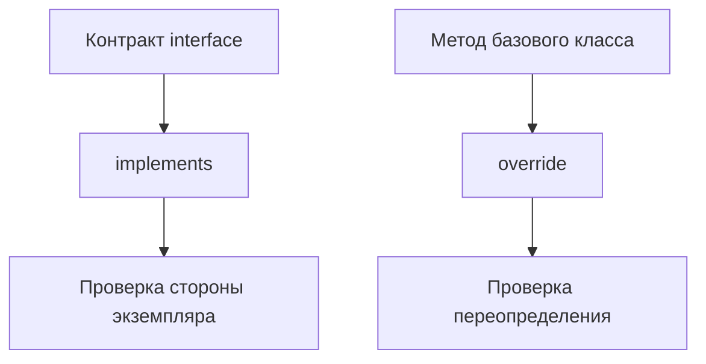

# implements and override

## Связь с предыдущей главой

В абстрактных классах контракт задавался через базовый класс и наследование.

Теперь мы разделим две задачи: проверить, что класс соответствует interface, и проверить, что метод действительно переопределяет базовое поведение.

## Главный вопрос

Как проверить, что класс соответствует контракту и корректно переопределяет поведение?

## Мотивация

Класс может быть частью публичного API проекта.

Например, разные компоненты отчета могут иметь одинаковый метод `render()`.

Нужно проверить, что каждый класс действительно реализует ожидаемый контракт.

## Теория

`implements` проверяет, что сторона экземпляра класса соответствует `interface`.

```ts
interface Formatter {
  format(value: string): string;
}

class UpperCaseFormatter implements Formatter {
  format(value: string): string {
    return value.toUpperCase();
  }
}
```

`implements` не добавляет методы в класс. Он только проверяет уже написанное тело класса.

`override` показывает, что метод намеренно переопределяет метод базового класса:

```ts
class BaseReporter {
  buildTitle(title: string): string {
    return `Report: ${title}`;
  }
}

class HtmlReporter extends BaseReporter {
  override buildTitle(title: string): string {
    return `<h1>${title}</h1>`;
  }
}
```

## Внутренний механизм



Интерфейсы исчезают после компиляции. Переопределение методов остается обычным JavaScript-поведением.

## Главная ментальная модель

`implements` проверяет обещание класса. `override` проверяет намерение изменить унаследованное поведение.

## Практические примеры

```ts
interface AssertionMessageBuilder {
  buildMessage(actual: string, expected: string): string;
}

class DefaultMessageBuilder implements AssertionMessageBuilder {
  buildMessage(actual: string, expected: string): string {
    return `Expected ${expected}, received ${actual}`;
  }
}
```

```ts
class JsonReporter {
  serialize(value: string): string {
    return JSON.stringify({ value });
  }
}

class PrettyJsonReporter extends JsonReporter {
  override serialize(value: string): string {
    return JSON.stringify({ value }, null, 2);
  }
}
```

## Automation QA

Component object может реализовать общий контракт:

```ts
interface ComponentObject {
  getName(): string;
}

class HeaderComponent implements ComponentObject {
  getName(): string {
    return "Header";
  }
}
```

Это помогает держать одинаковую форму у разных компонентов без валидации во время выполнения.

## Распространённые ошибки

Ошибка — думать, что `implements` создаст недостающий метод.

```ts
interface Runner {
  run(): void;
}

class SmokeRunner implements Runner {
  // TypeScript потребует реализовать run().
}
```

`implements` только проверяет класс. Он ничего не добавляет во время выполнения.

## Практика

Практические задания находятся в конце страницы.

## Краткие итоги

- `implements` проверяет сторону экземпляра класса.
- Interface не существует во время выполнения.
- `implements` не добавляет поля и методы.
- `override` помогает явно переопределять метод базового класса.
- Переопределение методов выполняется как обычное JavaScript-поведение во время выполнения.

## Переход

Модуль классов и объектных контрактов завершен. Следующий модуль переходит к TypeScript-модулям и декларациям.
