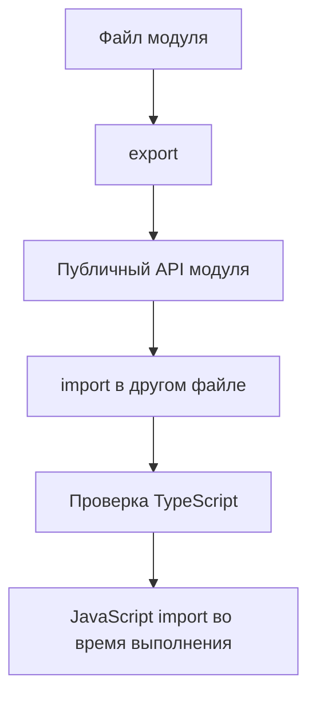

# TypeScript and JavaScript Modules

## Связь с предыдущей главой

В предыдущем модуле мы проверяли классы и объектные контракты.

Теперь эти контракты нужно передавать между файлами. JavaScript-модули уже знакомы, а TypeScript добавляет к ним проверку импортируемых и экспортируемых типов.

## Главный вопрос

Как TypeScript добавляет типы к уже знакомым JavaScript-модулям?

## Мотивация

В большом QA-проекте код быстро распадается на отдельные файлы:

- модели конфигурации;
- helper-функции;
- builders;
- утилиты отчетов;
- assertion messages.

JavaScript-модули позволяют разделить ответственность между файлами. TypeScript проверяет, что экспортируемые значения используются с правильными типами.

## Теория

### Файл становится модулем не всегда

Ключевое правило, о котором редко пишут явно: файл считается модулем, **только если содержит `import` или `export`** на верхнем уровне.

Файл без них — глобальный скрипт. Его объявления попадают в общую область, и два таких файла конфликтуют:

```ts
// a.ts
const sharedName = 1;

// b.ts
const sharedName = 2;   // ошибка: повторное объявление
```

Если файл неожиданно «видит» объявления из соседнего или жалуется на дубликаты — почти наверняка в нём нет ни одного экспорта.

### Что проверяет компилятор

При импорте проверяется:

- существует ли экспорт с таким именем;
- что принимает и возвращает импортированное значение;
- доступен ли импорт как значение или только как тип.

TypeScript не создаёт собственной системы модулей — он проверяет обычные модули JavaScript до запуска.

### Типы экспортируются и исчезают

```ts
export type TestStatus = "passed" | "failed";
export function formatStatus(status: TestStatus): string { }
```

Оба экспорта доступны при проверке, но после компиляции остаётся только функция. Попытка использовать `TestStatus` как значение — ошибка: такого значения не существует.

### Расширение `.js` в импортах

В примерах книги относительные импорты заканчиваются на `.js`, хотя исходный файл — `.ts`:

```ts
import { formatStatus } from "./status.js";
```

Это не опечатка. Node ESM требует расширение в пути, а компилятор **не переписывает** строки импортов. Путь должен указывать на файл, который будет существовать после компиляции.

Правило раздражает новичков, но оно последовательно: TypeScript принципиально не меняет семантику модулей.

### Именованный и стандартный экспорт

```ts
export function a() {}            // именованный
export default class B {}         // стандартный
```

Именованный лучше переживает переименования: импортирующая сторона обязана указать точное имя, а редактор умеет автоматически подставлять и обновлять его. У стандартного экспорта имя при импорте выбирает потребитель, поэтому один и тот же модуль легко получает три разных названия в трёх файлах.

Ни один вариант не «правильнее» — но единообразие внутри проекта важнее обоих.

### Побочные эффекты импорта

Импорт модуля выполняет его код. Для тестового проекта это существенно: модуль, который при загрузке читает переменные окружения или открывает соединение, сделает это при первом же импорте — иногда раньше, чем ожидалось.

Модули с побочными эффектами стоит держать наперечёт и загружать явно.

## Внутренний механизм



TypeScript не создает новую систему модулей. Он проверяет уже знакомые JavaScript-модули до запуска.

## Главная ментальная модель

Модуль — это файл с публичным API. TypeScript проверяет, что другие файлы используют этот API правильно.

## Практические примеры

Именованный экспорт:

```ts
export type TestStatus = "passed" | "failed";

export function formatStatus(status: TestStatus): string {
  return status.toUpperCase();
}
```

Именованный импорт:

```ts
import { formatStatus } from "./status.js";

console.log(formatStatus("passed"));
```

Экспорт по умолчанию:

```ts
export default class ReportName {
  constructor(public readonly value: string) {}
}
```

```ts
import ReportName from "./report-name.js";

const name = new ReportName("daily");
```

Именованный экспорт и экспорт по умолчанию — разные формы публичного API. Экспорт по умолчанию не лучше автоматически. Выбор зависит от того, как модуль должен читаться в проекте.

## Automation QA

Файл с моделью отчета может экспортировать тип и функцию:

```ts
export type ReportStatus = "passed" | "failed";

export function createReportLine(title: string, status: ReportStatus): string {
  return `${status}: ${title}`;
}
```

Другой модуль получает проверяемый API:

```ts
import { createReportLine } from "./report-line.js";

const line = createReportLine("login test", "passed");
```

Если передать случайную строку вместо `ReportStatus`, TypeScript покажет ошибку до запуска.

## Распространённые ошибки

Ошибка — импортировать тип как значение во время выполнения.

```ts
export interface TestMeta {
  title: string;
}
```

`TestMeta` существует только для проверки типов. В JavaScript после компиляции такого значения нет.

## Распространённые мифы

**Миф: любой файл — это модуль.**
Файл без `import` и `export` на верхнем уровне остаётся глобальным скриптом.

**Миф: компилятор перепишет путь импорта с `.ts` на `.js`.**
Он не меняет строки импортов. Путь должен указывать на итоговый файл.

**Миф: экспортированный тип можно использовать как значение.**
После компиляции его не существует.

**Миф: стандартный экспорт удобнее именованного.**
Он хуже переживает переименования: имя выбирает потребитель.

## Частые вопросы

**Почему два файла ругаются на повторное объявление?**
Ни в одном нет экспорта, поэтому оба попали в глобальную область.

**Почему в импорте пишут `.js`, если файл `.ts`?**
Node ESM требует расширение, а компилятор не переписывает пути.

**Что выбрать: именованный экспорт или стандартный?**
Важнее единообразие. Именованный лучше переживает переименования.

**Когда импорт опасен?**
Когда модуль выполняет работу при загрузке: чтение окружения, открытие соединений.

## Проверьте себя

1. При каком условии файл считается модулем?
2. Что происходит с объявлениями в файле без экспортов?
3. Почему в относительных импортах указывают `.js`?
4. Что остаётся от экспортированного типа после компиляции?
5. Чем именованный экспорт лучше стандартного при переименованиях?

## Практика

Практические задания находятся в конце страницы.

## Краткие итоги

- TypeScript использует JavaScript-модули.
- `export` задает публичный API файла.
- `import` подключает экспорт из другого модуля.
- TypeScript проверяет импортируемые и экспортируемые типы до запуска.
- Типы исчезают после компиляции и не становятся значениями во время выполнения.

## Переход

Теперь мы понимаем, как TypeScript проверяет обычные импорты и экспорты. Следующая глава отделит зависимости уровня типов от зависимостей времени выполнения.
