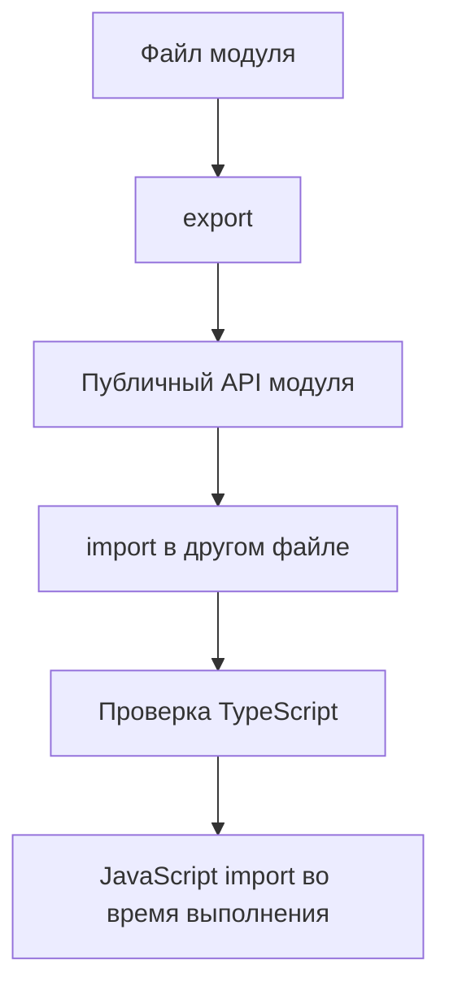

# TypeScript and JavaScript Modules

## Связь с предыдущей главой

В предыдущем модуле мы проверяли классы и объектные контракты.

Теперь эти контракты нужно передавать между файлами. JavaScript-модули уже знакомы, а TypeScript добавляет к ним проверку импортируемых и экспортируемых типов.

## Главный вопрос

Как TypeScript добавляет типы к уже знакомым JavaScript-модулям?

## Мотивация

В большом QA-проекте код быстро распадается на отдельные файлы:

- модели конфигурации;
- helper-функции;
- builders;
- утилиты отчетов;
- assertion messages.

JavaScript-модули позволяют разделить ответственность между файлами. TypeScript проверяет, что экспортируемые значения используются с правильными типами.

## Теория

TypeScript следует семантике JavaScript-модулей.

Если файл экспортирует значение, другой файл может его импортировать:

```ts
export function buildReportTitle(name: string): string {
  return `Report: ${name}`;
}
```

```ts
import { buildReportTitle } from "./report-title.js";

console.log(buildReportTitle("smoke"));
```

TypeScript проверяет:

- существует ли экспорт с таким именем;
- какие параметры принимает импортированная функция;
- какой тип возвращает импортированное значение;
- какие типы доступны только во время проверки.

Интерфейсы и type aliases могут экспортироваться из модуля, но после компиляции они исчезают.

В примерах этого раздела относительные импорты используют `.js` в конце пути. Исходный файл может быть `.ts`, но после компиляции Node ESM будет искать уже сгенерированный JavaScript-файл.

## Внутренний механизм



TypeScript не создает новую систему модулей. Он проверяет уже знакомые JavaScript-модули до запуска.

## Главная ментальная модель

Модуль — это файл с публичным API. TypeScript проверяет, что другие файлы используют этот API правильно.

## Практические примеры

Именованный экспорт:

```ts
export type TestStatus = "passed" | "failed";

export function formatStatus(status: TestStatus): string {
  return status.toUpperCase();
}
```

Именованный импорт:

```ts
import { formatStatus } from "./status.js";

console.log(formatStatus("passed"));
```

Экспорт по умолчанию:

```ts
export default class ReportName {
  constructor(public readonly value: string) {}
}
```

```ts
import ReportName from "./report-name.js";

const name = new ReportName("daily");
```

Именованный экспорт и экспорт по умолчанию — разные формы публичного API. Экспорт по умолчанию не лучше автоматически. Выбор зависит от того, как модуль должен читаться в проекте.

## Automation QA

Файл с моделью отчета может экспортировать тип и функцию:

```ts
export type ReportStatus = "passed" | "failed";

export function createReportLine(title: string, status: ReportStatus): string {
  return `${status}: ${title}`;
}
```

Другой модуль получает проверяемый API:

```ts
import { createReportLine } from "./report-line.js";

const line = createReportLine("login test", "passed");
```

Если передать случайную строку вместо `ReportStatus`, TypeScript покажет ошибку до запуска.

## Распространённые ошибки

Ошибка — импортировать тип как значение во время выполнения.

```ts
export interface TestMeta {
  title: string;
}
```

`TestMeta` существует только для проверки типов. В JavaScript после компиляции такого значения нет.

## Практика

Практические задания находятся в конце страницы.

## Краткие итоги

- TypeScript использует JavaScript-модули.
- `export` задает публичный API файла.
- `import` подключает экспорт из другого модуля.
- TypeScript проверяет импортируемые и экспортируемые типы до запуска.
- Типы исчезают после компиляции и не становятся значениями во время выполнения.

## Переход

Теперь мы понимаем, как TypeScript проверяет обычные импорты и экспорты. Следующая глава отделит зависимости уровня типов от зависимостей времени выполнения.
