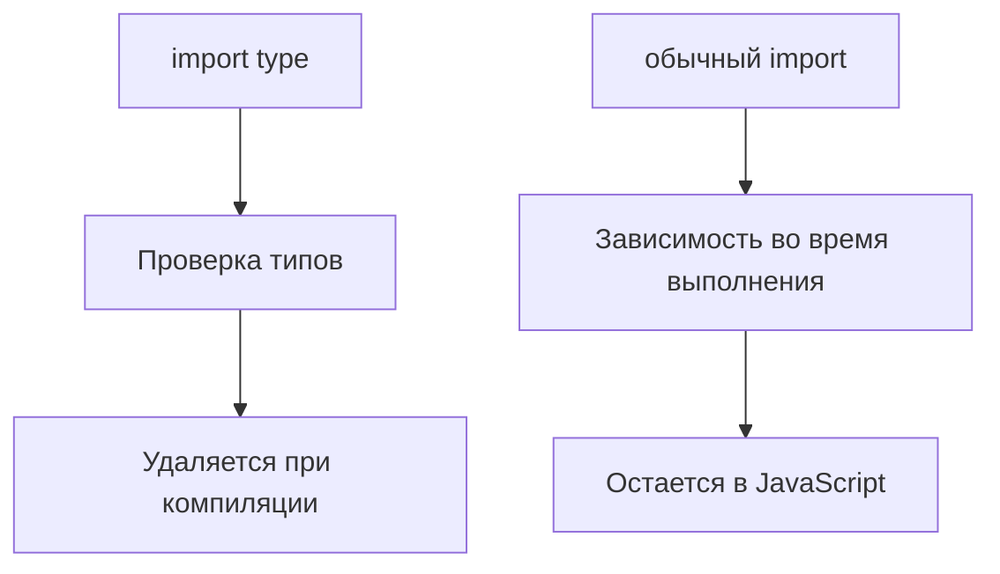

# Type-only Imports and Exports

## Связь с предыдущей главой

В предыдущей главе мы увидели, что модуль может экспортировать значения времени выполнения и типы.

Теперь нужно явно отделить зависимости, которые нужны только компилятору, от зависимостей, которые нужны JavaScript во время выполнения.

## Главный вопрос

Как импортировать типы отдельно от значений времени выполнения?

## Мотивация

В большом проекте легко перепутать:

- значение, которое должно существовать во время выполнения;
- тип, который нужен только для проверки.

Если файл импортирует только тип, JavaScript не обязан загружать этот импорт во время выполнения.

## Теория

### Записка для компилятора

`import type` сообщает, что импорт нужен **только для проверки типов**:

```ts
import type { ReportConfig } from "./report-config.js";

function printConfig(config: ReportConfig): void { }
```

При компиляции строка удаляется целиком. В JavaScript зависимости от этого модуля не останется.

### Почему это важно

Обычный импорт — это зависимость времени выполнения со всеми последствиями:

- **побочные эффекты**: импортированный модуль выполнится, даже если из него нужен один тип;
- **циклические зависимости**: два модуля, ссылающиеся друг на друга типами, при обычном импорте образуют настоящий цикл, а при `import type` — нет;
- **размер сборки**: лишний модуль попадает в результат.

Для тестового проекта особенно заметен первый пункт: модуль конфигурации, импортированный ради одного типа, может при загрузке прочитать переменные окружения и упасть раньше, чем начнётся тест.

### Класс — исключение

У класса две стороны: тип экземпляра и значение-конструктор. `import type` приносит только первую:

```ts
import type { ReportWriter } from "./report-writer.js";

function useWriter(writer: ReportWriter): string {   // допустимо
  return writer.write("passed");
}

const writer = new ReportWriter();   // ошибка: значения нет
```

Правило простое: если нужен `new`, `extends` или обращение к статическому члену — нужен обычный импорт.

### `export type`

Симметричная конструкция для экспорта:

```ts
export type { ReportConfig };
```

Она обязательна при реэкспорте типов в проектах с изолированной компиляцией: компилятор, обрабатывающий файлы по одному, не может определить, является ли реэкспортируемое имя типом, и `export type` снимает неоднозначность.

Именно так работают современные сборщики и транспиляторы — включая запуск тестов Playwright.

### Встроенные модификаторы

Тип можно пометить прямо в списке импорта:

```ts
import { type ReportConfig, createReport } from "./report.js";
```

Удобно, когда из модуля нужны и типы, и значения: не нужно писать два импорта. Результат тот же — тип будет удалён, значение останется.

### `verbatimModuleSyntax`

Настройка делает поведение предсказуемым: компилятор перестаёт самостоятельно угадывать, что можно удалить, и удаляет ровно то, что помечено как тип.

Побочный эффект — импорты без `type` сохраняются всегда, даже если использовались только в позиции типа. Это требует дисциплины, но убирает целый класс неожиданностей с исчезающими побочными эффектами.

### Когда применять

Практическое правило: **если имя используется только в позиции типа — помечайте импорт как типовой**. Это ничего не стоит, делает намерение явным и защищает от случайных зависимостей времени выполнения.

## Внутренний механизм



Если модуль нужен только как тип, `import type` делает это намерение явным.

## Главная ментальная модель

`import type` — это записка для TypeScript. Обычный `import` — это зависимость для JavaScript.

## Практические примеры

```ts
export type UserPayload = {
  id: number;
  email: string;
};
```

```ts
import type { UserPayload } from "./user-payload.js";

export function getEmail(payload: UserPayload): string {
  return payload.email;
}
```

Класс имеет две стороны: значение и тип экземпляра.

```ts
export class ReportWriter {
  write(value: string): string {
    return `Report: ${value}`;
  }
}
```

Если импортировать класс через `import type`, его можно использовать только в позиции типа:

```ts
import type { ReportWriter } from "./report-writer.js";

function useWriter(writer: ReportWriter): string {
  return writer.write("passed");
}
```

Создать `new ReportWriter()` через импорт только типа нельзя, потому что конструкция `new` требует значение времени выполнения.

Запускаемые версии этих примеров находятся в:

```text
examples/02-typescript/chapter-151/
```

`01-import-type.ts` — раздельный импорт значения и типа.

`02-type-only-class-diagnostic.ts` — `new` по классу, импортированному как тип (намеренная ошибка).

`03-export-type.ts` — импорт только типа из модуля.

`environment-config.ts` — модуль с типом и значением конфигурации.

`report-types.ts` — модуль только с типами.

`report-writer.ts` — класс, у которого есть и значение, и тип.

## Automation QA

Helper может принимать тип конфигурации, но не создавать саму конфигурацию:

```ts
import type { EnvironmentConfig } from "./environment-config.js";

export function buildBaseUrl(config: EnvironmentConfig): string {
  return `${config.protocol}://${config.host}`;
}
```

Так модуль helper явно показывает: ему нужна только форма данных.

## Распространённые ошибки

Ошибка — ожидать побочный эффект от `import type`.

```ts
import type { Config } from "./config.js";
```

Этот импорт нужен только компилятору. Он не должен использоваться как способ выполнить код модуля.

## Распространённые мифы

**Миф: `import type` — просто стилистическая пометка.**
Она меняет результат компиляции: зависимость исчезает вместе со строкой.

**Миф: через `import type` можно создать экземпляр класса.**
Нельзя: приходит только тип экземпляра, без конструктора.

**Миф: `export type` нужен редко.**
При изолированной компиляции он обязателен для реэкспорта типов.

**Миф: компилятор сам решит, что удалить.**
С `verbatimModuleSyntax` он удаляет ровно то, что помечено.

## Частые вопросы

**Когда обязателен обычный импорт класса?**
Когда нужен `new`, `extends` или статический член.

**Как импортировать типы и значения из одного модуля?**
Встроенным модификатором: `import { type A, b } from "..."`.

**Чем `import type` помогает с циклическими зависимостями?**
Типовой импорт не создаёт зависимости во время выполнения, поэтому цикла не возникает.

**Зачем `verbatimModuleSyntax`?**
Чтобы удаление импортов стало предсказуемым и не зависело от анализа использования.

## Проверьте себя

1. Что происходит со строкой `import type` при компиляции?
2. Назовите три последствия лишнего импорта времени выполнения.
3. Почему через `import type` нельзя вызвать `new`?
4. Когда обязателен `export type`?
5. Что меняет настройка `verbatimModuleSyntax`?

## Практика

Практические задания находятся в конце страницы.

## Краткие итоги

- `import type` импортирует только типы.
- Type-only imports стираются при компиляции.
- `export type` экспортирует типовое объявление.
- Значения времени выполнения нельзя использовать через `import type`.
- Классы имеют сторону значения и сторону типа.

## Переход

Теперь мы умеем разделять зависимости времени выполнения и зависимости уровня типов. Дальше нужно понять, как TypeScript вообще находит импортируемые модули и их типы.
