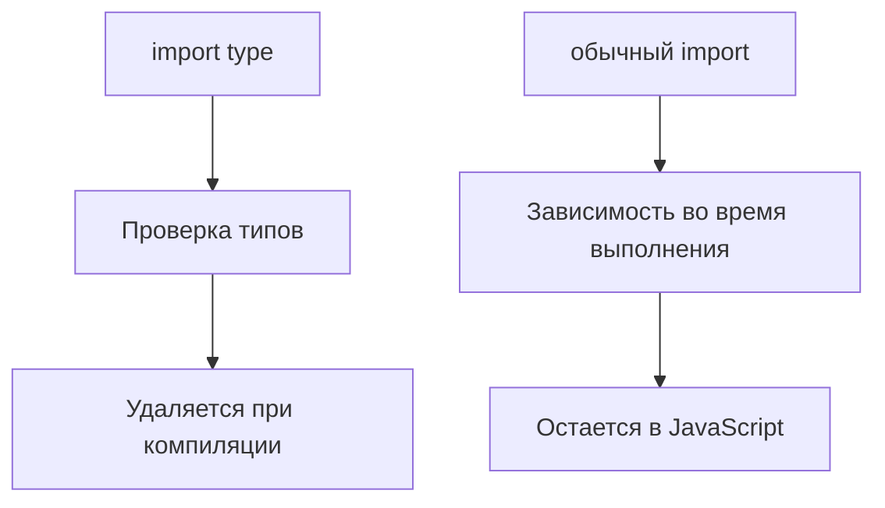

# Type-only Imports and Exports

## Связь с предыдущей главой

В предыдущей главе мы увидели, что модуль может экспортировать значения времени выполнения и типы.

Теперь нужно явно отделить зависимости, которые нужны только компилятору, от зависимостей, которые нужны JavaScript во время выполнения.

## Главный вопрос

Как импортировать типы отдельно от значений времени выполнения?

## Мотивация

В большом проекте легко перепутать:

- значение, которое должно существовать во время выполнения;
- тип, который нужен только для проверки.

Если файл импортирует только тип, JavaScript не обязан загружать этот импорт во время выполнения.

## Теория

`import type` импортирует объявление только для проверки типов:

```ts
import type { ReportConfig } from "./report-config.js";

function printConfig(config: ReportConfig): void {
  console.log(config.name);
}
```

Такой импорт удаляется при компиляции.

`export type` экспортирует только типовое объявление:

```ts
export type ReportConfig = {
  name: string;
  retries: number;
};
```

Значения времени выполнения через `import type` использовать нельзя.

## Внутренний механизм



Если модуль нужен только как тип, `import type` делает это намерение явным.

## Главная ментальная модель

`import type` — это записка для TypeScript. Обычный `import` — это зависимость для JavaScript.

## Практические примеры

```ts
export type UserPayload = {
  id: number;
  email: string;
};
```

```ts
import type { UserPayload } from "./user-payload.js";

export function getEmail(payload: UserPayload): string {
  return payload.email;
}
```

Класс имеет две стороны: значение и тип экземпляра.

```ts
export class ReportWriter {
  write(value: string): string {
    return `Report: ${value}`;
  }
}
```

Если импортировать класс через `import type`, его можно использовать только в позиции типа:

```ts
import type { ReportWriter } from "./report-writer.js";

function useWriter(writer: ReportWriter): string {
  return writer.write("passed");
}
```

Создать `new ReportWriter()` через импорт только типа нельзя, потому что конструкция `new` требует значение времени выполнения.

## Automation QA

Helper может принимать тип конфигурации, но не создавать саму конфигурацию:

```ts
import type { EnvironmentConfig } from "./environment-config.js";

export function buildBaseUrl(config: EnvironmentConfig): string {
  return `${config.protocol}://${config.host}`;
}
```

Так модуль helper явно показывает: ему нужна только форма данных.

## Распространённые ошибки

Ошибка — ожидать побочный эффект от `import type`.

```ts
import type { Config } from "./config.js";
```

Этот импорт нужен только компилятору. Он не должен использоваться как способ выполнить код модуля.

## Практика

Практические задания находятся в конце страницы.

## Краткие итоги

- `import type` импортирует только типы.
- Type-only imports стираются при компиляции.
- `export type` экспортирует типовое объявление.
- Значения времени выполнения нельзя использовать через `import type`.
- Классы имеют сторону значения и сторону типа.

## Переход

Теперь мы умеем разделять зависимости времени выполнения и зависимости уровня типов. Дальше нужно понять, как TypeScript вообще находит импортируемые модули и их типы.
