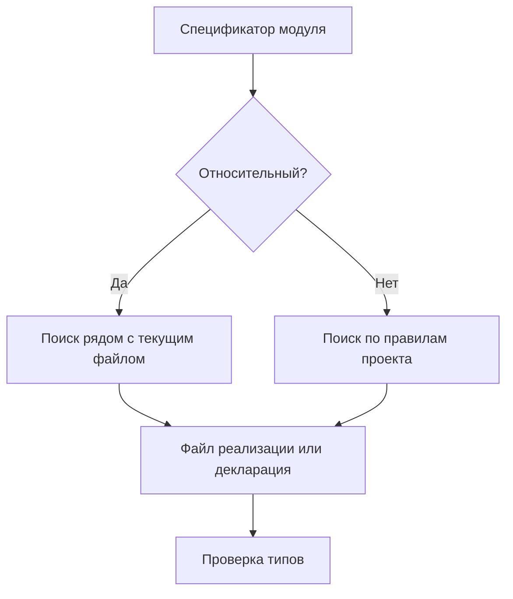

# Module Resolution

## Связь с предыдущей главой

Мы уже разделили обычные импорты и импорты только типов.

Теперь нужно понять, как TypeScript находит файл или типы, когда видит спецификатор модуля.

## Главный вопрос

Как TypeScript находит модуль и его типы?

## Мотивация

Ошибки `Cannot find module` часто появляются не из-за неправильного типа, а из-за того, что TypeScript не может сопоставить строку импорта с файлом или декларацией.

Для большого QA-проекта это важно: helper-функции, модели конфигурации и утилиты отчетов должны импортироваться предсказуемо.

## Теория

Разрешение модулей — это процесс поиска модуля по строке импорта.

```ts
import { createReportLine } from "./report-line.js";
```

`"./report-line.js"` — относительный импорт.

TypeScript ищет подходящий файл рядом с текущим модулем. В зависимости от настроек проекта он может учитывать `.ts`, `.tsx`, `.d.ts` и сгенерированный JavaScript.

Нерелятивный импорт выглядит иначе:

```ts
import { something } from "some-package";
```

Для таких импортов TypeScript ищет пакет или декларации по правилам проекта. Он не скачивает зависимости автоматически.

## Внутренний механизм



Разрешение модулей в TypeScript и поиск модулей во время выполнения связаны, но это не одно и то же. TypeScript может найти декларацию, но во время выполнения JavaScript все равно должен найти реальный модуль.

## Главная ментальная модель

Разрешение модулей — это адресная книга TypeScript: строка импорта должна привести к файлу реализации или к описанию типов.

## Практические примеры

Относительный импорт:

```ts
import { formatTitle } from "./format-title.js";

console.log(formatTitle("smoke"));
```

Ошибка возникает, если путь не соответствует реальному файлу:

```ts
// TypeScript не найдет модуль, если такого файла нет.
import { formatTitle } from "./missing-format-title.js";
```

Алиасы путей могут сделать импорты короче, но сами по себе не гарантируют поддержку во время выполнения. Если среда выполнения JavaScript не знает такой алиас, код может не запуститься.

## Automation QA

В проекте удобно держать helpers рядом с теми файлами, которые их используют:

```ts
import { buildReportName } from "./report-name.js";

export function buildReportFile(title: string): string {
  return `${buildReportName(title)}.json`;
}
```

Так зависимость видна прямо из relative path, без дополнительных правил.

## Распространённые ошибки

Ошибка — думать, что module resolution устанавливает пакет.

Если импорт выглядит так:

```ts
import { parse } from "external-parser";
```

TypeScript может искать типы для `"external-parser"`, но он не скачивает пакет и не создает runtime-модуль.

## Практика

Практические задания находятся в конце страницы.

## Краткие итоги

- Разрешение модулей сопоставляет строку импорта с файлом или декларацией.
- Относительные импорты ищутся относительно текущего файла.
- Нерелятивные импорты ищутся по правилам проекта.
- TypeScript не устанавливает зависимости автоматически.
- Найденная декларация не заменяет runtime-реализацию.

## Переход

Теперь понятно, как TypeScript ищет модуль. Следующая глава объяснит, как описывать типы JavaScript-кода, которого TypeScript сам не видит.
