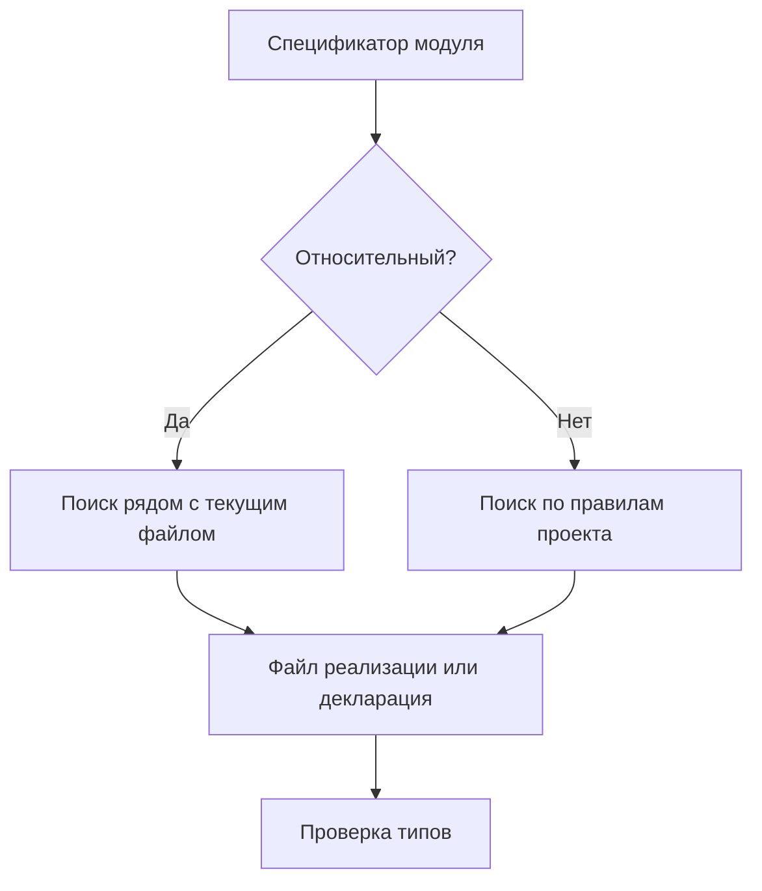

# Module Resolution

## Связь с предыдущей главой

Мы уже разделили обычные импорты и импорты только типов.

Теперь нужно понять, как TypeScript находит файл или типы, когда видит спецификатор модуля.

## Главный вопрос

Как TypeScript находит модуль и его типы?

## Мотивация

Ошибки `Cannot find module` часто появляются не из-за неправильного типа, а из-за того, что TypeScript не может сопоставить строку импорта с файлом или декларацией.

Для большого QA-проекта это важно: helper-функции, модели конфигурации и утилиты отчетов должны импортироваться предсказуемо.

## Теория

### Две разные адресные книги

Строку импорта разрешают **дважды и независимо**:

1. Компилятор ищет описание типов, чтобы проверить код.
2. Среда выполнения ищет настоящий файл, чтобы его загрузить.

Обе процедуры похожи, но это разные механизмы с разными правилами. Именно поэтому существует целый класс ошибок вида «редактор всё подсвечивает правильно, а запуск падает с „модуль не найден“».

### Относительные и нерелятивные импорты

```ts
import { formatTitle } from "./format-title.js";   // относительный
import { parse } from "external-parser";            // нерелятивный
```

Относительный путь ищется рядом с текущим файлом. Нерелятивный — по правилам поиска пакетов: сначала зависимости проекта, затем описания типов для них.

Компилятор при этом **не устанавливает** пакет. Если типов нет, он сообщит об этом, но сам ничего не скачает.

### Стратегия разрешения

Поведение задаётся настройкой `moduleResolution`. Практически значимы два варианта:

- `nodenext` — правила Node.js: расширения в относительных путях обязательны, учитываются поля `exports` в package.json;
- `bundler` — правила сборщиков: расширения можно опускать, потому что путь дорабатывает сборщик.

Выбор должен соответствовать тому, **как код будет запускаться**. Несовпадение даёт ровно ту ситуацию, когда проверка проходит, а запуск — нет.

### `paths` работает только для компилятора

Псевдонимы путей делают импорты короче:

```json
{ "compilerOptions": { "paths": { "@helpers/*": ["./src/helpers/*"] } } }
```

Но компилятор **не переписывает строки импортов**. После компиляции в файле останется `@helpers/...`, и среда выполнения такой путь не поймёт, если её отдельно не научить.

Это самая частая причина расхождения двух адресных книг. Псевдонимы работают, только когда их поддерживает и тот, кто запускает код: сборщик, загрузчик или `imports` в package.json.

### Почему «модуль не найден» при существующем файле

Типичные причины, в порядке частоты:

- пропущено расширение при `moduleResolution: nodenext`;
- указано `.ts` вместо `.js` — компилятор ждёт путь к результату компиляции;
- используется псевдоним, о котором знает только компилятор;
- пакет установлен, но не имеет типов и для него нет пакета с описаниями.

### Практический вывод

Для тестового проекта надёжнее всего оставаться в правилах среды выполнения: относительные пути с расширением и минимум псевдонимов. Короткие импорты приятны, но неработающий запуск обходится дороже.

## Внутренний механизм



Разрешение модулей в TypeScript и поиск модулей во время выполнения связаны, но это не одно и то же. TypeScript может найти декларацию, но во время выполнения JavaScript все равно должен найти реальный модуль.

## Главная ментальная модель

Разрешение модулей — это адресная книга TypeScript: строка импорта должна привести к файлу реализации или к описанию типов.

## Практические примеры

Относительный импорт:

```ts
import { formatTitle } from "./format-title.js";

console.log(formatTitle("smoke"));
```

Ошибка возникает, если путь не соответствует реальному файлу:

```ts
// TypeScript не найдет модуль, если такого файла нет.
import { formatTitle } from "./missing-format-title.js";
```

Алиасы путей могут сделать импорты короче, но сами по себе не гарантируют поддержку во время выполнения. Если среда выполнения JavaScript не знает такой алиас, код может не запуститься.

Запускаемые версии этих примеров находятся в:

```text
examples/02-typescript/chapter-152/
```

`01-relative-import.ts` — относительный импорт с расширением `.js`.

`02-dependent-module.ts` — цепочка модулей: один импортирует другой.

`03-missing-module-diagnostic.ts` — импорт несуществующего модуля (намеренная ошибка).

`format-title.ts` — вспомогательный модуль.

`report-file.ts` — модуль, зависящий от вспомогательного.

## Automation QA

В проекте удобно держать helpers рядом с теми файлами, которые их используют:

```ts
import { buildReportName } from "./report-name.js";

export function buildReportFile(title: string): string {
  return `${buildReportName(title)}.json`;
}
```

Так зависимость видна прямо из relative path, без дополнительных правил.

## Распространённые ошибки

Ошибка — думать, что module resolution устанавливает пакет.

Если импорт выглядит так:

```ts
import { parse } from "external-parser";
```

TypeScript может искать типы для `"external-parser"`, но он не скачивает пакет и не создает runtime-модуль.

## Распространённые мифы

**Миф: компилятор и среда выполнения ищут модуль одинаково.**
Это две независимые процедуры с разными правилами.

**Миф: `paths` делает короткие импорты рабочими.**
Он влияет только на проверку типов; строки импортов не переписываются.

**Миф: компилятор установит недостающий пакет.**
Он только ищет описания типов.

**Миф: расширение в импорте можно опустить всегда.**
При правилах Node.js оно обязательно.

## Частые вопросы

**Почему редактор доволен, а запуск падает?**
Скорее всего сработала только первая адресная книга: псевдоним или путь без расширения понятен компилятору, но не среде выполнения.

**Какой `moduleResolution` выбрать?**
Тот, что соответствует способу запуска: `nodenext` для Node.js, `bundler` — если путь дорабатывает сборщик.

**Почему в импорте `.js`, если файл `.ts`?**
Путь должен указывать на файл, который появится после компиляции.

**Можно ли пользоваться псевдонимами?**
Да, если их поддерживает и среда выполнения — через сборщик или поле `imports` в package.json.

## Проверьте себя

1. Какие две процедуры разрешают строку импорта и чем они различаются?
2. Чем относительный импорт отличается от нерелятивного по способу поиска?
3. Почему `paths` не решает проблему запуска?
4. Как выбрать стратегию разрешения модулей?
5. Назовите частые причины ошибки «модуль не найден» при существующем файле.

## Практика

Практические задания находятся в конце страницы.

## Краткие итоги

- Разрешение модулей сопоставляет строку импорта с файлом или декларацией.
- Относительные импорты ищутся относительно текущего файла.
- Нерелятивные импорты ищутся по правилам проекта.
- TypeScript не устанавливает зависимости автоматически.
- Найденная декларация не заменяет runtime-реализацию.

## Переход

Теперь понятно, как TypeScript ищет модуль. Следующая глава объяснит, как описывать типы JavaScript-кода, которого TypeScript сам не видит.
