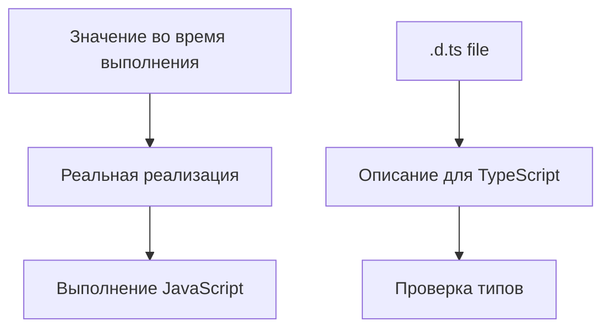

# Declaration Files

## Связь с предыдущей главой

В предыдущей главе мы разобрали, как TypeScript ищет модуль и его типы.

Теперь нужно понять, что происходит, когда код существует в JavaScript, а типы для него нужно описать отдельно.

## Главный вопрос

Как TypeScript узнает типы JavaScript-кода, которого сам не видит?

## Мотивация

В реальных проектах встречается JavaScript-код без TypeScript-аннотаций:

- старый helper;
- внешний модуль;
- небольшая утилита времени выполнения;
- глобальная переменная окружения.

TypeScript не может угадать все точно. Ему нужно описание формы API.

## Теория

Файл деклараций — это файл `.d.ts`.

Он содержит объявления типов, но обычно не содержит реализацию времени выполнения:

```ts
declare function buildReportName(title: string): string;
```

Такое объявление говорит TypeScript:

> Во время выполнения где-то существует функция `buildReportName`.

Но TypeScript не создает эту функцию.

Если реальной функции нет, JavaScript может упасть во время выполнения.

## Внутренний механизм



Декларация должна совпадать с реальным API во время выполнения. Неверная декларация может сделать опасный код внешне корректным.

## Главная ментальная модель

`.d.ts` — это паспорт JavaScript API для TypeScript. Паспорт описывает объект, но не создает сам объект.

## Практические примеры

Описание функции:

```ts
declare function readConfigValue(name: string): string;
```

Описание объекта:

```ts
declare const testEnvironment: {
  name: "local" | "staging";
  baseUrl: string;
};
```

Описание класса:

```ts
declare class LegacyReporter {
  constructor(name: string);
  write(message: string): void;
}
```

Все эти объявления нужны для проверки типов. Реализация должна прийти из JavaScript-кода или среды выполнения.

## Automation QA

Если в проекте есть старый JavaScript helper, декларация может описать его API:

```ts
declare function createLegacyReportLine(title: string, passed: boolean): string;
```

Тогда TypeScript сможет проверять вызовы этой функции в TypeScript-коде.

## Распространённые ошибки

Ошибка — считать `.d.ts` файлы кодом времени выполнения.

```ts
declare const currentUser: {
  email: string;
};
```

Это объявление не создает `currentUser`. Оно только сообщает TypeScript, что такое значение должно существовать во время выполнения.

## Практика

Практические задания находятся в конце страницы.

## Краткие итоги

- `.d.ts` файлы описывают типы существующего JavaScript API.
- Файлы деклараций обычно не содержат реализацию времени выполнения.
- `declare` не создает значение.
- Декларация должна соответствовать реальному API во время выполнения.
- Неверная декларация может скрыть ошибку.

## Переход

Теперь мы умеем описывать внешний JavaScript API. Следующая глава покажет, почему некоторые объявления TypeScript могут объединяться.
