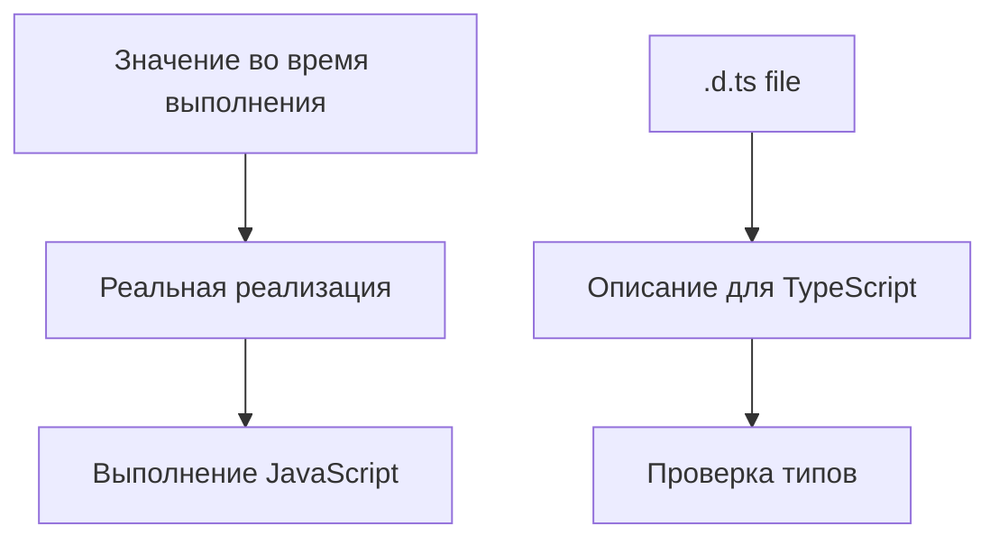

# Declaration Files

## Связь с предыдущей главой

В предыдущей главе мы разобрали, как TypeScript ищет модуль и его типы.

Теперь нужно понять, что происходит, когда код существует в JavaScript, а типы для него нужно описать отдельно.

## Главный вопрос

Как TypeScript узнает типы JavaScript-кода, которого сам не видит?

## Мотивация

В реальных проектах встречается JavaScript-код без TypeScript-аннотаций:

- старый helper;
- внешний модуль;
- небольшая утилита времени выполнения;
- глобальная переменная окружения.

TypeScript не может угадать все точно. Ему нужно описание формы API.

## Теория

### Описание без реализации

Файл `.d.ts` содержит только объявления:

```ts
declare function buildReportName(title: string): string;
```

Он сообщает компилятору: «где-то во время выполнения такая функция существует». Сама функция при этом не появляется — декларация ничего не создаёт.

Отсюда главное свойство: **декларация — это обещание**, и отвечает за него автор, а не компилятор.

### Откуда берутся декларации

Три источника, в порядке частоты:

1. **Встроенные в пакет.** Библиотека поставляет `.d.ts` вместе с кодом — ничего делать не нужно.
2. **Отдельный пакет с типами.** Для библиотек без собственных типов существуют пакеты вида `@types/имя`.
3. **Собственные.** Пишутся вручную, когда первых двух вариантов нет.

Проверить, какой случай перед вами, проще всего по сообщению об ошибке: компилятор прямо говорит, что описаний нет и где их искать.

### Неверная декларация опаснее отсутствующей

```ts
declare function readConfig(name: string): string;
```

Если на самом деле функция возвращает `string | undefined`, компилятор будет уверенно разрешать операции со строкой — и программа упадёт во время выполнения без единого предупреждения.

Это тот же механизм, что у неверного type guard из главы 129: обещание принимается на веру. Поэтому собственные декларации стоит писать по документации, а не по догадке, и проверять на реальных вызовах.

### `declare module` для пакетов без типов

Минимальный способ заглушить отсутствие описаний:

```ts
declare module "legacy-reporter";
```

Всё из такого модуля получит тип `any` — проверка отключена, зато сборка не падает. Вариант приемлем как временный.

Лучше описать хотя бы то, что реально используется:

```ts
declare module "legacy-reporter" {
  export function write(message: string): void;
}
```

Разница существенная: во втором случае ошибка в имени или аргументах будет найдена.

### Глобальные объявления

Файл `.d.ts` **без** `import` и `export` описывает глобальную область — то же правило, что для обычных модулей из главы 150.

Так добавляют описания к тому, что существует глобально: переменным окружения сборки, свойствам `globalThis`, расширениям стандартных типов.

### Генерация деклараций для своего кода

Если модуль используют другие проекты, декларации не пишут руками — их генерирует компилятор настройкой `declaration: true`.

Для тестового проекта это обычно не нужно: код никуда не поставляется, и описания берутся прямо из исходников.

## Внутренний механизм



Декларация должна совпадать с реальным API во время выполнения. Неверная декларация может сделать опасный код внешне корректным.

## Главная ментальная модель

`.d.ts` — это паспорт JavaScript API для TypeScript. Паспорт описывает объект, но не создает сам объект.

## Практические примеры

Описание функции:

```ts
declare function readConfigValue(name: string): string;
```

Описание объекта:

```ts
declare const testEnvironment: {
  name: "local" | "staging";
  baseUrl: string;
};
```

Описание класса:

```ts
declare class LegacyReporter {
  constructor(name: string);
  write(message: string): void;
}
```

Все эти объявления нужны для проверки типов. Реализация должна прийти из JavaScript-кода или среды выполнения.

## Automation QA

Если в проекте есть старый JavaScript helper, декларация может описать его API:

```ts
declare function createLegacyReportLine(title: string, passed: boolean): string;
```

Тогда TypeScript сможет проверять вызовы этой функции в TypeScript-коде.

## Распространённые ошибки

Ошибка — считать `.d.ts` файлы кодом времени выполнения.

```ts
declare const currentUser: {
  email: string;
};
```

Это объявление не создает `currentUser`. Оно только сообщает TypeScript, что такое значение должно существовать во время выполнения.

## Распространённые мифы

**Миф: `.d.ts` добавляет функцию в программу.**
Он только описывает то, что должно существовать независимо.

**Миф: отсутствующие типы — большая проблема, чем неверные.**
Наоборот: неверная декларация даёт ложную уверенность и молча ломает проверку.

**Миф: `declare module "x"` полноценно типизирует пакет.**
Такая заглушка даёт `any` для всего содержимого.

**Миф: декларации нужно писать любому проекту.**
Для тестового проекта типы берутся из исходников; генерация нужна библиотекам.

## Частые вопросы

**Что делать, если у пакета нет типов?**
Сначала проверить пакет `@types/имя`. Если его нет — описать используемую часть самому.

**Чем плоха заглушка `declare module "x"`?**
Она отключает проверку для всего модуля. Как временная мера допустима, как постоянная — нет.

**Как объявить что-то глобально?**
Файлом `.d.ts` без импортов и экспортов: тогда объявления попадут в глобальную область.

**Когда включать `declaration: true`?**
Когда код поставляется другим проектам как пакет.

## Проверьте себя

1. Что делает и чего не делает файл `.d.ts`?
2. Три источника деклараций — какие?
3. Почему неверная декларация опаснее отсутствующей?
4. Чем отличается пустой `declare module` от описания с содержимым?
5. При каком условии файл деклараций описывает глобальную область?

## Практика

Практические задания находятся в конце страницы.

## Краткие итоги

- `.d.ts` файлы описывают типы существующего JavaScript API.
- Файлы деклараций обычно не содержат реализацию времени выполнения.
- `declare` не создает значение.
- Декларация должна соответствовать реальному API во время выполнения.
- Неверная декларация может скрыть ошибку.

## Переход

Теперь мы умеем описывать внешний JavaScript API. Следующая глава покажет, почему некоторые объявления TypeScript могут объединяться.
