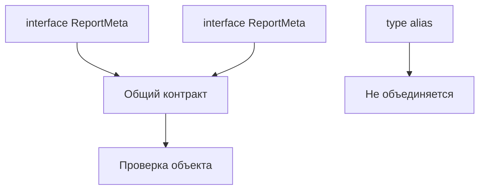

# Declaration Merging

## Связь с предыдущей главой

В предыдущей главе мы использовали декларации, чтобы описывать API для TypeScript.

Теперь нужно разобрать особенность TypeScript: некоторые объявления с одинаковым именем могут объединяться.

## Главный вопрос

Почему некоторые объявления TypeScript могут объединяться?

## Мотивация

Иногда один объектный контракт дополняется постепенно.

Например, одна часть проекта описывает базовые поля metadata, а другая добавляет поле для отчета. TypeScript умеет объединять некоторые объявления, но это не универсальное правило.

## Теория

Интерфейсы с одинаковым именем могут объединяться:

```ts
interface ReportMeta {
  title: string;
}

interface ReportMeta {
  status: "passed" | "failed";
}

const meta: ReportMeta = {
  title: "login",
  status: "passed",
};
```

После объединения `ReportMeta` содержит оба свойства.

Type aliases не объединяются:

```ts
type UserId = string;
```

Повторно объявить `type UserId` в той же области нельзя.

## Внутренний механизм



Объединение деклараций происходит на этапе проверки TypeScript. Оно не создает поля времени выполнения автоматически.

## Главная ментальная модель

Объединение деклараций — это склейка некоторых объявлений для компилятора, а не добавление поведения в JavaScript.

## Практические примеры

```ts
interface TestReport {
  title: string;
}

interface TestReport {
  durationMs: number;
}

const report: TestReport = {
  title: "smoke",
  durationMs: 1200,
};
```

Если одно и то же свойство объявлено несовместимо, TypeScript покажет ошибку:

```ts
interface ResultInfo {
  status: "passed";
}

interface ResultInfo {
  status: "failed";
}
```

Такая склейка не превращает TypeScript в систему runtime-расширения объектов.

## Automation QA

Для внутренних контрактов лучше использовать объединение деклараций осторожно.

```ts
interface ReportContext {
  runId: string;
}

interface ReportContext {
  environment: "local" | "staging";
}
```

Это может быть полезно, но слишком частое объединение деклараций делает источник контракта менее очевидным.

## Распространённые ошибки

Ошибка — думать, что объединение работает для всех объявлений.

`interface` может объединяться. `type alias` не объединяется.

Еще одна ошибка — ожидать, что объединение добавит объекту свойства во время выполнения. Объект все равно должен реально содержать нужные поля.

## Практика

Практические задания находятся в конце страницы.

## Краткие итоги

- Объединение деклараций объединяет поддерживаемые объявления на этапе проверки.
- Интерфейсы с одинаковым именем могут объединяться.
- Type aliases не объединяются.
- Несовместимые свойства дают диагностическую ошибку.
- Объединение не создает данные во время выполнения.

## Переход

Теперь мы знаем, как TypeScript работает с декларациями. Следующая глава свяжет это с параметрами компилятора, которые влияют на поддержку большого проекта.
