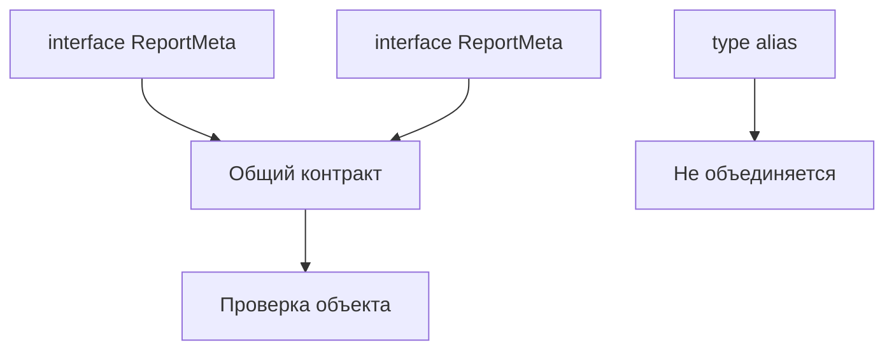

# Declaration Merging

## Связь с предыдущей главой

В предыдущей главе мы использовали декларации, чтобы описывать API для TypeScript.

Теперь нужно разобрать особенность TypeScript: некоторые объявления с одинаковым именем могут объединяться.

## Главный вопрос

Почему некоторые объявления TypeScript могут объединяться?

## Мотивация

Иногда один объектный контракт дополняется постепенно.

Например, одна часть проекта описывает базовые поля metadata, а другая добавляет поле для отчета. TypeScript умеет объединять некоторые объявления, но это не универсальное правило.

## Теория

### Что сливается, а что нет

Несколько объявлений интерфейса с одним именем объединяются в один тип:

```ts
interface ReportMeta { title: string }
interface ReportMeta { status: "passed" | "failed" }

const meta: ReportMeta = { title: "login", status: "passed" };
```

Требуются оба свойства. Type alias так не умеет — повторное объявление даёт ошибку «Duplicate identifier».

Это одно из немногих принципиальных различий между двумя инструментами, разобранных в главе 113.

### Конфликт — ошибка

Слияние не выбирает «последнее» объявление:

```ts
interface ResultInfo { status: "passed" }
interface ResultInfo { status: "failed" }   // ошибка
```

Несовместимые объявления одного свойства отвергаются сразу. Совместимые — например, одинаковый тип — допустимы.

### Настоящее применение: расширение чужих типов

В собственном коде слияние почти не нужно: гораздо понятнее объявить тип один раз. Настоящая ценность появляется там, где **менять исходник нельзя**.

Для этого существует дополнение модуля:

```ts
declare module "some-library" {
  interface Options {
    customField?: string;
  }
}
```

Так добавляют поля в типы библиотеки, не трогая её код. Без слияния такая операция была бы невозможна в принципе.

### Что это даёт в тестовом проекте

Типичный случай — расширение типов тестового фреймворка: добавить собственное поле в контекст теста, метаданные или конфигурацию.

Дополнение модуля решает задачу целиком: поле становится известно компилятору везде, где используется исходный тип, без обёрток и приведений.

Важно помнить границу: слияние добавляет поле **в тип**, а не в объект. Значение всё равно нужно положить туда самому — обычно это делает фикстура или настройка фреймворка.

### Другие виды слияния

Кроме интерфейсов сливаются пространства имён, а также пространство имён с функцией или классом. В прикладном коде это встречается редко и чаще всего в старых библиотеках.

### Почему не стоит злоупотреблять

Слияние делает источник контракта неочевидным: чтобы узнать полную форму типа, нужно найти все его объявления, которые могут лежать в разных файлах.

Практическое правило: слияние — инструмент для границы с чужим кодом. Внутри своего проекта тип объявляют один раз, а расширяют композицией — пересечением или отдельным типом.

## Внутренний механизм



Объединение деклараций происходит на этапе проверки TypeScript. Оно не создает поля времени выполнения автоматически.

## Главная ментальная модель

Объединение деклараций — это склейка некоторых объявлений для компилятора, а не добавление поведения в JavaScript.

## Практические примеры

```ts
interface TestReport {
  title: string;
}

interface TestReport {
  durationMs: number;
}

const report: TestReport = {
  title: "smoke",
  durationMs: 1200,
};
```

Если одно и то же свойство объявлено несовместимо, TypeScript покажет ошибку:

```ts
interface ResultInfo {
  status: "passed";
}

interface ResultInfo {
  status: "failed";
}
```

Такая склейка не превращает TypeScript в систему runtime-расширения объектов.

Запускаемые версии этих примеров находятся в:

```text
examples/02-typescript/chapter-154/
```

`01-interface-merging.ts` — два объявления интерфейса склеиваются.

`02-type-alias-no-merging-diagnostic.ts` — повторный `type` с тем же именем (намеренная ошибка).

`03-incompatible-merge-diagnostic.ts` — конфликт типов при склейке (намеренная ошибка).

## Automation QA

Для внутренних контрактов лучше использовать объединение деклараций осторожно.

```ts
interface ReportContext {
  runId: string;
}

interface ReportContext {
  environment: "local" | "staging";
}
```

Это может быть полезно, но слишком частое объединение деклараций делает источник контракта менее очевидным.

## Распространённые ошибки

Ошибка — думать, что объединение работает для всех объявлений.

`interface` может объединяться. `type alias` не объединяется.

Еще одна ошибка — ожидать, что объединение добавит объекту свойства во время выполнения. Объект все равно должен реально содержать нужные поля.

## Распространённые мифы

**Миф: слияние работает для любых объявлений типов.**
Интерфейсы сливаются, type alias — нет.

**Миф: при конфликте побеждает последнее объявление.**
Несовместимые объявления одного свойства дают ошибку.

**Миф: слияние добавляет свойство объекту.**
Оно меняет только тип. Значение нужно положить самому.

**Миф: это удобный способ расширять свои типы.**
Внутри проекта тип объявляют один раз; слияние — инструмент для чужого кода.

## Частые вопросы

**Как добавить поле в тип из библиотеки?**
Дополнением модуля: `declare module "имя" { interface X { ... } }`.

**Почему не стоит пользоваться слиянием в своём коде?**
Полная форма типа перестаёт читаться в одном месте.

**Что произойдёт, если объявить свойство дважды одинаково?**
Ничего страшного: совместимые объявления допустимы.

**Поле появилось в типе, но во время выполнения его нет. Почему?**
Слияние меняет только тип. Значение должна положить фикстура или настройка.

## Проверьте себя

1. Какие объявления сливаются, а какие нет?
2. Что происходит при несовместимом повторном объявлении свойства?
3. В чём настоящее назначение слияния объявлений?
4. Что даёт дополнение модуля в тестовом проекте?
5. Почему злоупотребление слиянием вредит читаемости?

## Практика

Практические задания находятся в конце страницы.

## Краткие итоги

- Объединение деклараций объединяет поддерживаемые объявления на этапе проверки.
- Интерфейсы с одинаковым именем могут объединяться.
- Type aliases не объединяются.
- Несовместимые свойства дают диагностическую ошибку.
- Объединение не создает данные во время выполнения.

## Переход

Теперь мы знаем, как TypeScript работает с декларациями. Следующая глава свяжет это с параметрами компилятора, которые влияют на поддержку большого проекта.
