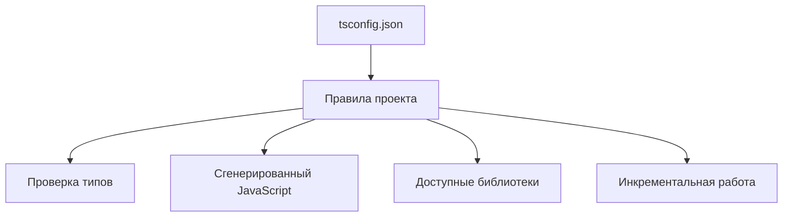

# Compiler Options for Real Projects

## Связь с предыдущей главой

Мы разобрали модули, type-only imports, module resolution и declaration files.

Теперь нужно понять, какие параметры компилятора влияют на поддержку большого проекта и почему они важны для команды.

## Главный вопрос

Какие параметры компилятора действительно влияют на поддержку большого проекта?

## Мотивация

В небольшом файле TypeScript кажется набором отдельных типов.

В большом проекте важны правила компилятора:

- какой JavaScript генерируется;
- какие библиотеки доступны;
- нужно ли выпускать сгенерированные файлы;
- насколько строгими будут проверки;
- как быстро пересобирать проект.

Параметры компилятора превращают TypeScript из инструмента проверки одного файла в правила всего проекта.

## Теория

### Две группы настроек

Опции компилятора делятся по тому, на что они влияют:

- **на проверку** — какие ошибки будут найдены;
- **на генерацию** — какой JavaScript получится.

Смешивать их в голове не стоит: первые меняют строгость, вторые — совместимость с тем, где код запускается.

### Настройки генерации

```json
{
  "compilerOptions": {
    "target": "ES2022",
    "module": "NodeNext",
    "outDir": "./build"
  }
}
```

`target` задаёт уровень языка в результате, `module` — формат модулей, `outDir` — куда складывать файлы.

Отдельный случай — `noEmit: true`: компилятор работает только проверяющим, файлы не создаются. Для тестового проекта это обычная конфигурация, потому что тесты запускает сам фреймворк.

### Настройки проверки сверх `strict`

`strict` включает базовый набор, но несколько ценных проверок в него не входят:

| Опция | Что находит |
| --- | --- |
| `noUncheckedIndexedAccess` | Обращение по индексу к возможно отсутствующему элементу |
| `exactOptionalPropertyTypes` | Смешение «свойства нет» и «свойство равно `undefined`» |
| `noImplicitOverride` | Переопределение метода без явного `override` |
| `noFallthroughCasesInSwitch` | Забытый `break` в `switch` |

Для тестового кода особенно окупается первая: массивы и словари там приходят из ответов API, и оптимистичное обращение по индексу — частый источник падений.

### Настройки скорости

`incremental: true` сохраняет результат предыдущей проверки и переиспользует его. На большом проекте это разница между секундами и минутами при повторном запуске.

Скорость влияет на поведение команды: проверка, идущая минуту, перестаёт запускаться перед коммитом.

### Что важно для совместимости модулей

`moduleResolution` должен соответствовать способу запуска — об этом глава 152. К нему примыкает `verbatimModuleSyntax`, делающий удаление импортов предсказуемым.

Ошибки в этой паре проявляются не как сообщения компилятора, а как падение при запуске — поэтому их стоит настроить один раз и осознанно.

### Как вводить строгость

Копировать чужой конфиг целиком — плохая стратегия: включённая опция, смысл которой команда не понимает, приводит к обходам через `as` и `any`. Формально строгость есть, фактически её нет.

Рабочий порядок: включать по одной опции, чинить найденное, объяснять команде, какой класс ошибок она предотвращает. Настройка, за которой стоит понятная история, переживает следующий сложный случай; настройка «так было в шаблоне» — нет.

### Конфигурация — это договор

`tsconfig.json` фиксирует, насколько строго проверяется код, какие API считаются доступными и во что он превращается. Это техническое соглашение команды, а не набор галочек, поэтому его изменения стоит обсуждать так же, как изменения архитектуры.

## Внутренний механизм



Параметры компилятора не исправляют архитектуру сами по себе. Они задают границы, внутри которых команда пишет код.

## Главная ментальная модель

`tsconfig.json` — это технический договор команды с компилятором.

## Практические примеры

`noEmit` полезен, когда TypeScript используется только для проверки:

```json
{
  "compilerOptions": {
    "noEmit": true
  }
}
```

`lib` определяет, какие стандартные API TypeScript считает доступными:

```json
{
  "compilerOptions": {
    "lib": ["ES2022"]
  }
}
```

`incremental` помогает ускорять повторные проверки проекта:

```json
{
  "compilerOptions": {
    "incremental": true
  }
}
```

Это не меняет смысл типов, но влияет на работу команды с проектом.

## Automation QA

В QA-проекте параметры компилятора помогают договориться:

- какие версии JavaScript доступны;
- насколько строго проверяются test data;
- должны ли helper-функции компилироваться в JavaScript;
- как быстро запускать проверку перед commit.

Например, строгие правила особенно полезны для config objects и API response models.

## Распространённые ошибки

Ошибка — копировать параметры компилятора без понимания последствий.

Если включить строгую опцию, но команда не понимает, какие ошибки она предотвращает, конфигурация превращается в источник случайных обходов.

Еще одна ошибка — думать, что параметр компилятора меняет API во время выполнения. Например, `lib` сообщает TypeScript, какие API доступны по типам, но не добавляет эти API в среду выполнения.

## Распространённые мифы

**Миф: `strict` включает все полезные проверки.**
Несколько ценных опций в него не входят и включаются отдельно.

**Миф: опции компилятора добавляют возможности среде выполнения.**
`lib` сообщает, какие API считать доступными, но не добавляет их.

**Миф: чужой конфиг можно скопировать целиком.**
Непонятая строгость обходится через `as` и `any`.

**Миф: скорость проверки — второстепенный вопрос.**
Медленная проверка перестаёт запускаться перед коммитом.

## Частые вопросы

**Какие опции включить сверх `strict`?**
Начать с `noUncheckedIndexedAccess`: для тестового кода она находит больше всего реальных ошибок.

**Нужен ли `outDir` тестовому проекту?**
Обычно нет: при `noEmit: true` файлы не создаются, тесты запускает фреймворк.

**Почему ошибка проявляется только при запуске?**
Скорее всего дело в паре `moduleResolution` и формата модулей: проверка прошла, а среда выполнения путь не нашла.

**Как вводить строгие опции в существующем проекте?**
По одной, с исправлением найденного и объяснением, какой класс ошибок она предотвращает.

## Проверьте себя

1. На какие две группы делятся опции компилятора?
2. Какие проверки не входят в `strict` и что они находят?
3. Почему тестовому проекту обычно подходит `noEmit`?
4. Как скорость проверки влияет на поведение команды?
5. Чем плохо копирование чужой конфигурации целиком?

## Практика

Практические задания находятся в конце страницы.

## Краткие итоги

- Параметры компилятора задают правила проекта.
- `target` и `module` влияют на сгенерированный JavaScript.
- `lib` влияет на доступные типы стандартных API.
- `noEmit` позволяет использовать TypeScript только для проверки.
- Строгие параметры помогают находить ошибки, но требуют дисциплины.

## Переход

Модуль модулей и деклараций завершен. Следующий модуль перейдет к проектной практике TypeScript в крупных QA-проектах.
