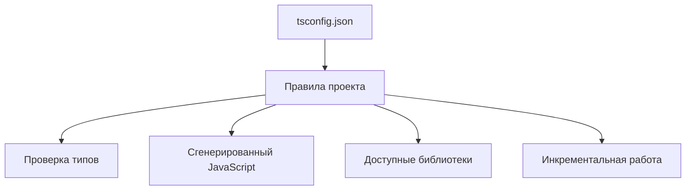

# Compiler Options for Real Projects

## Связь с предыдущей главой

Мы разобрали модули, type-only imports, module resolution и declaration files.

Теперь нужно понять, какие параметры компилятора влияют на поддержку большого проекта и почему они важны для команды.

## Главный вопрос

Какие параметры компилятора действительно влияют на поддержку большого проекта?

## Мотивация

В небольшом файле TypeScript кажется набором отдельных типов.

В большом проекте важны правила компилятора:

- какой JavaScript генерируется;
- какие библиотеки доступны;
- нужно ли выпускать сгенерированные файлы;
- насколько строгими будут проверки;
- как быстро пересобирать проект.

Параметры компилятора превращают TypeScript из инструмента проверки одного файла в правила всего проекта.

## Теория

`tsconfig.json` задает договор между проектом и TypeScript.

Некоторые параметры влияют на сгенерированный JavaScript:

```json
{
  "compilerOptions": {
    "target": "ES2022",
    "module": "ES2022"
  }
}
```

`target` описывает уровень JavaScript, который TypeScript должен генерировать.

`module` описывает формат модулей в сгенерированном JavaScript.

Другие параметры влияют на проверку:

```json
{
  "compilerOptions": {
    "strict": true,
    "noUncheckedIndexedAccess": true,
    "exactOptionalPropertyTypes": true
  }
}
```

Эти правила помогают находить более тонкие ошибки, но требуют более аккуратного кода.

## Внутренний механизм



Параметры компилятора не исправляют архитектуру сами по себе. Они задают границы, внутри которых команда пишет код.

## Главная ментальная модель

`tsconfig.json` — это технический договор команды с компилятором.

## Практические примеры

`noEmit` полезен, когда TypeScript используется только для проверки:

```json
{
  "compilerOptions": {
    "noEmit": true
  }
}
```

`lib` определяет, какие стандартные API TypeScript считает доступными:

```json
{
  "compilerOptions": {
    "lib": ["ES2022"]
  }
}
```

`incremental` помогает ускорять повторные проверки проекта:

```json
{
  "compilerOptions": {
    "incremental": true
  }
}
```

Это не меняет смысл типов, но влияет на работу команды с проектом.

## Automation QA

В QA-проекте параметры компилятора помогают договориться:

- какие версии JavaScript доступны;
- насколько строго проверяются test data;
- должны ли helper-функции компилироваться в JavaScript;
- как быстро запускать проверку перед commit.

Например, строгие правила особенно полезны для config objects и API response models.

## Распространённые ошибки

Ошибка — копировать параметры компилятора без понимания последствий.

Если включить строгую опцию, но команда не понимает, какие ошибки она предотвращает, конфигурация превращается в источник случайных обходов.

Еще одна ошибка — думать, что параметр компилятора меняет API во время выполнения. Например, `lib` сообщает TypeScript, какие API доступны по типам, но не добавляет эти API в среду выполнения.

## Практика

Практические задания находятся в конце страницы.

## Краткие итоги

- Параметры компилятора задают правила проекта.
- `target` и `module` влияют на сгенерированный JavaScript.
- `lib` влияет на доступные типы стандартных API.
- `noEmit` позволяет использовать TypeScript только для проверки.
- Строгие параметры помогают находить ошибки, но требуют дисциплины.

## Переход

Модуль модулей и деклараций завершен. Следующий модуль перейдет к проектной практике TypeScript в крупных QA-проектах.
