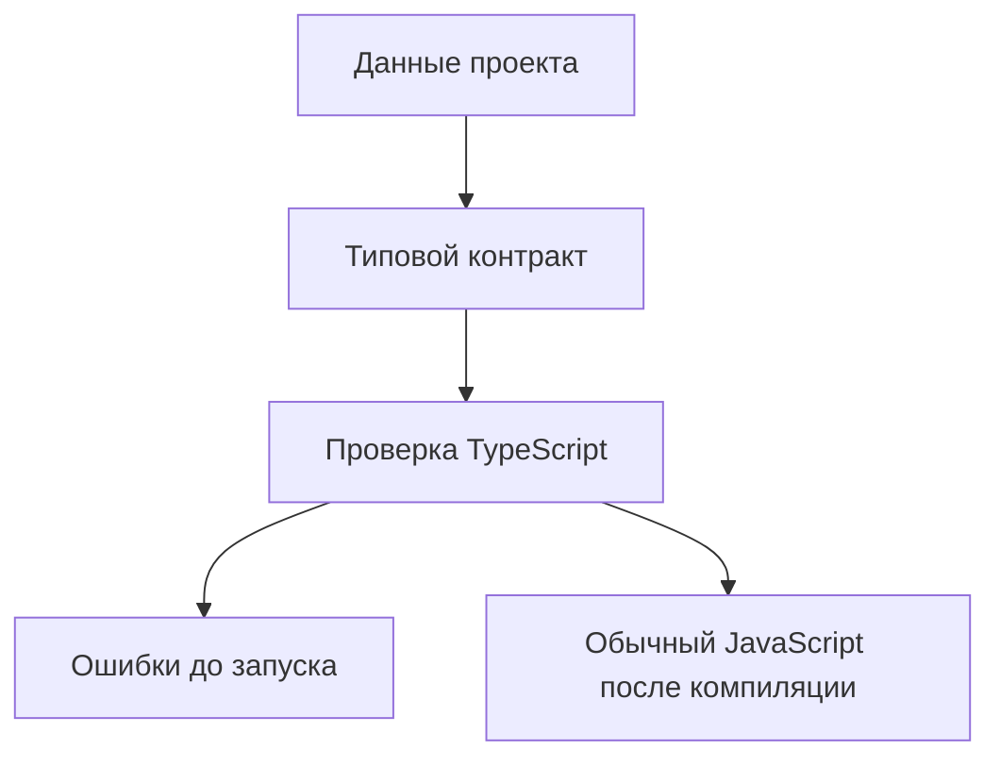

# Typed Configuration and Test Data

## Связь с предыдущей главой

Мы завершили модуль про TypeScript-модули, декларации и параметры компилятора.

Теперь переходим к проектной практике: как использовать уже изученные типы для данных, от которых зависит большой QA-проект.

## Главный вопрос

Как TypeScript помогает держать конфигурацию и тестовые данные согласованными?

## Мотивация

В JavaScript конфигурации и тестовые данные часто выглядят как обычные объекты.

Проблема появляется позже:

- в одном месте окружение называется `stage`, а в другом `staging`;
- тестовый пользователь потерял обязательное поле;
- URL окружения стал необязательным случайно;
- команда меняет структуру тестовых данных, но часть тестов остается старой.

TypeScript помогает сделать такие данные проверяемыми до запуска.

## Теория

Конфигурация и тестовые данные — это не просто значения. Это договор между разными частями проекта.

```ts
type EnvironmentName = "local" | "staging" | "production";

type EnvironmentConfig = {
  name: EnvironmentName;
  baseUrl: string;
  retries: number;
};
```

Такой тип описывает, какие поля обязаны быть у конфигурации.

Для набора окружений удобно использовать объект с фиксированными ключами:

```ts
type EnvironmentMap = Record<EnvironmentName, EnvironmentConfig>;
```

`Record` уже изучался как utility type. Здесь он помогает сказать: для каждого допустимого окружения должна быть конфигурация.

`satisfies` полезен, когда нужно проверить форму объекта, но сохранить точные значения:

```ts
const environments = {
  local: {
    name: "local",
    baseUrl: "http://localhost:3000",
    retries: 0,
  },
  staging: {
    name: "staging",
    baseUrl: "https://staging.example.test",
    retries: 2,
  },
  production: {
    name: "production",
    baseUrl: "https://example.test",
    retries: 1,
  },
} satisfies EnvironmentMap;
```

## Внутренний механизм



TypeScript проверяет объект во время компиляции. После компиляции остаются обычные JavaScript-объекты.

Типы не проверяют данные, которые пришли во время выполнения из файла, API или переменной окружения.

## Главная ментальная модель

Типизированная конфигурация — это чек-лист для данных проекта.

Если поле обязательно для запуска тестов, оно должно быть обязательным в типе.

## Практические примеры

Тестовый пользователь:

```ts
type TestUser = {
  readonly id: string;
  email: string;
  role: "admin" | "viewer";
};

const adminUser: TestUser = {
  id: "user-1",
  email: "admin@example.test",
  role: "admin",
};
```

Набор данных:

```ts
const users = [
  adminUser,
  {
    id: "user-2",
    email: "viewer@example.test",
    role: "viewer",
  },
] satisfies readonly TestUser[];
```

`readonly` защищает идентификатор от случайного переназначения в коде.

## Automation QA

В большом QA-проекте конфигурация обычно используется в разных местах:

- runner выбирает окружение;
- API helper берет `baseUrl`;
- report получает имя окружения;
- builder тестовых данных использует заранее описанных пользователей.

Если эти данные не типизированы, ошибка может проявиться только при запуске тестов.

TypeScript переносит часть ошибок на этап проверки проекта.

## Распространённые ошибки

Ошибка — считать типизированную конфигурацию проверкой во время выполнения.

Если данные пришли из внешнего JSON или переменной окружения, TypeScript не проверяет их автоматически во время выполнения.

Еще одна ошибка — использовать `as` вместо исправления данных. Утверждение типа может скрыть ошибку, но не делает объект правильным.

## Практика

Практические задания находятся в конце страницы.

## Краткие итоги

- Конфигурация и тестовые данные являются контрактом проекта.
- Literal types ограничивают допустимые значения.
- `Record` помогает требовать данные для каждого варианта.
- `satisfies` проверяет форму объекта и сохраняет точность значений.
- TypeScript не валидирует внешние данные во время выполнения.

## Переход

Мы описали данные проекта. Следующий шаг — применить типы к объектам, фикстурам и API вспомогательных функций, которые используют эти данные.
