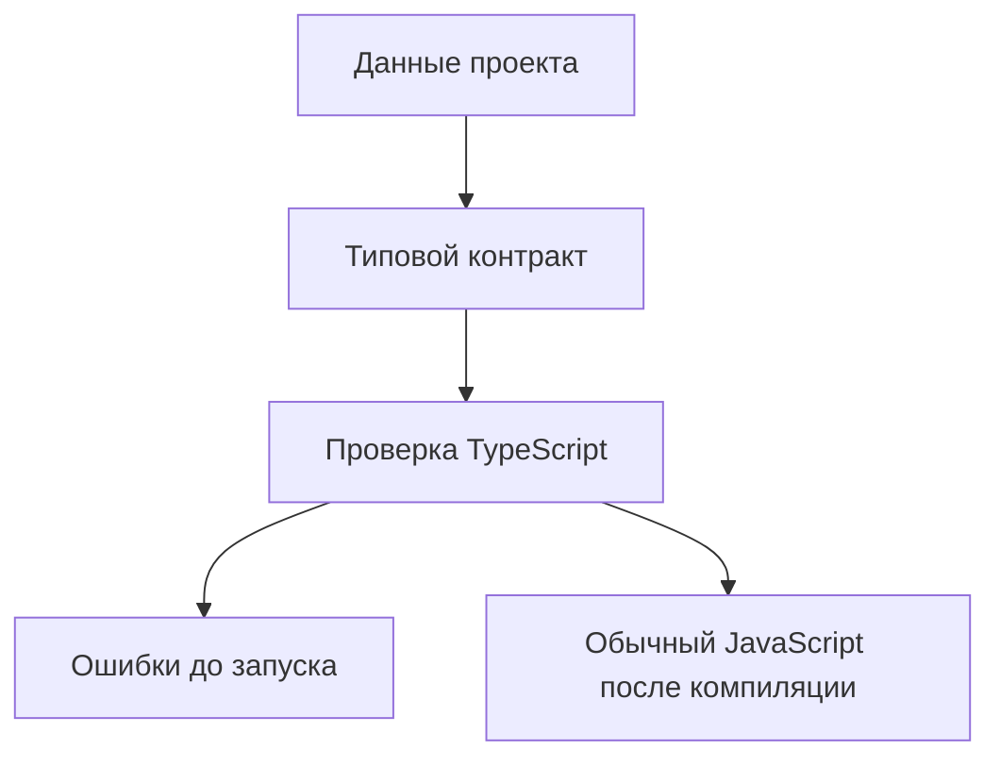

# Typed Configuration and Test Data

## Связь с предыдущей главой

Мы завершили модуль про TypeScript-модули, декларации и параметры компилятора.

Теперь переходим к проектной практике: как использовать уже изученные типы для данных, от которых зависит большой QA-проект.

## Главный вопрос

Как TypeScript помогает держать конфигурацию и тестовые данные согласованными?

## Мотивация

В JavaScript конфигурации и тестовые данные часто выглядят как обычные объекты.

Проблема появляется позже:

- в одном месте окружение называется `stage`, а в другом `staging`;
- тестовый пользователь потерял обязательное поле;
- URL окружения стал необязательным случайно;
- команда меняет структуру тестовых данных, но часть тестов остается старой.

TypeScript помогает сделать такие данные проверяемыми до запуска.

## Теория

### Конфигурация — это договор

Настройки запуска читают десятки мест: клиент API, фикстуры, отчёты, ожидания. Поэтому конфигурация описывается типом, а не собирается по месту:

```ts
type EnvironmentName = "local" | "staging" | "production";

type EnvironmentConfig = {
  name: EnvironmentName;
  baseUrl: string;
  retries: number;
};
```

Объединение литералов здесь важнее, чем кажется: оно превращает список окружений из договорённости в проверяемое правило.

### `Record` гарантирует полноту

```ts
type EnvironmentMap = Record<EnvironmentName, EnvironmentConfig>;
```

Такой тип требует **все** окружения и запрещает лишние. Добавили новое имя в объединение — компилятор потребовал для него конфигурацию.

Это и есть принцип «невозможные состояния невыразимы» в применении к настройкам: забыть окружение нельзя.

### `satisfies` сохраняет точность

```ts
const environments = {
  local: { name: "local", baseUrl: "http://localhost:3000", retries: 0 },
  staging: { name: "staging", baseUrl: "https://staging.example.test", retries: 2 },
} satisfies EnvironmentMap;
```

Форма проверена, но конкретные значения остались доступны: `environments.local.retries` — это `0`, а не просто `number`.

Аннотация здесь потеряла бы точность, а `as` вовсе не проверил бы форму. Это тот самый случай, ради которого `satisfies` и существует.

### Данные из окружения — всегда строки

Ключевая граница, которую часто пропускают:

```ts
const retries = process.env.RETRIES;   // string | undefined
```

Переменная окружения не имеет типа. Её нужно проверить и преобразовать **в одном месте**, а дальше по коду работать с готовой конфигурацией:

```ts
function readRetries(raw: string | undefined): number {
  const value = Number(raw ?? "0");
  if (!Number.isInteger(value) || value < 0) {
    throw new Error(`Некорректное значение RETRIES: ${raw}`);
  }
  return value;
}
```

Тогда ошибка настройки выглядит как понятное сообщение при старте, а не как загадочное падение в середине прогона.

### Один источник истины

Список окружений, статусов, ролей должен существовать **в одном месте**, а тип выводиться из него:

```ts
const ENVIRONMENTS = ["local", "staging", "production"] as const;
type EnvironmentName = typeof ENVIRONMENTS[number];
```

Массив можно перебрать во время выполнения — например, чтобы проверить значение из окружения. Тип получается автоматически и не может с ним разойтись.

### Тестовые данные

Для данных действуют те же правила плюс одно дополнительное: **уникальность**. Значения, создаваемые тестом, должны быть различимы между параллельными запусками, иначе изоляция ломается.

Типы здесь помогают выразить обязательность: построитель данных с обязательным маркером уникальности не даст забыть его добавить.

## Внутренний механизм



TypeScript проверяет объект во время компиляции. После компиляции остаются обычные JavaScript-объекты.

Типы не проверяют данные, которые пришли во время выполнения из файла, API или переменной окружения.

## Главная ментальная модель

Типизированная конфигурация — это чек-лист для данных проекта.

Если поле обязательно для запуска тестов, оно должно быть обязательным в типе.

## Практические примеры

Тестовый пользователь:

```ts
type TestUser = {
  readonly id: string;
  email: string;
  role: "admin" | "viewer";
};

const adminUser: TestUser = {
  id: "user-1",
  email: "admin@example.test",
  role: "admin",
};
```

Набор данных:

```ts
const users = [
  adminUser,
  {
    id: "user-2",
    email: "viewer@example.test",
    role: "viewer",
  },
] satisfies readonly TestUser[];
```

`readonly` защищает идентификатор от случайного переназначения в коде.

## Automation QA

В большом QA-проекте конфигурация обычно используется в разных местах:

- runner выбирает окружение;
- API helper берет `baseUrl`;
- report получает имя окружения;
- builder тестовых данных использует заранее описанных пользователей.

Если эти данные не типизированы, ошибка может проявиться только при запуске тестов.

TypeScript переносит часть ошибок на этап проверки проекта.

## Распространённые ошибки

Ошибка — считать типизированную конфигурацию проверкой во время выполнения.

Если данные пришли из внешнего JSON или переменной окружения, TypeScript не проверяет их автоматически во время выполнения.

Еще одна ошибка — использовать `as` вместо исправления данных. Утверждение типа может скрыть ошибку, но не делает объект правильным.

## Распространённые мифы

**Миф: конфигурацию достаточно описать как объект со строками.**
Тогда опечатка в имени окружения станет ошибкой времени выполнения.

**Миф: переменные окружения имеют тип.**
Они всегда `string | undefined` и требуют проверки на границе.

**Миф: `satisfies` и аннотация взаимозаменяемы для конфигурации.**
Аннотация теряет точные значения, `satisfies` сохраняет.

**Миф: список окружений можно продублировать в типе и в массиве.**
Две копии разойдутся. Тип выводят из массива.

## Частые вопросы

**Как гарантировать, что настроены все окружения?**
Описать карту как `Record<EnvironmentName, Config>`: компилятор потребует все ключи.

**Где проверять переменные окружения?**
В одном месте при старте. Дальше по коду должна ходить готовая конфигурация.

**Почему `satisfies` лучше аннотации здесь?**
Он проверяет форму и оставляет точные значения доступными.

**Зачем уникальность в тестовых данных?**
Без неё параллельные запуски конфликтуют на одних и тех же значениях.

## Проверьте себя

1. Почему список окружений описывают объединением литералов, а не `string`?
2. Что гарантирует `Record<EnvironmentName, Config>`?
3. Чем `satisfies` отличается от аннотации для объекта конфигурации?
4. Какой тип имеет переменная окружения и что из этого следует?
5. Как сделать так, чтобы список значений и тип не разошлись?

## Практика

Практические задания находятся в конце страницы.

## Краткие итоги

- Конфигурация и тестовые данные являются контрактом проекта.
- Literal types ограничивают допустимые значения.
- `Record` помогает требовать данные для каждого варианта.
- `satisfies` проверяет форму объекта и сохраняет точность значений.
- TypeScript не валидирует внешние данные во время выполнения.

## Переход

Мы описали данные проекта. Следующий шаг — применить типы к объектам, фикстурам и API вспомогательных функций, которые используют эти данные.
