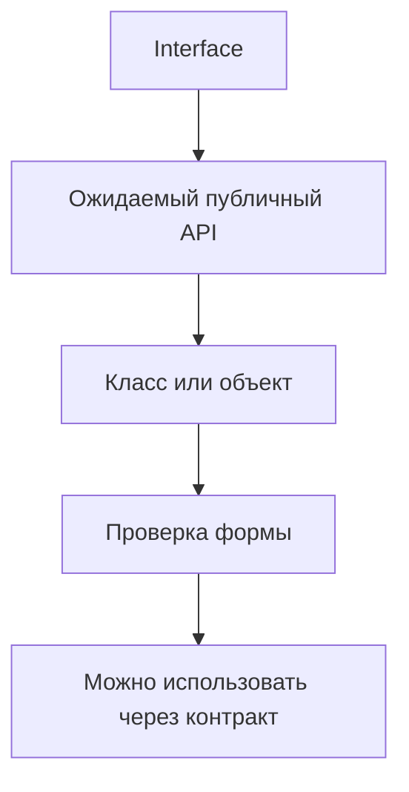

# Typed Page Objects, Fixtures and Helpers

## Связь с предыдущей главой

В предыдущей главе мы типизировали конфигурацию и тестовые данные.

Теперь посмотрим, как типы помогают удерживать границы между объектами страниц, фикстурами и вспомогательными функциями.

## Главный вопрос

Как типы помогают удерживать Page Objects, фикстуры и вспомогательные функции в понятных границах?

## Мотивация

В большом проекте быстро появляются общие объекты:

- page objects;
- фикстуры;
- вспомогательные модули;
- компоненты страниц;
- общие действия пользователя.

Без явных контрактов такие объекты начинают делать слишком много. Методы становятся случайными, параметры расползаются, а детали реализации начинают использоваться напрямую.

TypeScript помогает описать публичную границу объекта.

## Теория

### Контракт отдельно от реализации

Page Object можно описать интерфейсом, а реализацию дать классом:

```ts
interface LoginPage {
  open(): Promise<void>;
  signInAs(login: string, password: string): Promise<void>;
}
```

Разделение окупается не всегда. Оно полезно, когда реализаций действительно несколько — например, разные версии интерфейса или мобильный и десктопный вариант. Для единственной страницы интерфейс добавляет файл и ничего не гарантирует.

Практический ориентир: сначала класс, интерфейс — когда появился второй потребитель контракта.

### Типы делают методы читаемыми

Основная польза типов в Page Object — не в проверке, а в **выражении намерения**:

```ts
async function filterBy(status: "NEW" | "DONE", priority: "LOW" | "HIGH"): Promise<void>
```

Сигнатура сама рассказывает, какие значения допустимы. Вариант со `string` требует чтения реализации или документации — и допускает опечатку, которая проявится как падение локатора.

### Контракт фикстур описывает, что получает тест

```ts
type TestFixtures = {
  loginPage: LoginPage;
  workItems: WorkItemsApi;
  environment: EnvironmentName;
};
```

Такой тип — публичный API тестового фреймворка. По нему видно, что доступно в сценарии, а редактор подсказывает список без чтения исходников.

Правило то же, что для любого API: чем меньше, тем лучше. Фикстура, добавленная «на всякий случай», будет использоваться неправильно.

### Хелперы: узкие типы вместо строк

```ts
type BuildReportTitle = (suite: string, status: "passed" | "failed") => string;
```

Именованный тип функции полезен, когда одна и та же сигнатура встречается в нескольких местах: в параметре, в поле объекта, в переменной. Тогда изменение договора правится один раз.

### Асинхронность обязана быть в типе

Почти всё в тестовом коде асинхронно, и это должно быть видно:

```ts
open(): Promise<void>;
```

Метод, объявленный как `void`, но выполняющий `await` внутри, приводит к тому, что вызывающий код не дождётся завершения — ошибка из главы 123, которая выглядит как нестабильность теста.

### Где типы не помогают

Граница проходит там же, где всегда: **состояние приложения типами не проверяется**.

Тип метода `signInAs` гарантирует, что передали две строки. Он ничего не говорит о том, существует ли пользователь, доступна ли страница и появилась ли кнопка. Это работа проверок в тесте и ожиданий Playwright.

Полезно держать это различие явным: типы отвечают за согласованность кода, проверки — за поведение системы.

## Внутренний механизм

TypeScript проверяет не название класса, а его форму.

Если объект имеет нужные методы с нужными параметрами и результатами, он подходит контракту.



После компиляции interface и type alias исчезают. Во время выполнения остается JavaScript-класс и его методы.

## Главная ментальная модель

Тип для Page Object — это не реализация страницы, а договор о том, какие действия разрешено использовать извне.

## Практические примеры

Компонент страницы:

```ts
interface HeaderComponent {
  openProfile(): Promise<void>;
  logout(): Promise<void>;
}

class AppHeader implements HeaderComponent {
  async openProfile(): Promise<void> {
    console.log("open profile");
  }

  async logout(): Promise<void> {
    console.log("logout");
  }
}
```

Helper с явным контрактом:

```ts
type RetryDecision = {
  shouldRetry: boolean;
  reason: string;
};

function decideRetry(attempt: number, maxAttempts: number): RetryDecision {
  return {
    shouldRetry: attempt < maxAttempts,
    reason: attempt < maxAttempts ? "attempts remain" : "limit reached",
  };
}
```

Запускаемые версии этих примеров находятся в:

```text
examples/02-typescript/chapter-157/
```

`01-page-object-contract.ts` — интерфейс страницы и его реализация.

`02-fixture-and-helper-contracts.ts` — типы фикстур и контракт helper-функции.

`03-page-object-contract-diagnostic.ts` — неполная реализация интерфейса (намеренная ошибка).

## Automation QA

В реальном QA-проекте типы помогают договориться:

- какие методы есть у Page Object;
- какие зависимости предоставляет фикстура;
- какие параметры принимает вспомогательная функция;
- какие части класса являются публичными;
- какие детали реализации нельзя использовать напрямую.

Это снижает риск архитектурного расползания.

## Распространённые ошибки

Ошибка — превращать Page Object в объект на все случаи жизни.

Если класс отвечает и за страницу, и за тестовые данные, и за отчет, типы не спасут архитектуру. Они только покажут, что публичный API стал слишком большим.

Еще одна ошибка — раскрывать внутренние поля класса вместо методов с понятным назначением.

## Распространённые мифы

**Миф: у каждого Page Object должен быть интерфейс.**
Интерфейс нужен, когда реализаций несколько. Иначе он добавляет файл без гарантий.

**Миф: типы проверяют, что страница открылась.**
Они проверяют согласованность кода. Состояние приложения проверяют ожидания и утверждения.

**Миф: чем больше фикстур, тем удобнее.**
Лишняя фикстура будет использована неправильно. Контракт стоит держать маленьким.

**Миф: асинхронность метода — деталь реализации.**
Она часть договора: без `Promise` вызывающий код не дождётся завершения.

## Частые вопросы

**Когда выделять интерфейс Page Object?**
Когда появляется вторая реализация того же контракта.

**Зачем именованный тип для функции-хелпера?**
Чтобы одну и ту же сигнатуру не дублировать в параметре, поле и переменной.

**Почему параметры методов стоит сужать до литералов?**
Сигнатура становится документацией, а опечатка — ошибкой компиляции.

**Что типы точно не проверят в UI-тесте?**
Наличие элемента, доступность страницы, состояние данных на сервере.

## Проверьте себя

1. При каком условии интерфейс для Page Object оправдан?
2. Какую пользу дают литеральные типы в сигнатурах методов страницы?
3. Что описывает тип фикстур и почему его стоит держать маленьким?
4. Почему асинхронность обязана присутствовать в типе метода?
5. Где проходит граница между работой типов и работой проверок?

## Практика

Практические задания находятся в конце страницы.

## Краткие итоги

- Interface описывает публичный контракт объекта.
- Класс может подтвердить контракт через `implements`.
- Контракт фикстуры описывает доступные зависимости.
- Контракт вспомогательной функции делает общие функции предсказуемыми.
- TypeScript проверяет форму на этапе компиляции и не создает контракты во время выполнения.

## Переход

Мы описали объектные границы UI-слоя. Следующая глава применит те же идеи к API-клиентам, моделям ответов и вспомогательным функциям проверок.
