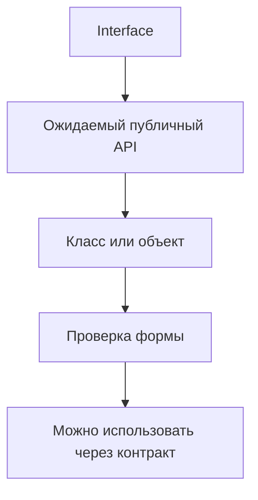

# Typed Page Objects, Fixtures and Helpers

## Связь с предыдущей главой

В предыдущей главе мы типизировали конфигурацию и тестовые данные.

Теперь посмотрим, как типы помогают удерживать границы между объектами страниц, фикстурами и вспомогательными функциями.

## Главный вопрос

Как типы помогают удерживать Page Objects, фикстуры и вспомогательные функции в понятных границах?

## Мотивация

В большом проекте быстро появляются общие объекты:

- page objects;
- фикстуры;
- вспомогательные модули;
- компоненты страниц;
- общие действия пользователя.

Без явных контрактов такие объекты начинают делать слишком много. Методы становятся случайными, параметры расползаются, а детали реализации начинают использоваться напрямую.

TypeScript помогает описать публичную границу объекта.

## Теория

Page Object можно описать через interface:

```ts
interface LoginPage {
  open(): Promise<void>;
  login(email: string, password: string): Promise<void>;
}
```

Класс может реализовать этот контракт:

```ts
class BasicLoginPage implements LoginPage {
  constructor(private readonly baseUrl: string) {}

  async open(): Promise<void> {
    console.log(`open ${this.baseUrl}/login`);
  }

  async login(email: string, password: string): Promise<void> {
    console.log(`login ${email} with password length ${password.length}`);
  }
}
```

Контракт фикстуры описывает, какие готовые зависимости получает тестовый сценарий:

```ts
type TestFixtures = {
  loginPage: LoginPage;
  environmentName: "local" | "staging" | "production";
};
```

Контракт вспомогательной функции делает общую функцию предсказуемой:

```ts
type BuildReportTitle = (suiteName: string, status: "passed" | "failed") => string;
```

## Внутренний механизм

TypeScript проверяет не название класса, а его форму.

Если объект имеет нужные методы с нужными параметрами и результатами, он подходит контракту.



После компиляции interface и type alias исчезают. Во время выполнения остается JavaScript-класс и его методы.

## Главная ментальная модель

Тип для Page Object — это не реализация страницы, а договор о том, какие действия разрешено использовать извне.

## Практические примеры

Компонент страницы:

```ts
interface HeaderComponent {
  openProfile(): Promise<void>;
  logout(): Promise<void>;
}

class AppHeader implements HeaderComponent {
  async openProfile(): Promise<void> {
    console.log("open profile");
  }

  async logout(): Promise<void> {
    console.log("logout");
  }
}
```

Helper с явным контрактом:

```ts
type RetryDecision = {
  shouldRetry: boolean;
  reason: string;
};

function decideRetry(attempt: number, maxAttempts: number): RetryDecision {
  return {
    shouldRetry: attempt < maxAttempts,
    reason: attempt < maxAttempts ? "attempts remain" : "limit reached",
  };
}
```

## Automation QA

В реальном QA-проекте типы помогают договориться:

- какие методы есть у Page Object;
- какие зависимости предоставляет фикстура;
- какие параметры принимает вспомогательная функция;
- какие части класса являются публичными;
- какие детали реализации нельзя использовать напрямую.

Это снижает риск архитектурного расползания.

## Распространённые ошибки

Ошибка — превращать Page Object в объект на все случаи жизни.

Если класс отвечает и за страницу, и за тестовые данные, и за отчет, типы не спасут архитектуру. Они только покажут, что публичный API стал слишком большим.

Еще одна ошибка — раскрывать внутренние поля класса вместо методов с понятным назначением.

## Практика

Практические задания находятся в конце страницы.

## Краткие итоги

- Interface описывает публичный контракт объекта.
- Класс может подтвердить контракт через `implements`.
- Контракт фикстуры описывает доступные зависимости.
- Контракт вспомогательной функции делает общие функции предсказуемыми.
- TypeScript проверяет форму на этапе компиляции и не создает контракты во время выполнения.

## Переход

Мы описали объектные границы UI-слоя. Следующая глава применит те же идеи к API-клиентам, моделям ответов и вспомогательным функциям проверок.
