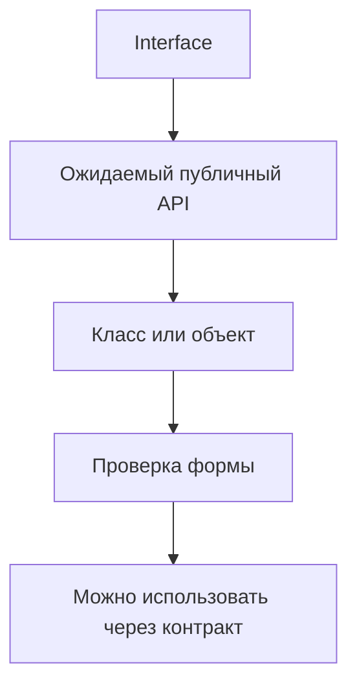

# Типизированные объекты страниц, фикстуры и вспомогательные функции

## Связь с предыдущей главой

В предыдущей главе мы типизировали конфигурацию и тестовые данные.

Теперь посмотрим, как типы помогают удерживать границы между объектами страниц, фикстурами и вспомогательными функциями.

## Главный вопрос

Как типы помогают удерживать объекты страниц, фикстуры и вспомогательные функции в понятных границах?

## Мотивация

В большом проекте быстро появляются общие объекты:

- page objects;
- фикстуры;
- вспомогательные модули;
- компоненты страниц;
- общие действия пользователя.

Без явных контрактов такие объекты начинают делать слишком много. Методы становятся случайными, параметры расползаются, а детали реализации начинают использоваться напрямую.

TypeScript помогает описать публичную границу объекта.

## Теория

### Контракт отдельно от реализации

Объект страницы можно описать интерфейсом, а реализацию дать классом:

```ts
interface LoginPage {
  open(): Promise<void>;
  signInAs(login: string, password: string): Promise<void>;
}
```

Разделение окупается не всегда. Оно полезно, когда реализаций действительно несколько — например, разные версии интерфейса или мобильный и десктопный вариант. Для единственной страницы интерфейс добавляет файл и ничего не гарантирует.

Практический ориентир: сначала класс, интерфейс — когда появился второй потребитель контракта.

### Типы делают методы читаемыми

Основная польза типов здесь — не в проверке, а в **выражении намерения**:

```ts
async function filterBy(status: "NEW" | "DONE", priority: "LOW" | "HIGH"): Promise<void>
```

Сигнатура сама рассказывает, какие значения допустимы. Вариант со `string` требует чтения реализации или документации — и допускает опечатку, которая проявится как падение локатора.

### Контракт фикстур описывает, что получает тест

```ts
type TestFixtures = {
  loginPage: LoginPage;
  workItems: WorkItemsApi;
  environment: EnvironmentName;
};
```

Такой тип — публичный API тестового фреймворка. По нему видно, что доступно в сценарии, а редактор подсказывает список без чтения исходников.

Правило то же, что для любого API: чем меньше, тем лучше. Фикстура, добавленная «на всякий случай», будет использоваться неправильно.

### Хелперы: узкие типы вместо строк

```ts
type BuildReportTitle = (suite: string, status: "passed" | "failed") => string;
```

Именованный тип функции полезен, когда одна и та же сигнатура встречается в нескольких местах: в параметре, в поле объекта, в переменной. Тогда изменение договора правится один раз.

### Асинхронность обязана быть в типе

Почти всё в тестовом коде асинхронно, и это должно быть видно:

```ts
open(): Promise<void>;
```

Метод, объявленный как `void`, но выполняющий `await` внутри, приводит к тому, что вызывающий код не дождётся завершения — ошибка из главы 123, которая выглядит как нестабильность теста.

### Где типы не помогают

Граница проходит там же, где всегда: **состояние приложения типами не проверяется**.

Тип метода `signInAs` гарантирует, что передали две строки. Он ничего не говорит о том, существует ли пользователь, доступна ли страница и появилась ли кнопка. Это работа проверок в тесте и ожиданий Playwright.

Полезно держать это различие явным: типы отвечают за согласованность кода, проверки — за поведение системы.

## Внутренний механизм

TypeScript проверяет не название класса, а его форму.

Если объект имеет нужные методы с нужными параметрами и результатами, он подходит контракту.


```mermaid
flowchart TD
    A[Interface] --> B[Ожидаемый публичный API]
    B --> C[Класс или объект]
    C --> D[Проверка формы]
    D --> E[Можно использовать через контракт]
```

После компиляции интерфейс и псевдоним типа исчезают. Во время выполнения остаётся класс JavaScript и его методы.

### Контракт вместо класса

```ts
interface WorkItemsPage {
  open(): Promise<void>;
  create(title: string): Promise<string>;
}

// Подходит и класс, и обычный объект — проверяется форма.
const page: WorkItemsPage = createWorkItemsPage(browserPage);
```

Структурная типизация позволяет фикстуре обещать **контракт**, а не конкретный
класс. Тест зависит от набора операций, и подменить реализацию (например, на
работающую через API) можно без правки тестов.

### Типизация фикстур

```ts
type Fixtures = {
  workItemsPage: WorkItemsPage;
  client: ApiClient;
};

export const test = base.extend<Fixtures>({ … });
```

Тип фикстур — это публичный договор всего слоя: именно он подсказывается в теле
теста и именно он ломается при переименовании. Поэтому в нём держат контракты, а
не классы с внутренними методами.

### Где типы не помогут

| Ситуация | Кто ловит |
| --- | --- |
| опечатка в имени фикстуры | компилятор |
| несовместимая сигнатура метода | компилятор |
| сохранённый объект страницы пережил свой тест | **никто**, ошибка в прогоне |
| локатор указывает не на тот элемент | никто, только проверка теста |

Две нижние строки — граница части TypeScript: типы описывают форму, но ничего
не знают ни о жизненном цикле объектов, ни о содержимом страницы.

## Главная ментальная модель

Тип для объекта страницы — это не реализация страницы, а договор о том, какие действия разрешено использовать извне.

## Практические примеры

Компонент страницы:

```ts
interface HeaderComponent {
  openProfile(): Promise<void>;
  logout(): Promise<void>;
}

class AppHeader implements HeaderComponent {
  async openProfile(): Promise<void> {
    console.log("open profile");
  }

  async logout(): Promise<void> {
    console.log("logout");
  }
}
```

Вспомогательная функция с явным договором:

```ts
type RetryDecision = {
  shouldRetry: boolean;
  reason: string;
};

function decideRetry(attempt: number, maxAttempts: number): RetryDecision {
  return {
    shouldRetry: attempt < maxAttempts,
    reason: attempt < maxAttempts ? "attempts remain" : "limit reached",
  };
}
```

Запускаемые версии этих примеров находятся в:

```text
examples/02-typescript/chapter-157/
```

`01-page-object-contract.ts` — интерфейс страницы и его реализация.

`02-fixture-and-helper-contracts.ts` — типы фикстур и договор вспомогательной функции.

`03-page-object-contract-diagnostic.ts` — неполная реализация интерфейса (намеренная ошибка).

## Automation QA

В реальном QA-проекте типы помогают договориться:

- какие методы есть у объекта страницы;
- какие зависимости предоставляет фикстура;
- какие параметры принимает вспомогательная функция;
- какие части класса являются публичными;
- какие детали реализации нельзя использовать напрямую.

Это снижает риск архитектурного расползания.

### Тип контекста выводится из фикстуры

Повторять состав контекста в типе не нужно: он выводится из функции, которая
его собирает. Тогда добавление зависимости в фикстуру сразу становится
доступным в сценарии.

```ts
function createContext(page: Page) {
  return {
    login: new LoginPage(page),
    workItems: new WorkItemsPage(page)
  };
}

type UiContext = ReturnType<typeof createContext>;

async function scenario(context: UiContext): Promise<number> {
  await context.login.signIn('educational_tester', 'educational-tester-password');
  await context.workItems.open();

  return context.workItems.rowCount();
}
```

Сценарий не создаёт объектов страниц и не знает, как они устроены, — ровно та
граница, что описана в главе 185.

### Что типы здесь не проверяют

Тип показывает, какие методы есть у объекта страницы, но не запрещает вызвать
`page.locator` прямо в сценарии. Эту границу проверяет не компилятор, а
проверка формы кода из главы 179 — та, что читает текст решения и ищет в нём
поиск элементов.

Типы задают словарь, дисциплину задаёт разбор кода.

## Распространённые ошибки

Ошибка — превращать объект страницы в объект на все случаи жизни.

Если класс отвечает и за страницу, и за тестовые данные, и за отчет, типы не спасут архитектуру. Они только покажут, что публичный API стал слишком большим.

Еще одна ошибка — раскрывать внутренние поля класса вместо методов с понятным назначением.

## Распространённые мифы

**Миф: у каждого объекта страницы должен быть интерфейс.**
Интерфейс нужен, когда реализаций несколько. Иначе он добавляет файл без гарантий.

**Миф: типы проверяют, что страница открылась.**
Они проверяют согласованность кода. Состояние приложения проверяют ожидания и утверждения.

**Миф: чем больше фикстур, тем удобнее.**
Лишняя фикстура будет использована неправильно. Контракт стоит держать маленьким.

**Миф: асинхронность метода — деталь реализации.**
Она часть договора: без `Promise` вызывающий код не дождётся завершения.

## Частые вопросы

**Когда выделять интерфейс объекта страницы?**
Когда появляется вторая реализация того же контракта.

**Зачем именованный тип для функции-хелпера?**
Чтобы одну и ту же сигнатуру не дублировать в параметре, поле и переменной.

**Почему параметры методов стоит сужать до литералов?**
Сигнатура становится документацией, а опечатка — ошибкой компиляции.

**Что типы точно не проверят в UI-тесте?**
Наличие элемента, доступность страницы, состояние данных на сервере.

## Проверьте себя

1. При каком условии интерфейс для объекта страницы оправдан?
2. Какую пользу дают литеральные типы в сигнатурах методов страницы?
3. Что описывает тип фикстур и почему его стоит держать маленьким?
4. Почему асинхронность обязана присутствовать в типе метода?
5. Где проходит граница между работой типов и работой проверок?

### Ответы

1. Когда у страницы есть несколько реализаций или её подменяют в тестах. Для единственного класса интерфейс добавляет файл, но не проверку.
2. Опечатка в имени вкладки, поля или состояния становится ошибкой компиляции, а редактор подсказывает допустимые значения.
3. Состав того, что тест получает готовым: страницы, клиенты, данные. Маленький тип легче понять и он не тянет в каждый тест то, что ему не нужно.
4. Иначе вызов без `await` не будет ошибкой, и тест продолжится, не дождавшись шага.
5. Типы отвечают за форму кода: правильные имена, аргументы, наличие `await`. Проверки отвечают за поведение приложения — это разные вещи, и одно не заменяет другое.

## Практика

Практические задания находятся в конце страницы.

## Краткие итоги

- Интерфейс описывает публичный договор объекта.
- Класс может подтвердить контракт через `implements`.
- Контракт фикстуры описывает доступные зависимости.
- Контракт вспомогательной функции делает общие функции предсказуемыми.
- TypeScript проверяет форму на этапе компиляции и не создает контракты во время выполнения.

## Переход

Мы описали объектные границы UI-слоя. Следующая глава применит те же идеи к API-клиентам, моделям ответов и вспомогательным функциям проверок.
