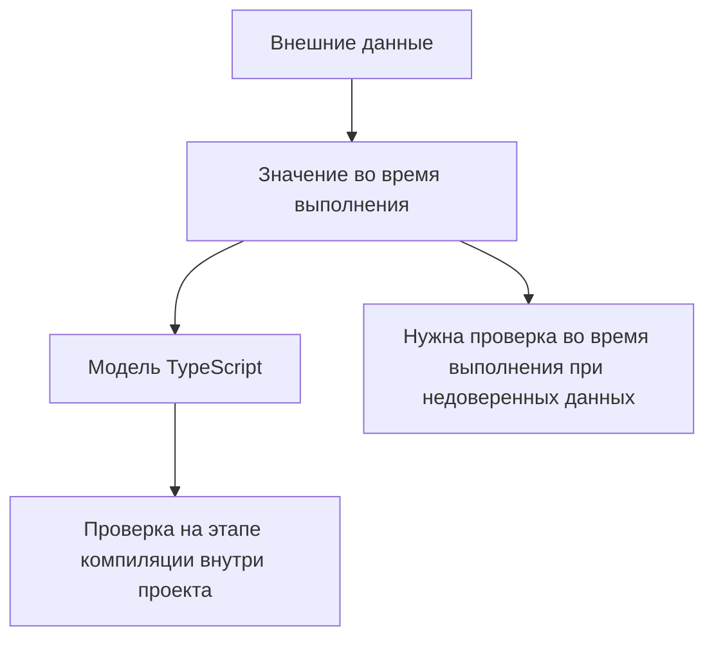

# Typed API Clients and Assertions

## Связь с предыдущей главой

Мы применили TypeScript к Page Objects, фикстурам и API вспомогательных функций.

Теперь перенесем эту идею на API-клиенты, модели ответов и вспомогательные функции проверок.

## Главный вопрос

Как TypeScript помогает описывать ответы API и проверки?

## Мотивация

API-тесты часто работают с данными, которые приходят извне.

В JavaScript ошибка может появиться поздно:

- ответ не содержит ожидаемое поле;
- вспомогательная функция возвращает данные другой формы;
- проверка использует не тот статус;
- результат из базы данных отличается от ответа API;
- модель gRPC имеет другую структуру.

TypeScript помогает описать ожидаемую форму данных внутри проекта.

## Теория

Универсальная модель ответа:

```ts
type ApiResponse<TBody> = {
  status: number;
  body: TBody;
};
```

Модель пользователя:

```ts
type UserResponse = {
  id: string;
  email: string;
  role: "admin" | "viewer";
};
```

Типизированный клиент может вернуть `Promise<ApiResponse<UserResponse>>`:

```ts
async function getUser(): Promise<ApiResponse<UserResponse>> {
  return {
    status: 200,
    body: {
      id: "user-1",
      email: "admin@example.test",
      role: "admin",
    },
  };
}
```

Вспомогательная функция проверки получает уже описанную модель:

```ts
function assertSuccessfulUserResponse(response: ApiResponse<UserResponse>): void {
  if (response.status !== 200) {
    throw new Error(`Expected 200, received ${response.status}`);
  }
}
```

## Внутренний механизм



TypeScript проверяет код, который работает с моделью.

Он не доказывает, что реальный ответ API действительно соответствует типу.

Если данные недоверенные, нужна отдельная проверка во время выполнения.

## Главная ментальная модель

Тип ответа API — это карта ожидаемых данных, а не гарантия того, что сервер всегда вернет именно такие данные.

## Практические примеры

Типизированное тело запроса:

```ts
type CreateUserPayload = {
  email: string;
  role: "admin" | "viewer";
};

function buildCreateUserPayload(email: string): CreateUserPayload {
  return {
    email,
    role: "viewer",
  };
}
```

Модель результата из базы данных:

```ts
type UserRow = {
  id: string;
  email: string;
  role: "admin" | "viewer";
};

function mapRowToResponse(row: UserRow): UserResponse {
  return {
    id: row.id,
    email: row.email,
    role: row.role,
  };
}
```

Контракт вспомогательной функции проверки:

```ts
type AssertStatus = (response: ApiResponse<unknown>, expectedStatus: number) => void;
```

## Automation QA

В QA-проекте TypeScript полезен для:

- модели тела запроса;
- модели тела ответа;
- модели результатов из базы данных;
- модели запросов и ответов gRPC;
- контракты вспомогательных функций проверок;
- переиспользуемые методы API-клиента.

Это не заменяет проверку реального ответа. Это делает код, который обрабатывает ответ, согласованным.

## Распространённые ошибки

Ошибка — принять тип за проверку во время выполнения.

Если функция объявлена как `Promise<ApiResponse<UserResponse>>`, это не значит, что сервер физически не может вернуть другую форму.

Еще одна ошибка — использовать `any` в API-клиенте. Тогда TypeScript перестает помогать именно там, где данные наиболее рискованные.

## Практика

Практические задания находятся в конце страницы.

## Краткие итоги

- `ApiResponse<T>` помогает типизировать разные ответы единообразно.
- Тело запроса и тело ответа лучше описывать отдельными типами.
- Вспомогательная функция проверки должна принимать понятный контракт.
- Модели базы данных и gRPC можно описывать как отдельные модели данных.
- TypeScript не валидирует внешние данные автоматически.

## Переход

Мы применили TypeScript к данным, объектам и API-границам. Последняя глава раздела соберет эти идеи в правила поддержки большого TypeScript-проекта.
