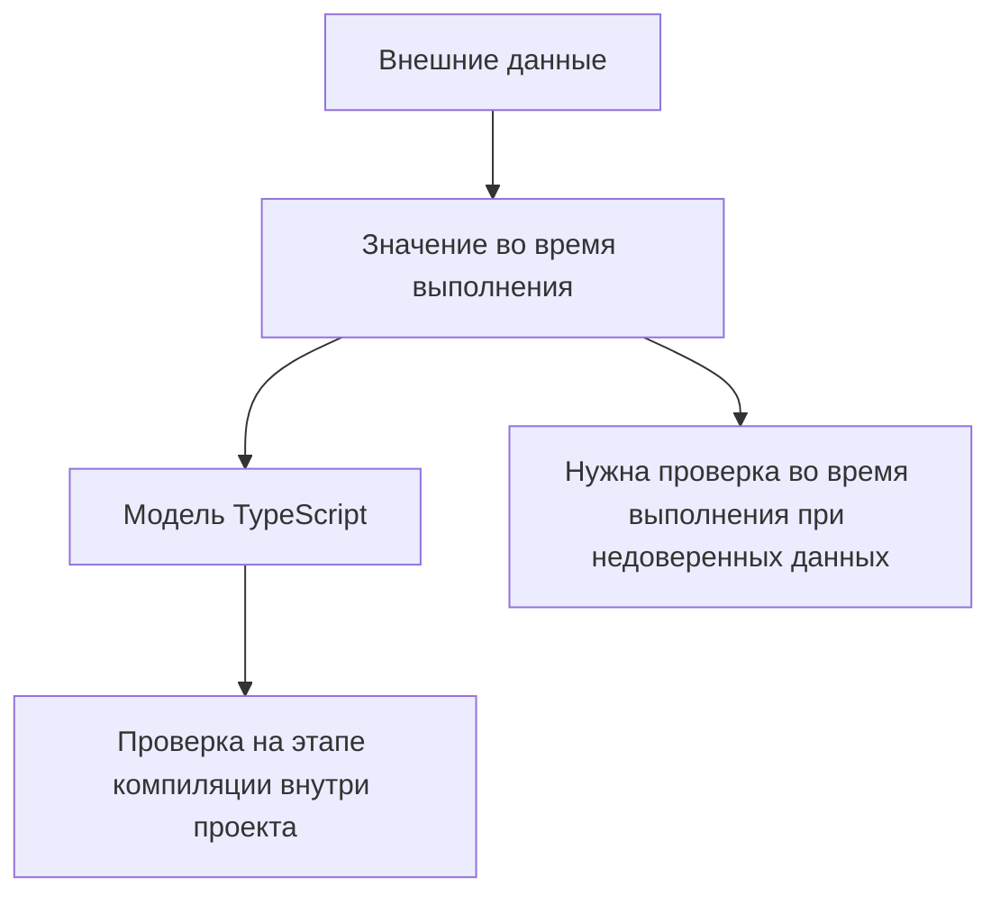

# Typed API Clients and Assertions

## Связь с предыдущей главой

Мы применили TypeScript к Page Objects, фикстурам и API вспомогательных функций.

Теперь перенесем эту идею на API-клиенты, модели ответов и вспомогательные функции проверок.

## Главный вопрос

Как TypeScript помогает описывать ответы API и проверки?

## Мотивация

API-тесты часто работают с данными, которые приходят извне.

В JavaScript ошибка может появиться поздно:

- ответ не содержит ожидаемое поле;
- вспомогательная функция возвращает данные другой формы;
- проверка использует не тот статус;
- результат из базы данных отличается от ответа API;
- модель gRPC имеет другую структуру.

TypeScript помогает описать ожидаемую форму данных внутри проекта.

## Теория

### Обобщённая модель ответа

Конверт ответа одинаков для всех запросов, меняется только тело:

```ts
type ApiResponse<Body> = {
  status: number;
  body: Body;
};

type WorkItem = {
  id: string;
  title: string;
  status: "NEW" | "IN_PROGRESS" | "DONE" | "CANCELLED";
  version: number;
};
```

Один шаблон описывает все ответы, а конкретные модели живут отдельно и переиспользуются.

### Тип — это ожидание, а не факт

Ключевая мысль всей главы:

```ts
async function getWorkItem(id: string): Promise<ApiResponse<WorkItem>> { }
```

Сигнатура обещает форму, но **ничего не проверяет**. Если сервер вернёт другое, программа продолжит работать с неверным предположением — и упадёт позже, в другом месте.

Поэтому тип обязательно дополняется проверкой на границе.

### Guard на границе

```ts
function isWorkItem(value: unknown): value is WorkItem {
  if (typeof value !== "object" || value === null) return false;

  const candidate = value as Record<string, unknown>;

  return typeof candidate["id"] === "string"
    && typeof candidate["title"] === "string"
    && typeof candidate["version"] === "number";
}
```

Клиент вызывает проверку один раз — сразу после разбора ответа. Дальше весь код работает с доказанным типом.

Побочная выгода существенна: такая проверка становится **проверкой контракта**. Изменение формы ответа обнаружит тест, а не пользователь.

### Ошибки — тоже часть модели

Ответ бывает успешным и неуспешным, и это лучше выражать размеченным объединением, а не одним типом с необязательными полями:

```ts
type ApiResult<Body> =
  | { ok: true; status: number; body: Body }
  | { ok: false; status: number; error: { code: string; message: string } };
```

Тогда невозможно обратиться к телу, не проверив успешность, и невозможно получить одновременно тело и ошибку.

### Проверки, сохраняющие тип

Утверждение, которое сужает тип, полезнее возвращающего `boolean`:

```ts
function assertOk<Body>(result: ApiResult<Body>): asserts result is Extract<ApiResult<Body>, { ok: true }> {
  if (!result.ok) {
    throw new Error(`Ожидался успех, получено ${result.status}: ${result.error.code}`);
  }
}
```

После вызова компилятор знает, что тело доступно — ветвление не нужно, а сообщение об ошибке содержит и статус, и код.

### Что проверять, а что нет

Проверять всё подряд дорого и бессмысленно. Рабочий ориентир — проверять то, **на что опирается тест**: поля, которые он читает, и признаки, по которым ветвится.

Полная валидация схемы уместна для контрактных тестов; для обычного сценария достаточно убедиться, что используемые поля на месте и нужного типа.

## Внутренний механизм



TypeScript проверяет код, который работает с моделью.

Он не доказывает, что реальный ответ API действительно соответствует типу.

Если данные недоверенные, нужна отдельная проверка во время выполнения.

## Главная ментальная модель

Тип ответа API — это карта ожидаемых данных, а не гарантия того, что сервер всегда вернет именно такие данные.

## Практические примеры

Типизированное тело запроса:

```ts
type CreateUserPayload = {
  email: string;
  role: "admin" | "viewer";
};

function buildCreateUserPayload(email: string): CreateUserPayload {
  return {
    email,
    role: "viewer",
  };
}
```

Модель результата из базы данных:

```ts
type UserRow = {
  id: string;
  email: string;
  role: "admin" | "viewer";
};

function mapRowToResponse(row: UserRow): UserResponse {
  return {
    id: row.id,
    email: row.email,
    role: row.role,
  };
}
```

Контракт вспомогательной функции проверки:

```ts
type AssertStatus = (response: ApiResponse<unknown>, expectedStatus: number) => void;
```

## Automation QA

В QA-проекте TypeScript полезен для:

- модели тела запроса;
- модели тела ответа;
- модели результатов из базы данных;
- модели запросов и ответов gRPC;
- контракты вспомогательных функций проверок;
- переиспользуемые методы API-клиента.

Это не заменяет проверку реального ответа. Это делает код, который обрабатывает ответ, согласованным.

## Распространённые ошибки

Ошибка — принять тип за проверку во время выполнения.

Если функция объявлена как `Promise<ApiResponse<UserResponse>>`, это не значит, что сервер физически не может вернуть другую форму.

Еще одна ошибка — использовать `any` в API-клиенте. Тогда TypeScript перестает помогать именно там, где данные наиболее рискованные.

## Распространённые мифы

**Миф: типизированный клиент гарантирует форму ответа.**
Он описывает ожидание. Факт устанавливает проверка во время выполнения.

**Миф: достаточно привести ответ через `as`.**
Приведение ничего не проверяет и переносит ошибку в другое место.

**Миф: ошибку удобно описывать необязательными полями.**
Тогда возможны бессмысленные сочетания. Нужен размеченный вариант.

**Миф: нужно валидировать весь ответ целиком.**
Достаточно полей, на которые тест реально опирается, — если это не контрактный тест.

## Частые вопросы

**Где вызывать проверку ответа?**
Сразу после разбора, в клиенте. Дальше код работает с доказанным типом.

**Чем утверждение лучше проверки, возвращающей `boolean`?**
Оно сужает тип и убирает ветвление, а сообщение об ошибке формируется в одном месте.

**Как отличить успех от ошибки на уровне типов?**
Размеченным объединением с полем-признаком.

**Даёт ли проверка что-то, кроме безопасности?**
Да: она становится проверкой контракта — изменение формы ответа заметит тест.

## Проверьте себя

1. Что именно обещает сигнатура типизированного клиента и чего не обещает?
2. Почему `as` не заменяет проверку ответа?
3. Чем размеченное объединение лучше типа с необязательными полями для ошибок?
4. Что даёт функция-утверждение по сравнению с обычным guard?
5. Какой объём проверки достаточен для обычного сценария?

## Практика

Практические задания находятся в конце страницы.

## Краткие итоги

- `ApiResponse<T>` помогает типизировать разные ответы единообразно.
- Тело запроса и тело ответа лучше описывать отдельными типами.
- Вспомогательная функция проверки должна принимать понятный контракт.
- Модели базы данных и gRPC можно описывать как отдельные модели данных.
- TypeScript не валидирует внешние данные автоматически.

## Переход

Мы применили TypeScript к данным, объектам и API-границам. Последняя глава раздела соберет эти идеи в правила поддержки большого TypeScript-проекта.
