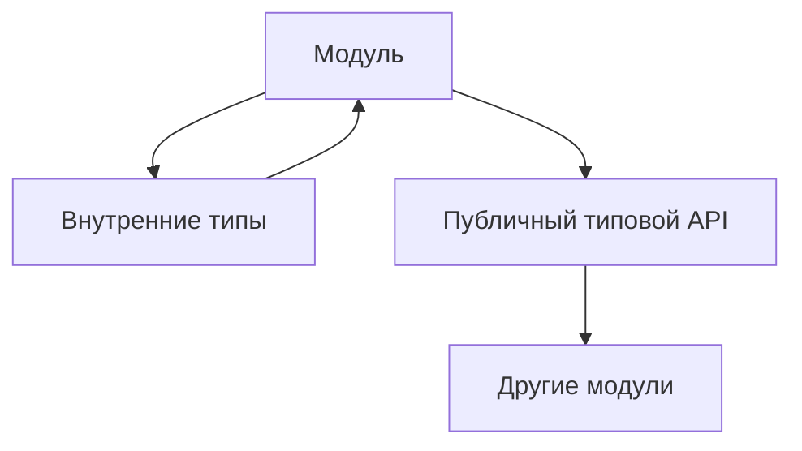

# Maintaining Large TypeScript Test Projects

## Связь с предыдущей главой

Мы типизировали конфигурацию, тестовые данные, Page Objects, фикстуры, вспомогательные функции, API-клиенты и функции проверок.

Теперь нужно понять, как поддерживать большой TypeScript-проект так, чтобы типы помогали, а не превращались в хаос.

## Главный вопрос

Как поддерживать большой TypeScript-проект без превращения типов в хаос?

## Мотивация

TypeScript может сделать проект надежнее.

Но он же может сделать проект тяжелым, если типы:

- дублируются без владельца;
- экспортируются отовсюду;
- усложняются ради красоты;
- скрывают проблемы через `any` и assertions;
- описывают внутренние детали вместо публичных границ.

В большом QA-проекте важно не просто писать типы, а управлять ими как частью архитектуры.

## Теория

### У каждого типа есть владелец

Тип живёт рядом с тем модулем, который отвечает за его смысл:

- типы конфигурации — рядом с загрузкой конфигурации;
- контракты страниц — рядом со слоем страниц;
- модели ответов — рядом с клиентом API;
- типы отчёта — рядом с границей отчётности.

Общий файл `types.ts`, куда складывают всё, выглядит удобным ровно до первого рефакторинга: у типов пропадает владелец, а зависимости между слоями становятся невидимыми.

### Публичный типовой API должен быть маленьким

Экспортированный тип — это обязательство. Чем их больше, тем сложнее менять модуль.

```ts
export type ReportStatus = "passed" | "failed" | "skipped";
export type ReportSummary = { suiteName: string; status: ReportStatus };

type InternalReportLine = { text: string; level: "info" | "warning" };   // не экспортируется
```

Правило простое: экспортируется то, что нужно снаружи **сейчас**, а не то, что может понадобиться.

### Как типы портятся

Три типичных сценария деградации:

1. **Расползание `any`.** Одно значение с отключённой проверкой тянет за собой цепочку. Лечится запретом неявного `any` и точечными проверками на границах.
2. **Накопление необязательных полей.** Каждое новое поле добавляют как `?`, чтобы не чинить существующий код. Через год тип допускает любое сочетание и ничего не гарантирует.
3. **Дублирование моделей.** Одна и та же сущность описана в трёх местах и постепенно расходится. Лечится выводом производных типов из одного источника.

Все три развиваются незаметно и не вызывают ошибок — до момента, когда типы перестают ловить что-либо вообще.

### Признаки, что модель пора менять

- перед обращением к полю приходится писать проверку, которая всегда истинна;
- в коде встречается `as` для одного и того же типа больше одного раза;
- добавление поля требует правок в нескольких несвязанных местах;
- необязательных полей больше, чем обязательных.

Каждый признак говорит, что тип описывает не то, что происходит на самом деле.

### Строгость вводится процессом, а не разом

Включить все строгие опции в существующем проекте — верный способ получить сотни ошибок и обходы через `as`. Работает другой порядок: одна опция, исправление найденного, объяснение команде.

Важна и договорённость о новом коде: новые модули пишутся по строгим правилам сразу, старые чинятся по мере изменения. Тогда строгость растёт вместе с проектом, а не требует отдельного проекта по её внедрению.

### Типы не заменяют тесты

Финальная граница, которую стоит держать в голове всей части: система типов проверяет **согласованность кода**. Она не проверяет поведение продукта, корректность бизнес-логики и форму данных, пришедших извне.

Хорошо типизированный тестовый проект — это проект, где компилятор снимает рутинный класс ошибок и освобождает внимание для того, ради чего тесты и пишут: для проверки того, как система ведёт себя на самом деле.

## Внутренний механизм



TypeScript проверяет связи между модулями через импортируемые и экспортируемые типы.

Если публичный типовой API слишком широкий, изменения внутри модуля начинают ломать слишком много кода.

## Главная ментальная модель

Типы — это архитектурные границы проекта.

Хороший тип показывает, что можно использовать. Плохой тип раскрывает детали, которые должны оставаться внутри модуля.

## Практические примеры

Публичный контракт вспомогательного модуля:

```ts
export type RetryPolicy = {
  maxAttempts: number;
  delayMs: number;
};

export function shouldRetry(attempt: number, policy: RetryPolicy): boolean {
  return attempt < policy.maxAttempts;
}
```

Типизированная граница отчетности:

```ts
type ReportEvent = {
  title: string;
  status: "passed" | "failed";
};

function createReportSummary(events: readonly ReportEvent[]): string {
  const failed = events.filter((event) => event.status === "failed").length;

  return `failed: ${failed}`;
}
```

Рефакторинг с обратной связью компилятора:

```ts
type UserRole = "admin" | "viewer";

type TestUser = {
  id: string;
  role: UserRole;
};
```

Если изменить `UserRole`, TypeScript покажет места, где проект зависит от старого набора ролей.

Запускаемые версии этих примеров находятся в:

```text
examples/02-typescript/chapter-159/
```

`01-public-type-api.ts` — публичные типы модуля и внутренние типы.

`02-refactoring-feedback.ts` — компилятор показывает места, задетые изменением типа.

`03-public-api-diagnostic.ts` — нарушение публичного контракта (намеренная ошибка).

## Automation QA

Для большого Automation QA проекта полезны правила:

- типы конфигурации принадлежат слою конфигурации;
- типы ответов API принадлежат API-слою;
- Page Object не экспортирует внутренние детали поиска элементов;
- вспомогательные функции проверок принимают доменные модели, а не `any`;
- модуль отчетности экспортирует только нужные типы сводки;
- сложный тип должен решать реальную инженерную проблему.

Так TypeScript становится инструментом поддержки архитектуры, а не набором случайных аннотаций.

## Распространённые ошибки

Ошибка — экспортировать каждый тип на всякий случай.

Чем больше публичный типовой API, тем дороже рефакторинг.

Еще одна ошибка — строить слишком умные типы там, где простой object type понятнее для команды.

TypeScript должен снижать сложность проекта, а не добавлять новую.

## Распространённые мифы

**Миф: общий файл с типами упрощает проект.**
Он лишает типы владельца и скрывает зависимости между слоями.

**Миф: экспортировать типы безвредно.**
Каждый экспорт — обязательство, усложняющее изменение модуля.

**Миф: типы деградируют заметно.**
Расползание `any` и накопление `?` не вызывают ошибок и долго остаются невидимыми.

**Миф: строгость можно включить одним коммитом.**
В существующем проекте это даёт обходы вместо исправлений.

## Частые вопросы

**Где должен лежать тип?**
Рядом с модулем, который отвечает за его смысл.

**Что экспортировать наружу?**
То, что нужно потребителям сейчас. Остальное держать внутренним.

**Как понять, что модель устарела?**
По признакам: лишние проверки, повторяющиеся `as`, правки в несвязанных местах, перевес необязательных полей.

**С чего начать ужесточение в старом проекте?**
С запрета неявного `any` и договорённости, что новый код пишется по строгим правилам.

## Проверьте себя

1. Почему у типа должен быть владелец и чем плох общий файл типов?
2. Почему стоит ограничивать число экспортированных типов?
3. Назовите три сценария деградации типов в проекте.
4. По каким признакам понять, что модель описывает не то, что происходит?
5. Что система типов проверяет, а что остаётся работой тестов?

## Практика

Практические задания находятся в конце страницы.

## Краткие итоги

- У типов должен быть владелец.
- Публичный типовой API должен быть небольшим и осознанным.
- Внутренние типы не нужно экспортировать без причины.
- Избыточные абстракции вредят читаемости.
- TypeScript помогает рефакторингу через обратную связь компилятора.

## Переход

Раздел TypeScript завершен. Дальше курс переходит к Automation QA Framework, где TypeScript будет использоваться как уже известный инженерный инструмент.
