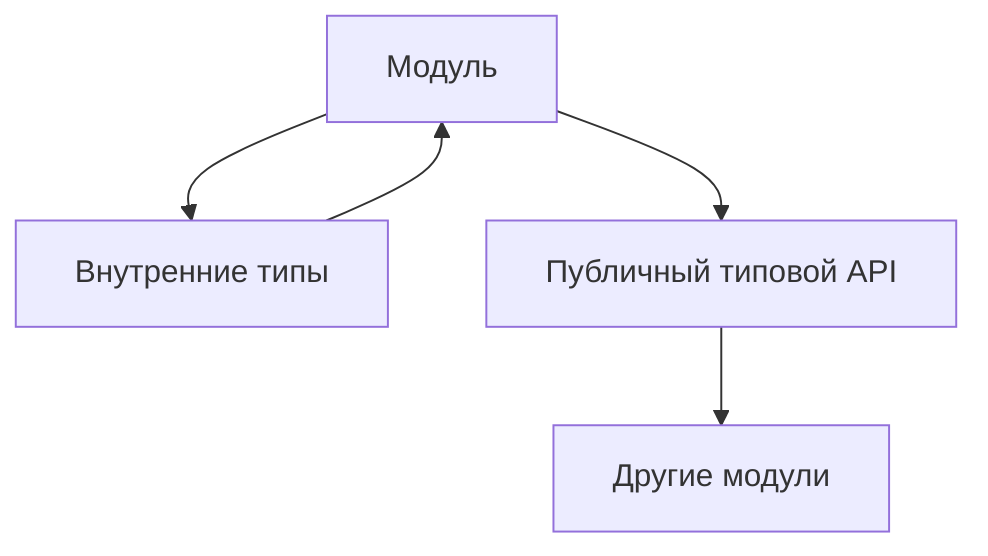

# Maintaining Large TypeScript Test Projects

## Связь с предыдущей главой

Мы типизировали конфигурацию, тестовые данные, Page Objects, фикстуры, вспомогательные функции, API-клиенты и функции проверок.

Теперь нужно понять, как поддерживать большой TypeScript-проект так, чтобы типы помогали, а не превращались в хаос.

## Главный вопрос

Как поддерживать большой TypeScript-проект без превращения типов в хаос?

## Мотивация

TypeScript может сделать проект надежнее.

Но он же может сделать проект тяжелым, если типы:

- дублируются без владельца;
- экспортируются отовсюду;
- усложняются ради красоты;
- скрывают проблемы через `any` и assertions;
- описывают внутренние детали вместо публичных границ.

В большом QA-проекте важно не просто писать типы, а управлять ими как частью архитектуры.

## Теория

У каждого важного типа должен быть владелец.

Например:

- типы конфигурации живут рядом с модулем конфигурации;
- контракты Page Object живут рядом со слоем страниц;
- модели ответов API живут рядом с API-клиентом;
- типы отчета живут рядом с границей отчетности.

Публичный типовой API должен быть небольшим:

```ts
export type ReportStatus = "passed" | "failed" | "skipped";

export type ReportSummary = {
  suiteName: string;
  status: ReportStatus;
  durationMs: number;
};
```

Внутренние типы не нужно экспортировать без причины:

```ts
type InternalReportLine = {
  text: string;
  level: "info" | "warning";
};
```

## Внутренний механизм



TypeScript проверяет связи между модулями через импортируемые и экспортируемые типы.

Если публичный типовой API слишком широкий, изменения внутри модуля начинают ломать слишком много кода.

## Главная ментальная модель

Типы — это архитектурные границы проекта.

Хороший тип показывает, что можно использовать. Плохой тип раскрывает детали, которые должны оставаться внутри модуля.

## Практические примеры

Публичный контракт вспомогательного модуля:

```ts
export type RetryPolicy = {
  maxAttempts: number;
  delayMs: number;
};

export function shouldRetry(attempt: number, policy: RetryPolicy): boolean {
  return attempt < policy.maxAttempts;
}
```

Типизированная граница отчетности:

```ts
type ReportEvent = {
  title: string;
  status: "passed" | "failed";
};

function createReportSummary(events: readonly ReportEvent[]): string {
  const failed = events.filter((event) => event.status === "failed").length;

  return `failed: ${failed}`;
}
```

Рефакторинг с обратной связью компилятора:

```ts
type UserRole = "admin" | "viewer";

type TestUser = {
  id: string;
  role: UserRole;
};
```

Если изменить `UserRole`, TypeScript покажет места, где проект зависит от старого набора ролей.

## Automation QA

Для большого Automation QA проекта полезны правила:

- типы конфигурации принадлежат слою конфигурации;
- типы ответов API принадлежат API-слою;
- Page Object не экспортирует внутренние детали поиска элементов;
- вспомогательные функции проверок принимают доменные модели, а не `any`;
- модуль отчетности экспортирует только нужные типы сводки;
- сложный тип должен решать реальную инженерную проблему.

Так TypeScript становится инструментом поддержки архитектуры, а не набором случайных аннотаций.

## Распространённые ошибки

Ошибка — экспортировать каждый тип на всякий случай.

Чем больше публичный типовой API, тем дороже рефакторинг.

Еще одна ошибка — строить слишком умные типы там, где простой object type понятнее для команды.

TypeScript должен снижать сложность проекта, а не добавлять новую.

## Практика

Практические задания находятся в конце страницы.

## Краткие итоги

- У типов должен быть владелец.
- Публичный типовой API должен быть небольшим и осознанным.
- Внутренние типы не нужно экспортировать без причины.
- Избыточные абстракции вредят читаемости.
- TypeScript помогает рефакторингу через обратную связь компилятора.

## Переход

Раздел TypeScript завершен. Дальше курс переходит к Automation QA Framework, где TypeScript будет использоваться как уже известный инженерный инструмент.
