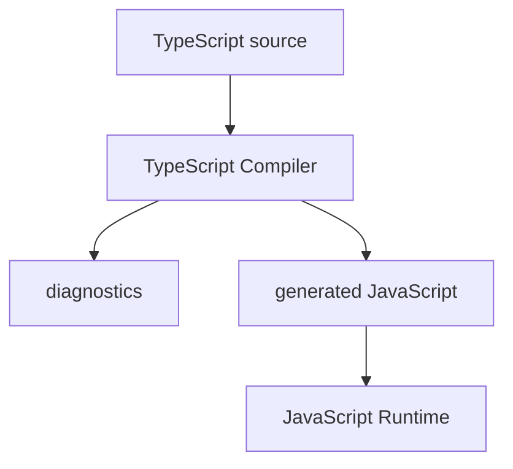
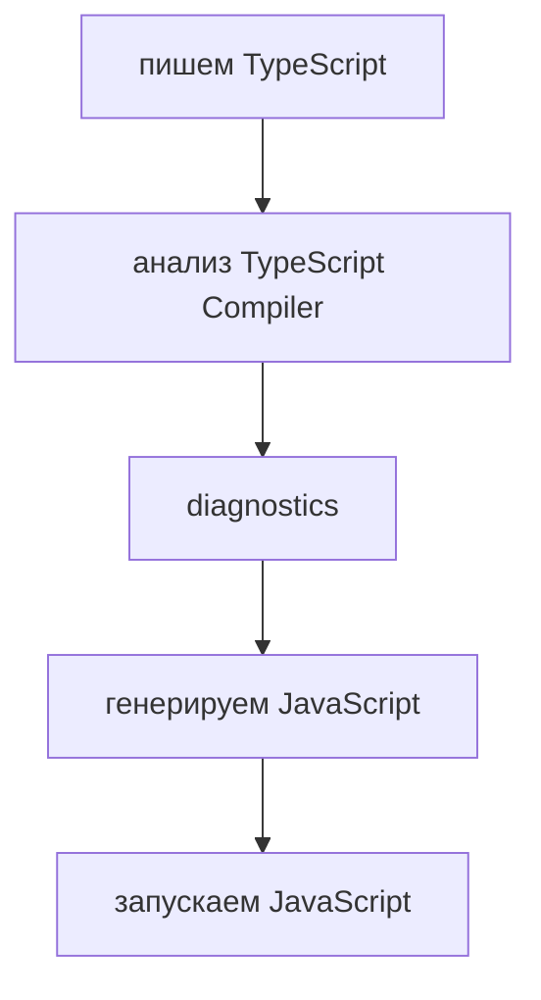

# TypeScript Compiler

## Связь с предыдущей главой

Глава 96 объяснила, почему после JavaScript естественно появляется TypeScript: большим проектам нужны ранние проверки договоренностей между частями кода.

Здесь мы не повторяем мотивацию. Мы смотрим на первый механизм TypeScript: компилятор TypeScript.

## Главный вопрос

> Что делает TypeScript Compiler до запуска программы?

Короткий ответ: TypeScript Compiler анализирует `.ts`-код, выдает диагностические сообщения и генерирует JavaScript, который затем выполняется обычным JavaScript runtime.

## Мотивация

В JavaScript ошибка часто становится видимой только после запуска конкретного сценария.

В Automation QA это дорого:

* тест может упасть в CI;
* ошибка может пройти через helper, fixture и API client;
* root cause может быть далеко от места падения;
* refactoring требует ручной проверки связей.

TypeScript Compiler добавляет этап перед запуском программы. Он не выполняет тесты, но проверяет, согласованы ли части кода между собой.

## Теория

TypeScript-код пишется в файлах `.ts`.

Компилятор TypeScript читает эти файлы и выполняет две важные работы:

* проверяет код по правилам TypeScript;
* создает JavaScript-файлы для выполнения.

В проекте TypeScript обычно устанавливают локально как dev dependency:

```bash
npm install --save-dev typescript
```

После этого компилятор TypeScript запускают через локальную команду проекта:

```bash
npx tsc --version
npx tsc examples/02-typescript/chapter-97/01-compiler-input.ts
```

Команда `npx tsc file.ts` проверяет TypeScript-файл и генерирует JavaScript. Она не выполняет `.ts`-файл напрямую.

Главная идея:



TypeScript не создает новый runtime.

После компиляции программу выполняет JavaScript.

## Внутренний механизм

Компилятор TypeScript строит представление кода, анализирует значения, функции и обращения между ними.

Если код нарушает ожидаемую договоренность, компилятор TypeScript сообщает об ошибке до запуска.

Пример:

```typescript
const retryCount: number = 'three';
```

Здесь значение строковое, а ожидается число.

JavaScript мог бы выполнить похожий код и показать проблему позже. TypeScript Compiler сообщает о несоответствии заранее.

## Главная ментальная модель



TypeScript Compiler — это контрольный пункт перед runtime.

Он не заменяет выполнение программы, но уменьшает количество ошибок, которые доходят до запуска.

## Практические примеры

Примеры находятся в:

```text
examples/02-typescript/chapter-97/
```

Файл `01-compiler-input.ts` показывает исходный TypeScript-код.

Файл `02-compiler-feedback.ts` содержит намеренный диагностический пример с `@ts-expect-error`.

Файл `03-generated-javascript.js` показывает, что после компиляции остается JavaScript.

## Automation QA

Представим helper:

```typescript
const retryCount: number = 3;
```

Если кто-то случайно передаст строку вместо числа, компилятор TypeScript может остановить проблему раньше, чем тест начнет повторять действие неправильное количество раз.

В большом Playwright-проекте это особенно важно для:

* конфигурации;
* test data;
* helper-функций;
* request builders;
* report settings.

## Распространённые ошибки

### Ошибка 1. Думать, что TypeScript Compiler запускает программу

Компилятор TypeScript проверяет и генерирует JavaScript. Выполняет программу JavaScript runtime.

### Ошибка 2. Думать, что TypeScript исправляет код автоматически

Компилятор TypeScript сообщает о проблемах, но решение принимает разработчик.

### Ошибка 3. Думать, что компилятор TypeScript заменяет тесты

TypeScript проверяет типовые договоренности. Он не проверяет бизнес-логику и не заменяет тестирование.

## Практика

Практика находится в:

```text
practice/02-typescript/97-typescript-compiler.md
```

Решения находятся в:

```text
solutions/02-typescript/97-typescript-compiler.md
```

## Краткие итоги

TypeScript Compiler:

* анализирует `.ts`-код до запуска;
* находит часть ошибок раньше runtime;
* генерирует JavaScript;
* не создает новый runtime;
* помогает большим Automation QA проектам безопаснее менять код.

## Переход к следующей теме

Теперь мы понимаем роль компилятора TypeScript.

Дальше нужно разделить две области: что TypeScript проверяет до запуска, а что остается ответственностью JavaScript runtime.
