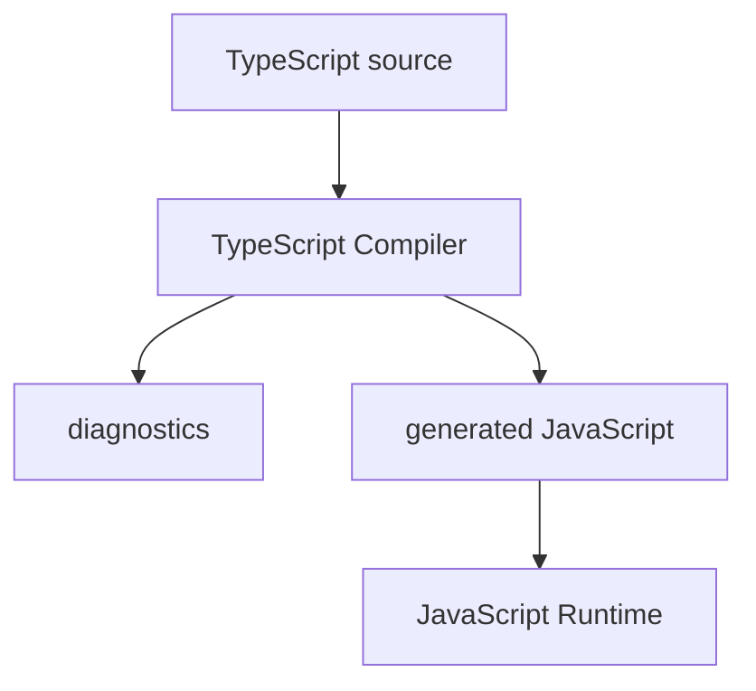

# TypeScript Compiler

## Связь с предыдущей главой

Глава 96 объяснила, почему после JavaScript естественно появляется TypeScript: большим проектам нужны ранние проверки договоренностей между частями кода.

Здесь мы не повторяем мотивацию. Мы смотрим на первый механизм TypeScript: компилятор TypeScript.

## Главный вопрос

> Что делает TypeScript Compiler до запуска программы?

Короткий ответ: TypeScript Compiler анализирует `.ts`-код, выдает диагностические сообщения и генерирует JavaScript, который затем выполняется обычным JavaScript runtime.

## Мотивация

В JavaScript ошибка часто становится видимой только после запуска конкретного сценария.

В Automation QA это дорого:

* тест может упасть в CI;
* ошибка может пройти через helper, fixture и API client;
* root cause может быть далеко от места падения;
* refactoring требует ручной проверки связей.

TypeScript Compiler добавляет этап перед запуском программы. Он не выполняет тесты, но проверяет, согласованы ли части кода между собой.

## Теория

### Две независимые работы

Компилятор делает две вещи, и их важно не сливать в одну:

1. **Проверяет код** по правилам TypeScript и выдаёт диагностические сообщения.
2. **Генерирует JavaScript**, который потом выполнит runtime.

Эти работы независимы. Из этого следует свойство, которое удивляет почти всех новичков.

### JavaScript создаётся даже при ошибках типов

По умолчанию `tsc` **всё равно генерирует JavaScript**, даже если нашёл ошибки типов.

Логика такая: ошибка типа — это сообщение разработчику, а не запрет на выполнение. Сгенерированный код может быть вполне рабочим: TypeScript просто не смог доказать его корректность.

Для проекта такое поведение обычно нежелательно — никто не хочет запускать тесты по коду, который не прошёл проверку. Поэтому в конфигурации включают:

```json
{
  "compilerOptions": {
    "noEmitOnError": true
  }
}
```

С этой настройкой наличие ошибок останавливает генерацию. Второй распространённый вариант — `noEmit: true`: тогда компилятор работает только как проверяющий, а JavaScript производит другой инструмент.

### Компилятор не создаёт новый runtime

TypeScript не добавляет собственную среду выполнения. После компиляции программу выполняет обычный JavaScript — в Node.js или в браузере.

Отсюда практический вывод: всё, что вы знаете о поведении JavaScript, остаётся в силе. TypeScript меняет то, что вы **можете написать**, а не то, как написанное **выполняется**.



### Как компилятор попадает в проект

TypeScript устанавливают локально как dev dependency:

```bash
npm install --save-dev typescript
```

Локальная установка важнее, чем кажется: версия компилятора влияет на то, какие ошибки будут найдены. Глобальная установка означает, что у разных участников команды и у CI могут оказаться разные версии — и тогда «у меня всё собирается» перестаёт быть аргументом.

Запуск идёт через команду проекта:

```bash
npx tsc --version
npx tsc examples/02-typescript/chapter-97/01-compiler-input.ts
```

Команда `npx tsc file.ts` проверяет TypeScript-файл и генерирует JavaScript. Она не выполняет `.ts`-файл напрямую.

### Что компилятор не проверяет

Граница проверки проходит по тому, что видно в коде. Компилятор не знает:

* верна ли бизнес-логика — согласованность типов не означает правильность алгоритма;
* какие данные реально придут из сети, файла или окружения;
* что происходит внутри библиотеки без описания типов;
* корректно ли работает продукт, который вы тестируете.

Поэтому компилятор не заменяет тесты. Он убирает целый класс ошибок — несогласованность частей кода — и освобождает внимание для проверок, которые действительно требуют выполнения.

## Внутренний механизм

Компилятор TypeScript строит представление кода, анализирует значения, функции и обращения между ними.

Если код нарушает ожидаемую договоренность, компилятор TypeScript сообщает об ошибке до запуска.

Пример:

```typescript
const retryCount: number = 'three';
```

Здесь значение строковое, а ожидается число.

JavaScript мог бы выполнить похожий код и показать проблему позже. TypeScript Compiler сообщает о несоответствии заранее.

## Главная ментальная модель

TypeScript Compiler — это контрольный пункт перед runtime.

Он не заменяет выполнение программы, но уменьшает количество ошибок, которые доходят до запуска.

## Практические примеры

Примеры находятся в:

```text
examples/02-typescript/chapter-97/
```

Файл `01-compiler-input.ts` показывает исходный TypeScript-код.

Файл `02-compiler-feedback.ts` содержит намеренный диагностический пример с `@ts-expect-error`.

Файл `03-generated-javascript.js` показывает, что после компиляции остается JavaScript.

## Automation QA

Представим helper:

```typescript
const retryCount: number = 3;
```

Если кто-то случайно передаст строку вместо числа, компилятор TypeScript может остановить проблему раньше, чем тест начнет повторять действие неправильное количество раз.

В большом Playwright-проекте это особенно важно для:

* конфигурации;
* test data;
* helper-функций;
* request builders;
* report settings.

Практическое следствие для процесса: проверка типов должна быть **отдельным шагом в CI**, а не побочным эффектом запуска тестов. Playwright выполняет тесты через собственную транспиляцию и не останавливается на ошибках типов, поэтому без явного шага проверки они доедут до основной ветки незамеченными.

## Распространённые мифы

**Миф: если `tsc` выдал ошибку, JavaScript не создастся.**
По умолчанию создастся. Остановить генерацию нужно явно — через `noEmitOnError`.

**Миф: TypeScript замедляет выполнение программы.**
Во время выполнения TypeScript отсутствует. Стоимость проверки платится один раз при компиляции, а не при каждом запуске.

**Миф: компилятор исправляет код.**
Он сообщает о несоответствии. Решение принимает разработчик: изменить код, изменить тип или явно признать исключение.

**Миф: если код прошёл проверку типов, тесты не нужны.**
Проверка типов подтверждает согласованность кода, а не правильность поведения. Функция с корректными типами может возвращать неверный результат.

## Частые вопросы

**Почему `npx tsc`, а не просто `tsc`?**
`npx` запускает версию, установленную в проекте. Так у всех участников и у CI одинаковый компилятор, а значит одинаковый набор ошибок.

**Playwright запускает `.ts`-тесты сам. Зачем тогда `tsc`?**
Playwright транспилирует код, то есть превращает TypeScript в JavaScript, но не выполняет полную проверку типов. Ошибки типов при таком запуске не останавливают тесты. Проверку нужно запускать отдельно.

**Можно ли компилировать только для проверки, без файлов на диске?**
Да, для этого есть `noEmit: true`. Типичный случай — когда JavaScript производит сборщик, а `tsc` остаётся только проверяющим.

**Почему один и тот же код собирается у меня и падает в CI?**
Чаще всего различаются версия TypeScript или конфигурация. Локальная установка компилятора и единый конфиг закрывают большую часть таких расхождений.

## Распространённые ошибки

### Ошибка 1. Думать, что TypeScript Compiler запускает программу

Компилятор TypeScript проверяет и генерирует JavaScript. Выполняет программу JavaScript runtime.

### Ошибка 2. Думать, что TypeScript исправляет код автоматически

Компилятор TypeScript сообщает о проблемах, но решение принимает разработчик.

### Ошибка 3. Думать, что компилятор TypeScript заменяет тесты

TypeScript проверяет типовые договоренности. Он не проверяет бизнес-логику и не заменяет тестирование.

### Ошибка 4. Полагаться на то, что ошибка типов остановит сборку

Без `noEmitOnError` компилятор сообщит об ошибке и всё равно создаст JavaScript.

## Проверьте себя

1. Какие две независимые работы выполняет компилятор?
2. Что произойдёт с генерацией JavaScript, если в коде есть ошибка типов и `noEmitOnError` не включён?
3. Почему компилятор устанавливают локально, а не глобально?
4. Почему проверку типов выделяют в отдельный шаг CI, если Playwright и так запускает `.ts`?
5. Назовите три вещи, которые компилятор проверить не может.

## Практика

Практика находится в:

```text
practice/02-typescript/97-typescript-compiler.md
```

Решения находятся в:

```text
solutions/02-typescript/97-typescript-compiler.md
```

## Краткие итоги

TypeScript Compiler:

* анализирует `.ts`-код до запуска;
* находит часть ошибок раньше runtime;
* генерирует JavaScript и по умолчанию делает это даже при ошибках;
* не создает новый runtime;
* помогает большим Automation QA проектам безопаснее менять код.

## Переход к следующей теме

Теперь мы понимаем роль компилятора TypeScript.

Дальше нужно разделить две области: что TypeScript проверяет до запуска, а что остается ответственностью JavaScript runtime.
