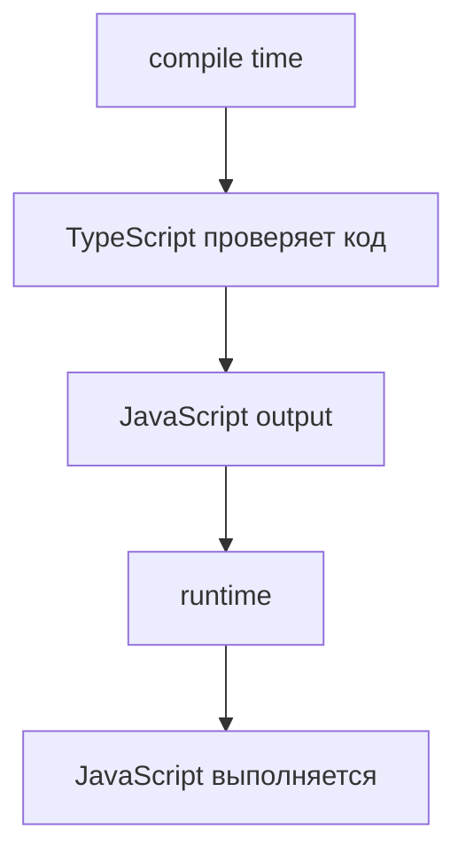

# Type Checking vs Runtime

## Связь с предыдущей главой

Предыдущая глава показала TypeScript Compiler как контрольный пункт перед запуском программы.

Теперь нужно понять границу: какие ошибки находятся на этапе type checking, а какие остаются runtime-проблемами.

## Главный вопрос

> Почему TypeScript находит ошибки до запуска, но не существует во время выполнения?

Короткий ответ: TypeScript проверяет код на этапе compile time, а runtime выполняет уже сгенерированный JavaScript.

## Мотивация

В JavaScript есть только runtime-проверка поведения.

Если функция ожидает строку, а получает число, ошибка может появиться только в момент вызова:

```javascript
function getStatusText(status) {
  return status.toUpperCase();
}

getStatusText(200);
```

TypeScript добавляет более ранний слой анализа.

Он может показать, что вызов выглядит опасно, еще до запуска теста.

## Теория

### Две области с разным предметом

Разница между compile time и runtime — не во времени, а в том, **с чем работает каждый этап**.

| | Compile time | Runtime |
| --- | --- | --- |
| Предмет | Текст программы | Реальные значения |
| Вопрос | Согласован ли код сам с собой? | Что произойдёт с этими данными? |
| Инструмент | Компилятор TypeScript | Движок JavaScript |
| Результат | Диагностические сообщения | Поведение программы |

Компилятор никогда не видит ни одного настоящего значения. Он рассуждает о том, что **может** оказаться в переменной, исходя из написанного кода.



### Что проверка типов находит

Несоответствия, видимые из текста программы:

* присваивание значения неподходящего типа;
* вызов функции с неверными аргументами;
* обращение к отсутствующему свойству;
* пропущенное обязательное поле;
* необработанная ветка при разборе объединения типов.

Все они имеют общее свойство: чтобы их обнаружить, **не нужно запускать программу**.

### Где кончается граница доверия

Есть три места, где программа получает данные извне и проверка типов бессильна:

1. **Сеть** — ответ API имеет ту форму, которую вернул сервер, а не ту, что записана в типе.
2. **Файлы и окружение** — содержимое файла или переменной окружения известно только во время выполнения.
3. **Пользовательский ввод** — включая то, что вводит автотест.

Во всех трёх случаях тип в коде выражает **ожидание**, а не факт. Ожидание может не сбыться, и тогда поможет только проверка во время выполнения.

### Как границу пересекают намеренно

Иногда разработчик знает о значении больше, чем компилятор. Для этого существует утверждение типа:

```typescript
const response = await request.get('/api/v1/work-items/1');
const item = (await response.json()) as WorkItem;
```

Запись `as WorkItem` **ничего не проверяет**. Она говорит компилятору: «считай, что здесь такой тип». Если сервер вернул другую форму, программа продолжит работать с неверным предположением, а ошибка проявится позже и в другом месте.

То же относится к `any`: значение этого типа отключает проверку для всей цепочки, по которой оно проходит.

Оба инструмента нужны, но каждое их использование — это место, где ответственность переходит от компилятора к человеку.

### Почему ошибка «уезжает» от причины

Когда граница пересечена неверно, падение происходит не там, где ошиблись.

Типичная цепочка в тестовом проекте: ответ API приведён к типу через `as` → значение передано в helper → helper положил его в построитель данных → падение случилось при формировании отчёта. Настоящая причина — неверное предположение о форме ответа — осталась на три шага раньше.

Отсюда практический приём: проверять внешние данные **на границе**, сразу при получении. Тогда ошибка возникает рядом с причиной.

## Внутренний механизм

TypeScript анализирует текст программы и выводит, какие значения допустимы в конкретных местах.

Если функция ожидает строку:

```typescript
function getStatusText(status: string) {
  return status.toUpperCase();
}
```

то вызов с числом выглядит как нарушение договора:

```typescript
getStatusText(200);
```

Компилятор TypeScript может остановить такой код до runtime.

Но если данные пришли из сети, TypeScript не может гарантировать их реальную форму без runtime-проверки.

## Главная ментальная модель

TypeScript отвечает за статическую проверку кода.

Runtime отвечает за выполнение реальных значений.

## Практические примеры

Примеры находятся в:

```text
examples/02-typescript/chapter-98/
```

`01-runtime-javascript.js` показывает обычный JavaScript-вызов.

`02-type-checking-before-runtime.ts` содержит намеренный диагностический пример с `@ts-expect-error`.

`03-runtime-still-executes-js.js` показывает, что JavaScript runtime все равно работает со значениями во время выполнения.

## Automation QA

В Playwright-проекте helper может ожидать строковый статус:

```typescript
function createStatusMessage(status: string) {
  return `Test status: ${status}`;
}
```

Если другой модуль передает число, TypeScript может показать ошибку до запуска тестов.

Но если статус пришел из API response, runtime-проверка все равно может понадобиться.

TypeScript уменьшает риск, но не отменяет проверку внешних данных.

Практическое правило для тестового фреймворка: **всё, что пересекает границу процесса, проверяется во время выполнения**. Ответ REST, сообщение gRPC, строка из базы, переменная окружения — для каждого источника нужна проверка формы, а не только объявленный тип.

Выгода двойная. Тест падает с понятным сообщением о неожиданном ответе вместо загадочной ошибки где-то в глубине helper-ов. А заодно такая проверка становится полноценной проверкой контракта: изменение формы ответа обнаруживается тестом, а не пользователем.

## Распространённые мифы

**Миф: типы защищают от неверных данных API.**
Тип описывает ожидание в коде. Ответ приходит во время выполнения, когда типов уже нет.

**Миф: `as` — это преобразование типа.**
Это утверждение для компилятора. Никакой проверки и никакого преобразования значения не происходит.

**Миф: если компилятор доволен, программа не упадёт.**
Он подтверждает согласованность кода. Деление на ноль, отсутствующий файл и неожиданный ответ сервера остаются возможными.

**Миф: `any` — это «любой тип».**
Практически это «не проверяй». Значение проходит через код, отключая проверки на своём пути.

## Частые вопросы

**Когда `as` оправдан?**
Когда вы уже проверили значение другим способом и хотите сообщить об этом компилятору. Само по себе, без проверки, утверждение лишь прячет неопределённость.

**Чем `unknown` лучше `any`?**
`unknown` тоже означает «тип неизвестен», но запрещает работать со значением, пока вы его не проверите. Это перекладывает проверку на нужный момент вместо её отключения.

**Нужно ли проверять данные из собственного API?**
Да. Собственный API тоже меняется, и тест должен замечать изменение контракта, а не падать позже по непонятной причине.

**Как понять, где проходит граница в моём коде?**
Ищите места, где значение появляется не из кода: `await response.json()`, чтение файла, `process.env`, ответ клиента базы. Каждое такое место — граница.

## Распространённые ошибки

### Ошибка 1. Ожидать runtime-защиту от TypeScript

TypeScript не существует во время выполнения программы.

### Ошибка 2. Думать, что type checking проверяет данные из API

TypeScript проверяет код. Реальный response приходит в runtime.

### Ошибка 3. Смешивать compile time и runtime

Если ошибка появляется после запуска, это уже область JavaScript runtime.

### Ошибка 4. Использовать `as` вместо проверки

Утверждение типа убирает сообщение компилятора, но не меняет реальную форму данных.

## Проверьте себя

1. С чем работает компилятор и с чем работает runtime?
2. Назовите три источника данных, которые проверка типов не контролирует.
3. Что на самом деле делает запись `as WorkItem`?
4. Почему ошибка из-за неверного `as` проявляется далеко от места ошибки?
5. Чем `unknown` отличается от `any` по поведению?

## Практика

Практика находится в:

```text
practice/02-typescript/98-type-checking-vs-runtime.md
```

Решения находятся в:

```text
solutions/02-typescript/98-type-checking-vs-runtime.md
```

## Краткие итоги

Главное:

* TypeScript работает до запуска и рассуждает о тексте программы;
* JavaScript runtime выполняет сгенерированный код и работает с реальными значениями;
* type checking находит часть ошибок раньше;
* runtime-проблемы не исчезают;
* внешние данные требуют проверки на границе.

## Переход к следующей теме

Мы отделили compile time от runtime.

Теперь нужно понять, почему TypeScript-типы исчезают из программы после компиляции.
