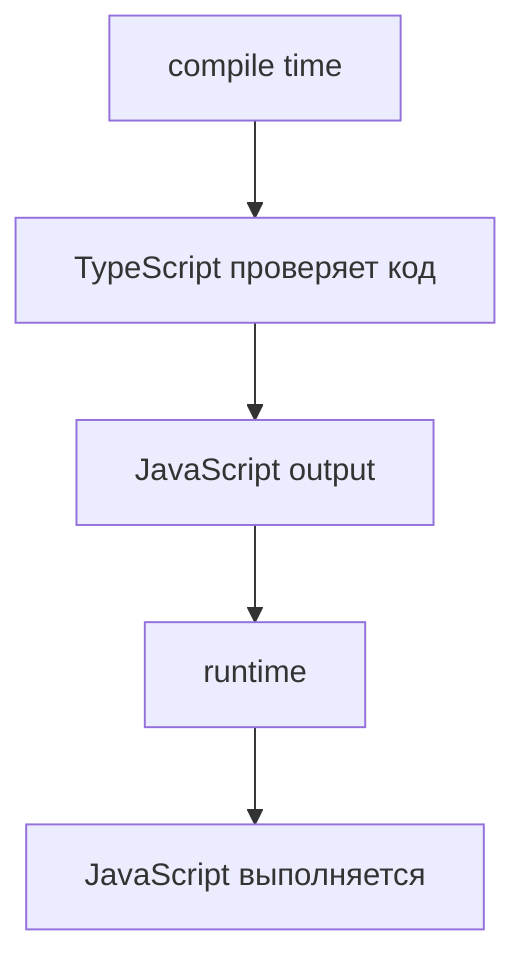
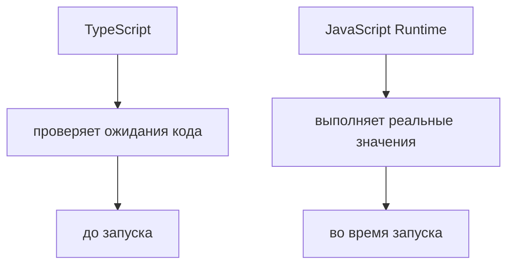

# Type Checking vs Runtime

## Связь с предыдущей главой

Предыдущая глава показала TypeScript Compiler как контрольный пункт перед запуском программы.

Теперь нужно понять границу: какие ошибки находятся на этапе type checking, а какие остаются runtime-проблемами.

## Главный вопрос

> Почему TypeScript находит ошибки до запуска, но не существует во время выполнения?

Короткий ответ: TypeScript проверяет код на этапе compile time, а runtime выполняет уже сгенерированный JavaScript.

## Мотивация

В JavaScript есть только runtime-проверка поведения.

Если функция ожидает строку, а получает число, ошибка может появиться только в момент вызова:

```javascript
function getStatusText(status) {
  return status.toUpperCase();
}

getStatusText(200);
```

TypeScript добавляет более ранний слой анализа.

Он может показать, что вызов выглядит опасно, еще до запуска теста.

## Теория

Есть две разные области:

* compile time — когда TypeScript анализирует код;
* runtime — когда JavaScript выполняет программу.



Type checking помогает найти несоответствия:

* неправильное значение;
* неверный аргумент функции;
* несовпадение ожидаемой формы объекта;
* пропущенное обязательное поле.

Но TypeScript не проверяет все, что может произойти во время выполнения.

## Внутренний механизм

TypeScript анализирует текст программы и выводит, какие значения допустимы в конкретных местах.

Если функция ожидает строку:

```typescript
function getStatusText(status: string) {
  return status.toUpperCase();
}
```

то вызов с числом выглядит как нарушение договора:

```typescript
getStatusText(200);
```

Компилятор TypeScript может остановить такой код до runtime.

Но если данные пришли из сети, TypeScript не может гарантировать их реальную форму без runtime-проверки.

## Главная ментальная модель



TypeScript отвечает за статическую проверку.

Runtime отвечает за выполнение реальных значений.

## Практические примеры

Примеры находятся в:

```text
examples/02-typescript/chapter-98/
```

`01-runtime-javascript.js` показывает обычный JavaScript-вызов.

`02-type-checking-before-runtime.ts` содержит намеренный диагностический пример с `@ts-expect-error`.

`03-runtime-still-executes-js.js` показывает, что JavaScript runtime все равно работает со значениями во время выполнения.

## Automation QA

В Playwright-проекте helper может ожидать строковый статус:

```typescript
function createStatusMessage(status: string) {
  return `Test status: ${status}`;
}
```

Если другой модуль передает число, TypeScript может показать ошибку до запуска тестов.

Но если статус пришел из API response, runtime-проверка все равно может понадобиться.

TypeScript уменьшает риск, но не отменяет проверку внешних данных.

## Распространённые ошибки

### Ошибка 1. Ожидать runtime-защиту от TypeScript

TypeScript не существует во время выполнения программы.

### Ошибка 2. Думать, что type checking проверяет данные из API

TypeScript проверяет код. Реальный response приходит в runtime.

### Ошибка 3. Смешивать compile time и runtime

Если ошибка появляется после запуска, это уже область JavaScript runtime.

## Практика

Практика находится в:

```text
practice/02-typescript/98-type-checking-vs-runtime.md
```

Решения находятся в:

```text
solutions/02-typescript/98-type-checking-vs-runtime.md
```

## Краткие итоги

Главное:

* TypeScript работает до запуска;
* JavaScript runtime выполняет сгенерированный код;
* type checking находит часть ошибок раньше;
* runtime-проблемы не исчезают;
* внешние данные требуют осторожности.

## Переход к следующей теме

Мы отделили compile time от runtime.

Теперь нужно понять, почему TypeScript-типы исчезают из программы после компиляции.
