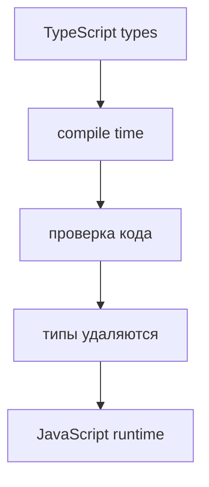

# Type Erasure

## Связь с предыдущей главой

Предыдущая глава разделила compile time и runtime.

Теперь важно понять, что происходит с типами между этими этапами.

## Главный вопрос

> Почему типы исчезают после компиляции?

Короткий ответ: TypeScript-типы нужны компилятору TypeScript для проверки кода, но JavaScript runtime их не выполняет.

## Мотивация

TypeScript добавляет в код информацию для проверки:

```typescript
const timeoutMs: number = 5000;
```

Но JavaScript не знает синтаксис TypeScript-типов.

Перед запуском компилятор TypeScript должен создать обычный JavaScript:

```javascript
const timeoutMs = 5000;
```

Именно поэтому типы удаляются.

## Теория

### Что именно стирается

Type erasure — удаление конструкций системы типов при генерации JavaScript.

Стираются полностью:

* аннотации типов (`: number`, `: string`);
* `interface` и `type`;
* параметры-типы дженериков;
* `implements` у классов;
* `declare` и `import type`;
* утверждения типов (`as`).

После компиляции от них не остаётся ничего — ни объекта, ни имени, ни возможности спросить о них во время выполнения.



### Стирается не всё

Это место, где интуиция «в TypeScript всё исчезает» подводит. Часть конструкций **порождает настоящий код**:

| Конструкция | Что остаётся после компиляции |
| --- | --- |
| `interface`, `type` | Ничего |
| `class` | Настоящий класс JavaScript |
| `enum` | Объект со значениями |
| `namespace` | Функция-обёртка с объектом |
| Параметры-свойства в конструкторе | Присваивания в теле конструктора |

Поэтому `class` можно проверять через `instanceof`, а `interface` — нельзя: проверять нечего.

`enum` — отдельный источник путаницы: он выглядит как часть системы типов, но оставляет после себя объект, который увеличивает размер сборки и существует во время выполнения.

### Почему тип нельзя спросить во время выполнения

Прямое следствие стирания: не существует операции «проверить, соответствует ли значение типу».

```typescript
// Так написать нельзя: WorkItem не существует во время выполнения
if (value instanceof WorkItem) { }
```

Доступны только средства самого JavaScript:

* `typeof` — различает примитивы и функцию;
* `instanceof` — работает с классами;
* `Array.isArray` — для массивов;
* проверка наличия свойства через `in` или сравнение с `undefined`.

Все они проверяют **значение**, а не объявленный тип.

### Что делать вместо: функция-страж

Проверку формы пишут руками, а её результат связывают с типом через предикат:

```typescript
type WorkItem = { id: string; version: number };

function isWorkItem(value: unknown): value is WorkItem {
  if (typeof value !== 'object' || value === null) return false;

  const candidate = value as Record<string, unknown>;

  return typeof candidate.id === 'string'
    && typeof candidate.version === 'number';
}
```

Запись `value is WorkItem` — это предикат типа. Он говорит компилятору: если функция вернула `true`, дальше можно считать значение `WorkItem`.

Ключевое свойство: **проверка настоящая**, её выполняет JavaScript. Компилятор лишь узнаёт о её результате. Именно этим страж отличается от `as`, который ничего не проверяет.

### Последствие для дженериков

Параметр-тип не существует во время выполнения, поэтому внутри дженерика нельзя узнать, чем он был:

```typescript
function createEmpty<T>(): T[] {
  // Узнать, что такое T, невозможно: этой информации в runtime нет
  return [];
}
```

Если поведение должно зависеть от типа, его передают значением — например, функцией-стражем или явным параметром. Это не ограничение конкретной версии, а следствие самой модели стирания.

### Стирание и отладка

После компиляции выполняется JavaScript, и стек ошибок указывает на него, а не на исходный `.ts`.

Связь между ними восстанавливают source maps: они сопоставляют строки сгенерированного файла строкам исходного. Без них трассировка будет указывать на код, которого вы не писали.

## Внутренний механизм

Компилятор TypeScript использует типы как подсказки для анализа.

Например:

```typescript
const baseUrl: string = 'https://api.example.test';
```

После компиляции остается:

```javascript
const baseUrl = 'https://api.example.test';
```

Runtime видит только значение.

Он не знает, что разработчик указывал `string`.

## Главная ментальная модель

TypeScript-типы — это инструмент проверки до запуска, а не часть выполняемой программы.

## Практические примеры

Примеры находятся в:

```text
examples/02-typescript/chapter-99/
```

`01-source-types.ts` показывает TypeScript-код с типами.

`02-after-type-erasure.js` показывает JavaScript после удаления типов.

`03-runtime-validation-needed.js` показывает, что runtime-проверки для внешних данных все еще нужны.

## Automation QA

В API-тестах TypeScript может помочь описать ожидаемую форму данных в коде.

Но реальный ответ сервера приходит во время выполнения.

Если API вернул неожиданную форму, TypeScript сам не остановит runtime.

Поэтому в Automation QA остаются нужны:

* assertions;
* response validation;
* проверки обязательных полей;
* понятные ошибки в helper-функциях.

Практический приём: держите функции-стражи рядом с типами, которые они проверяют. Тогда при изменении типа сразу видно, что нужно обновить и проверку. Если страж живёт отдельно, он незаметно расходится с типом — и начинает подтверждать форму, которой уже нет.

## Распространённые мифы

**Миф: после компиляции от TypeScript не остаётся ничего.**
`class`, `enum`, `namespace` и параметры-свойства порождают настоящий код.

**Миф: `interface` можно проверить через `instanceof`.**
Интерфейс стирается полностью. Проверять нечего — нужна функция-страж.

**Миф: дженерик знает свой тип внутри функции.**
Параметр-тип стирается. Если поведение зависит от типа, его надо передать значением.

**Миф: `enum` — это только про типы, он ничего не стоит.**
Обычный `enum` оставляет объект во время выполнения. Это осознанный выбор, а не бесплатная аннотация.

## Частые вопросы

**Почему `value is WorkItem` лучше, чем `as WorkItem`?**
Предикат стоит после настоящей проверки: компилятор сужает тип, потому что проверка действительно выполнена. `as` сужает тип без всяких оснований.

**Как проверить тип значения, если типы стёрты?**
Проверять не тип, а форму значения: свойства, их типы через `typeof`, принадлежность классу через `instanceof`. Итог связывается с типом через предикат.

**Почему в стеке ошибки указаны незнакомые строки?**
Выполняется сгенерированный JavaScript. Чтобы видеть исходные строки, нужны source maps.

**Стоит ли использовать `enum`?**
Если нужен только набор допустимых значений, объединение строковых литералов обходится без кода во время выполнения. `enum` оправдан, когда объект со значениями действительно нужен.

## Распространённые ошибки

### Ошибка 1. Думать, что типы существуют в runtime

После компиляции TypeScript-типы удаляются.

### Ошибка 2. Проверять внешние данные только типами

Данные из API, файлов и окружения приходят в runtime.

### Ошибка 3. Думать, что TypeScript создает новый язык выполнения

После compilation выполняется JavaScript.

### Ошибка 4. Считать, что стирается вообще всё

`class`, `enum` и `namespace` оставляют после себя работающий код.

## Проверьте себя

1. Какие конструкции стираются полностью, а какие порождают код?
2. Почему `instanceof` работает с классом, но не с интерфейсом?
3. Чем предикат `value is T` отличается от утверждения `as T`?
4. Почему внутри дженерика нельзя узнать, чем был параметр-тип?
5. Зачем нужны source maps после стирания типов?

## Практика

Практика находится в:

```text
practice/02-typescript/99-type-erasure.md
```

Решения находятся в:

```text
solutions/02-typescript/99-type-erasure.md
```

## Краткие итоги

Главное:

* TypeScript-типы существуют для проверки кода;
* после компиляции аннотации, интерфейсы и дженерики удаляются;
* `class`, `enum` и `namespace` оставляют настоящий код;
* runtime выполняет JavaScript и не знает об объявленных типах;
* внешние данные требуют проверки функциями-стражами.

## Переход к следующей теме

Мы поняли, что компилятор TypeScript проверяет код и удаляет типы.

Теперь нужно понять, откуда компилятор TypeScript берет правила проекта.
